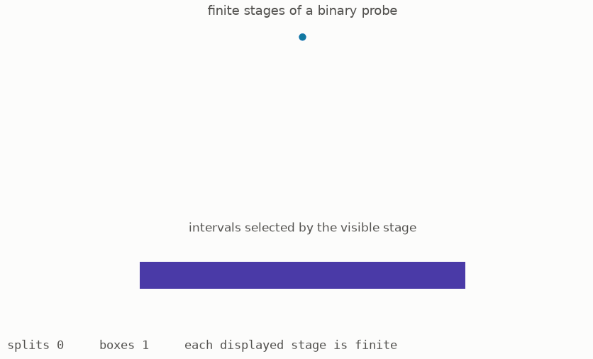
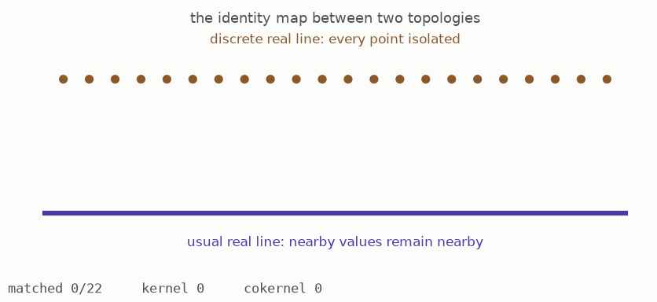
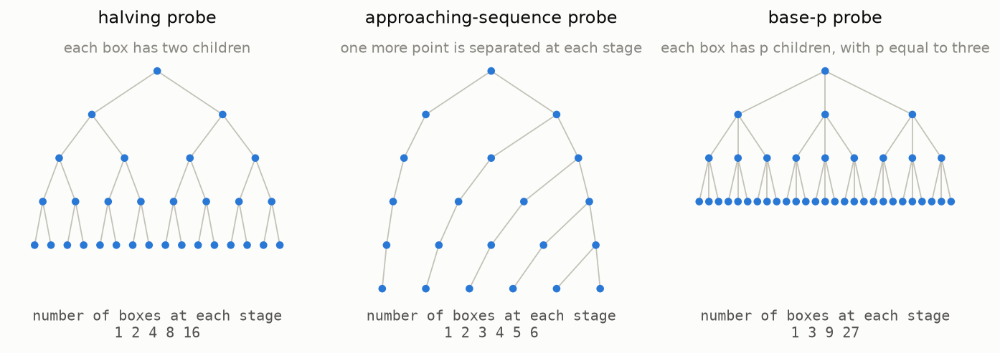
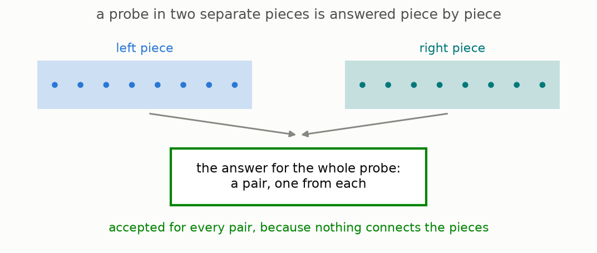
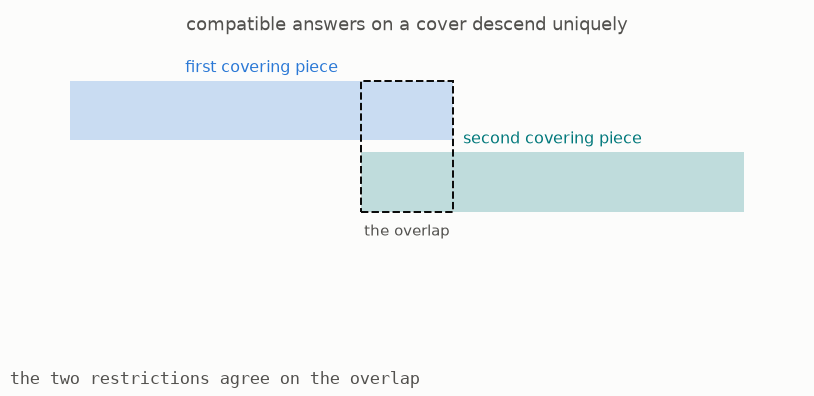
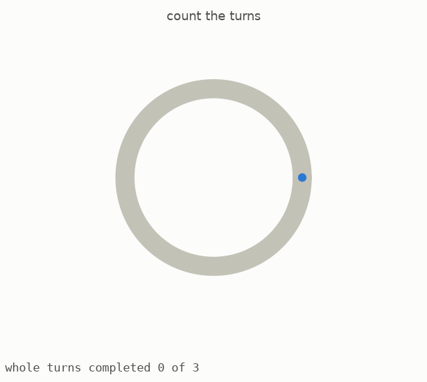
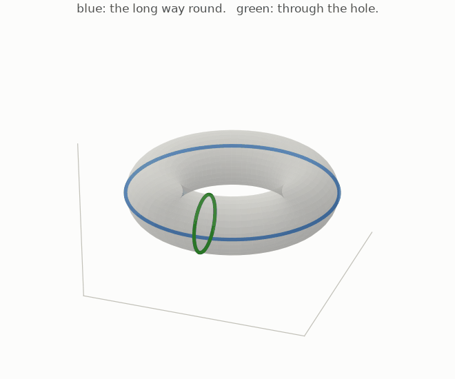
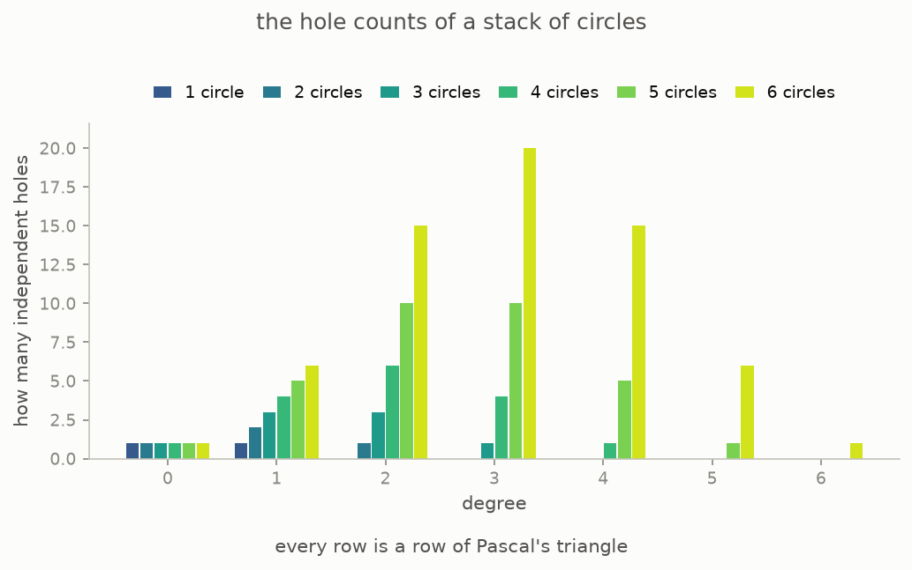

# Shapes You Can Only See By Probing Them

*Part one of three on condensed mathematics. We begin with a familiar problem: the same set of numbers can carry different ideas of nearness, but ordinary algebra does not record that difference well. Step by step, this part introduces probes, explains how a space answers them, and shows how this new description makes subtraction work without losing familiar spaces or their holes. No previous mathematics is assumed.*



The animation introduces the basic object used throughout this guide. Begin with one box, split it into two, and then split each new box again. Every stage is finite, so you can see the whole stage at once. If the process continues forever, each path through the boxes approaches a point, while the full branching pattern remembers how those points were separated. We will call the resulting object a **probe**. Condensed mathematics describes a space through all the continuous ways probes can enter it, rather than through its points alone.

This is part one of three. It covers the first three lectures of Peter Scholze's *Lectures on Condensed Mathematics* ([arXiv:2605.03658](https://arxiv.org/abs/2605.03658), May 2026), which record a course taught in Bonn in 2019 and present joint work with Dustin Clausen. Part two develops infinite sums, and part three moves from addition to rings and geometry. The text, figures, and code for every computed example are available in the open source repository at [github.com/muchmirul/conjectures](https://github.com/muchmirul/conjectures). Most sections also include a [page you can play with](https://muchmirul.github.io/conjectures/condensed-math/condensed-math01/play/index.html), where changing one choice updates the corresponding picture.

```
    the problem                 1  two real lines, and the broken bridge
    the new object              2  probes that branch
                                3  what a shape says to a probe
                                4  cut, and glue
    what it repairs             5  the quotient with no points
                                6  probes that never need folding
    what it costs               7  nothing was lost
                                8  counting holes
```

**[Play with this](https://muchmirul.github.io/conjectures/condensed-math/condensed-math01/play/00.html)** to build a probe one split at a time and see how its finite stages fit together.

## 1 · Two real lines

Start with the set of all real numbers and give it two different rules about nearness. In the first copy, forget nearness completely. Two numbers are either equal or different, and no distinct numbers count as close. We will call this copy **the dust**, which is the real line with the discrete topology.

In the second copy, keep the usual notion of distance. In this copy, 0.999 is close to 1, sequences can approach limits, and continuous motion makes sense. We will call this copy **the ruler**, which is the ordinary topological real line.



Send each number in the dust to the same number on the ruler. The animation shows this matching. Every input has one output, different inputs remain different, and every point on the ruler is reached. As a map of underlying sets, it is a perfect one-to-one correspondence.

However, the two topological groups are not the same. The map from the dust to the ruler is continuous, but its inverse is not. A single point is open in the dust, while a single point is not open on the ruler, so the inverse fails the basic test for continuity. A bijection of points therefore does not guarantee an isomorphism of topological objects.

This causes a precise algebraic problem. In an abelian setting, one studies a map by finding its kernel, the elements it sends to zero, and its cokernel, the part of the target it fails to account for. If both are zero, the map should be an isomorphism. For the map above, both are zero even though the map is not an isomorphism, so topological abelian groups do not support this standard algebraic test.

The lectures begin with this example ([Example 1.9, page 9](https://arxiv.org/pdf/2605.03658v1#page=9)) and give two related failures. These examples identify the problem that condensed mathematics is designed to solve. The point sets of the dust and ruler agree, so a successful repair must record how whole compact families of points move, not merely which individual points exist.

### The mathematics

Write $\mathbb{R}_{\mathrm{disc}}$ for the dust and $\mathbb{R}$ for the ruler, both taken as topological abelian groups. Sending each number to itself is a continuous homomorphism between them, and in the category of topological abelian groups it has no kernel and no cokernel:

```math
\mathbb{R}_{\mathrm{disc}} \xrightarrow{\;\mathrm{id}\;} \mathbb{R},
\qquad \ker = 0, \qquad \mathrm{coker} = 0,
\qquad \text{yet } \mathbb{R}_{\mathrm{disc}} \not\cong \mathbb{R}.
```

**Reading the symbols.** The symbol $\mathbb{R}$ means the real numbers, and the subscript $\mathrm{disc}$ says that distinct numbers are treated as separate, with no usual notion of nearness. The arrow labelled $\mathrm{id}$ sends every number to itself. The symbol $\ker$ names the kernel, or everything sent to zero, while $\mathrm{coker}$ names the cokernel, or what remains unaccounted for in the target. Both are $0$, meaning that neither detects a difference. The symbol $\not\cong$ says that the two topological groups are nevertheless not isomorphic.

**Why it matters.** In an abelian category, a map whose kernel and cokernel are both zero must be an isomorphism. This example violates that implication, so the category of topological abelian groups is not abelian. As a result, the usual tools of homological algebra cannot simply be applied there.

**In the simulation.** The slider controls how closely you inspect the two copies of the real line. The two rows represent $\mathbb{R}_{\mathrm{disc}}$ and $\mathbb{R}$, and the vertical lines show the identity map matching equal numbers. The readout displays the kernel and cokernel, which remain zero even while the pictures retain different notions of nearness.

**[Play with this](https://muchmirul.github.io/conjectures/condensed-math/condensed-math01/play/01.html)** to inspect the matching and see why its empty kernel and cokernel do not make it an isomorphism.

## 2 · Probes that branch

To detect nearness, we need an object that carries nearness of its own. Build one by starting with a box and repeatedly dividing it into smaller boxes. At each stage there are only finitely many pieces, together with a map telling us which new piece came from which old one. The infinite object is completely described by these finite stages and their connecting maps.



A **probe** consists of such a compatible sequence of finite divisions and the points obtained by following branches through every stage. The lectures call this a profinite set. Three examples will be used repeatedly in this guide.

The **halving probe** divides every box into two at each stage. After ten rounds it has 1024 boxes. Its limiting points form the classical Cantor set, which can also be made by repeatedly removing the middle third of every remaining interval.

The **approaching probe** records one convergent sequence and its limit. At stage five, the first five points have been separated into their own boxes, while all later points and the limit still occupy one final box. Further stages separate one more point at a time.

The **counting-in-base-p probe** divides each box into p pieces. Its limiting points form the p-adic integers, an important number system in which divisibility by powers of p determines nearness. Part two will use this probe to explain an infinite sum that converges in one notion of size but not another.

The formal name *profinite set* means an inverse limit of finite sets ([Definition 1.2, page 6](https://arxiv.org/pdf/2605.03658v1#page=6)). Two parts of that description are important. Every individual stage is finite, and all information about the probe lies in the stages and the maps between them. The code follows this definition literally by storing finite sets and their transition maps. Its tests check the expected growth of all three probes and verify that compatible data can be read consistently through their levels.

**[Play with this](https://muchmirul.github.io/conjectures/condensed-math/condensed-math01/play/02.html)** to compare the three probes, change their depth, and inspect the points contained in any box.

## 3 · What a shape says to a probe

We can now use a probe to examine a space. A probe **lands** in a space when its points are mapped there continuously. Continuity means that the map respects the nearness already carried by the probe. In particular, if probe points approach a limit, their images must approach the image of that limit.


The animation tests two attempted landings of the approaching probe. In the first, the sequence of images approaches the image of the limit point, so the landing is continuous. In the second, the sequence approaches one place while the limit point is sent elsewhere. That break in continuity causes the landing to be rejected.

This suggests a new way to describe a space. For every possible probe, record every continuous way that probe can land in the space. The resulting record is like an answer sheet: each probe poses a test, and the space answers with its set of legal landings. This answer sheet remembers not only which points exist but also which compact families of points fit together continuously.

An answer sheet satisfying the two compatibility rules in the next section is called a **condensed set** ([Definition 1.2, page 6](https://arxiv.org/pdf/2605.03658v1#page=6)). If the original space has addition, its landings can be added point by point, producing a condensed group. If it also has multiplication, the same construction produces a condensed ring ([Example 1.3, page 7](https://arxiv.org/pdf/2605.03658v1#page=7)).

This description immediately distinguishes the two real lines. The approaching probe has many continuous landings in the ruler, because any convergent sequence of real numbers and its limit gives one. In the dust, a convergent sequence must eventually remain at one value, so nearly all of those landings disappear. Although the dust and ruler have the same individual points, their answer sheets are different.

For spaces with a distance, the approaching probe already contains enough information to detect the topology. Such a space is determined by its convergent sequences, and this probe tests exactly those sequences ([Remark 1.6, page 9](https://arxiv.org/pdf/2605.03658v1#page=9)). More general spaces require all profinite probes, but this small example explains why probes can see information that points alone miss.


**[Play with this](https://muchmirul.github.io/conjectures/condensed-math/condensed-math01/play/03.html)** to move the images of a convergent sequence and see exactly when the proposed landing stops being continuous.

## 4 · Cut, and glue

The entries of an answer sheet cannot be chosen independently. They must respect two basic ways of relating probes, called **cut** and **glue**. Together, these are the sheaf conditions in the definition of a condensed set.

**Cut.** If a probe is a disjoint union of two pieces, then a landing of the whole probe contains exactly the same information as one landing for each piece. Since the pieces do not meet, the two landings can be chosen independently and then combined.



**Glue.** Suppose a larger probe covers a smaller probe. A landing on the covering probe descends to the smaller one when it assigns the same result wherever the cover represents the same point more than once. If that agreement holds, there must be one and only one landing downstairs that produces the given landing upstairs.



The glue rule prevents two kinds of failure. Compatible local answers must assemble into a global answer, so information cannot agree everywhere locally but fail to exist globally. The global answer must also be unique, so the same local data cannot produce two different results. The lectures place these two requirements directly after the definition ([Definition 1.2, page 6](https://arxiv.org/pdf/2605.03658v1#page=6)). Thus, a condensed set is precisely an answer sheet on profinite probes that respects disjoint pieces and compatible covers.

A size issue also appears in the definition, and the lectures address it immediately ([Remark 1.4, page 7](https://arxiv.org/pdf/2605.03658v1#page=7)). There are too many profinite sets to collect into one ordinary set, so the phrase "every probe" must be handled carefully. One first chooses a sufficiently large size bound, develops the theory within that bound, and proves that enlarging it does not change the resulting mathematics. This guide will treat that step as background bookkeeping.

**[Play with this](https://muchmirul.github.io/conjectures/condensed-math/condensed-math01/play/04.html)** to assign local answers and see how the cut and glue rules decide whether they form one valid answer.

## 5 · The quotient with no points

We can now revisit the map from the dust to the ruler. Their answer sheets are different because probes detect continuous families on the ruler that do not exist in the dust. Condensed groups therefore allow us to form a meaningful cokernel of the map. This guide calls that cokernel **the ghost**.

At a single point, the ghost looks like zero: the dust and ruler contain exactly the same real numbers, so their point-level quotient has nothing left. A branching probe gives a different result. It can move continuously through the ruler in ways that are not locally constant and therefore cannot come from the discrete real line.


The animation constructs such a landing on the halving probe. Values are assigned on increasingly fine boxes in a compatible way. In the limit, the resulting map to the ruler is continuous but never becomes constant on a finite collection of boxes. Maps from a compact probe to the dust must be locally constant, so this landing cannot come from the dust. It therefore gives a nonzero element of the ghost ([Example 1.9, page 9](https://arxiv.org/pdf/2605.03658v1#page=9)).

The ghost is consequently nonzero even though its value on the one-point probe is zero. This explains why the original kernel-and-cokernel test failed: it examined individual points and missed a quotient visible only to larger probes. In the condensed setting, that missing quotient becomes an ordinary algebraic object instead of disappearing.

The general result can now be stated in the form needed for algebra:

> Condensed abelian groups form an abelian category. In this category, a map with zero kernel and zero cokernel is an isomorphism.

This is the opening theorem of the lectures ([Theorem 1.10, page 9](https://arxiv.org/pdf/2605.03658v1#page=9), restated with the size bound fixed as [Theorem 2.2, page 11](https://arxiv.org/pdf/2605.03658v1#page=11)). In standard language, condensed abelian groups form an abelian category with especially strong closure properties. The usual machinery of kernels, cokernels, and exact sequences therefore works here, including for topological information that ordinary topological groups fail to record algebraically.

**[Play with this](https://muchmirul.github.io/conjectures/condensed-math/condensed-math01/play/05.html)** to build a probe-level element of the ghost while its value on individual points remains zero.

## 6 · Probes that never need folding

This section uses only the ideas already introduced and asks which probes are easiest to work with. Suppose one probe maps onto another, so every point downstairs has at least one point above it. Choosing one point above each point downstairs gives a **lift**. For the lift to be useful, that choice must also be continuous.


A continuous lift does not always exist. In the animation, the possible choices alternate as points approach the limit. Following either set of choices forces a jump at the end, so no continuous selection can be made. The covering folds over the target in a way that cannot be continuously undone.

A probe is called **unfoldable** in this guide when every covering onto it has a continuous lift. The standard term is *extremally disconnected* ([Definition 2.4, page 11](https://arxiv.org/pdf/2605.03658v1#page=11)). Important examples come from the Stone-Čech compactification of a discrete set. Start with separate points and add exactly the limiting information needed so that every map from those points to a compact space extends uniquely. To lift a cover, choose a point above each original discrete point; the extension property then turns those choices into one continuous lift on the completion ([Example 2.5, page 11](https://arxiv.org/pdf/2605.03658v1#page=11)).


Unfoldable probes behave very differently from familiar geometric spaces. Any convergent sequence in one must eventually be constant ([Warning 2.6, page 12](https://arxiv.org/pdf/2605.03658v1#page=12)). To see the obstruction, colour alternating terms of a nonconstant sequence with two colours. In an unfoldable probe, that colouring extends to two separated regions, leaving infinitely many terms on each side. Such a sequence cannot converge. The same warning notes another unusual fact: the product of two infinite unfoldable probes is never unfoldable.

Their usefulness comes from the glue rule. Since every cover of an unfoldable probe admits a lift, compatible data over the cover descend automatically. An answer sheet is therefore determined by its values on unfoldable probes, and only the cut rule remains to be checked there ([Proposition 2.8, page 12](https://arxiv.org/pdf/2605.03658v1#page=12)). This simpler description is one reason condensed groups have unusually strong algebraic properties, and the next two parts will repeatedly use these probes as convenient building blocks.

**[Play with this](https://muchmirul.github.io/conjectures/condensed-math/condensed-math01/play/06.html)** to attempt a lift and identify the discontinuity that prevents one from existing.

## 7 · Nothing was lost

Changing from spaces to answer sheets is useful only if familiar spaces and continuous maps can still be recovered. The concern is natural because an answer sheet contains far more entries than a point set. The relevant comparison theorem says that, for a broad class of ordinary spaces, the new description preserves exactly the original maps and keeps distinct spaces distinct.


Read the picture from the centre outward. Compact Hausdorff spaces correspond exactly to condensed sets that satisfy the matching compactness condition ([Theorem 2.16, page 17](https://arxiv.org/pdf/2605.03658v1#page=17)). In familiar Euclidean examples, these are the closed and bounded shapes. A larger surrounding class contains all metric spaces and spaces built from cells. On this larger class, the translation is fully faithful: different spaces have different answer sheets, and maps of answer sheets are exactly the continuous maps of spaces ([Proposition 1.7, page 9](https://arxiv.org/pdf/2605.03658v1#page=9)). Condensed sets extend beyond this image, as the ghost from section 5 demonstrates.


There is also a return construction. Begin with the point entries of an answer sheet, and declare a subset closed when every probe detects it as closed. For the broad class just described, translating a space into an answer sheet and then applying this construction returns the original topology. The animation follows that round trip.

The comparison has limits, and the lectures state them explicitly. If a topological space has a point that is not closed, its probe data do not define a condensed set of the required kind ([Warning 2.14, page 16](https://arxiv.org/pdf/2605.03658v1#page=16)). In the other direction, the return to ordinary topology can identify condensed information that topology cannot retain. One example involves compact objects built as increasing unions of strictly smaller closed pieces. The lectures interpret this as a limitation of ordinary topology, and note that the issue does not occur for countable colimits.

**[Play with this](https://muchmirul.github.io/conjectures/condensed-math/condensed-math01/play/07.html)** to follow a space through the translation and compare the recovered result with the starting space.

## 8 · Counting holes

The final check is whether the translation preserves topological features such as holes. A basic way to detect a hole in a circle is to draw a closed path and count how many times it travels around the centre. This count is the winding number, and it remains unchanged when the path is continuously deformed without being broken.



The animation computes the winding number of a closed path around the circle. This number is always an integer and records both the number of turns and their direction. A generator of the circle's first cohomology measures this winding, so the first cohomology group is one copy of the integers.

Products of circles create more independent directions for loops. The product of two circles is the surface of a torus, which has one loop around its central opening and another around the body of the tube.



The rotating view makes the three-dimensional surface and its two independent loops visible. Products of more circles have higher-degree holes formed by choosing several circle directions at once. The lectures compute this pattern for any number of factors, including infinitely many ([Proposition 3.1, page 20](https://arxiv.org/pdf/2605.03658v1#page=20)).



The chart shows the finite cases recomputed in this repository. Each row is a row of Pascal's triangle. For a product of several circles, the count in a given degree equals the number of ways to choose that many circle directions, exactly as the formula in the lectures predicts.

Two theorems connect this calculation to condensed mathematics. First, for every compact space, cohomology computed after translation to condensed sets agrees with classical cohomology ([Theorem 3.2, page 21](https://arxiv.org/pdf/2605.03658v1#page=21)). Second, when the coefficients are the usual real numbers rather than the integers, all positive-degree cohomology vanishes ([Theorem 3.3, page 22](https://arxiv.org/pdf/2605.03658v1#page=22)); degree zero records the continuous real-valued functions. This vanishing result is important later because it shows that the usual real line behaves very differently from the integer-based objects used in part two.

**[Play with this](https://muchmirul.github.io/conjectures/condensed-math/condensed-math01/play/08.html)** to change a loop's winding number and then compare the two independent loop directions on a torus.

## Where part one leaves you

Part one has changed the basic description of a space. A probe is an inverse system of finite sets, and a condensed set records how every probe can land in it while respecting cut and glue. For familiar spaces, this translation preserves the topology, continuous maps, and cohomology. At the same time, it reveals objects such as the ghost, which have no nonzero point-level value but are visible to larger probes. This extra information restores the algebra of kernels and cokernels.

We have not yet defined how to add an infinite family of elements. That requires a rule for convergence or completion, and different rules can give different answers to the same formal series. Part two develops such a rule from compatible weights on the finite stages of a probe. The resulting notion is called solidity.

**[Part two: Infinite Sums That Finally Land](../condensed-math02/ARTICLE.md)**

## How this part lines up with the lectures

The lectures are kept in this repository at `docs/condensed-math/paper/lectures-on-condensed-mathematics.pdf` and published at [arXiv:2605.03658](https://arxiv.org/abs/2605.03658). The following table shows where each section's definitions and quoted results appear in the source.

| this guide | in the lectures |
|---|---|
| section 1, two real lines | Question 1.1 and the problem list, page 6; Example 1.9, page 9 |
| section 2, probes that branch | Definition 1.2, page 6, the profinite sets |
| section 3, what a shape says | Example 1.3, page 7; Remark 1.6, page 9 |
| section 4, cut and glue | the two sheaf conditions under Definition 1.2, page 6 |
| section 5, the quotient with no points | Example 1.9, page 9; Theorem 1.10, page 9; Theorem 2.2, page 11 |
| section 6, probes that never fold | Definition 2.4 and Example 2.5, page 11; Warning 2.6 and Proposition 2.8, page 12 |
| section 7, nothing was lost | Proposition 1.7, page 9; Warning 2.14, page 16; Theorem 2.16, page 17 |
| section 8, counting holes | Proposition 3.1, page 20; Theorem 3.2, page 21; Theorem 3.3, page 22 |

## Checking it yourself

You can rebuild the figures and rerun every finite computation from the repository. These commands require Python and a command line, but no additional mathematics.

```
cd condensed-math
make venv        # prepare the software once
make test        # recompute every number this guide quotes
make figures     # rebuild every picture
```

For this part, the tests:

- build the three probes as honest inverse systems and check the level sizes double, grow by one, and multiply by p
- check every stored probe really is an inverse system, with surjective transition maps
- check that reading a function at a coarser level and at a finer one gives the same integral
- run Bergman's basis construction on the halving probe and confirm it produces exactly as many basis elements as the level has boxes
- recompute the hole counts of a stack of circles and confirm the binomial pattern of Proposition 3.1
- compute the winding number of sample loops and confirm it is a whole number that survives deformation

The categorical results are quoted rather than computed. These include the claims that condensed groups form an abelian category and that familiar spaces embed fully faithfully. A finite program cannot verify a theorem about every object in an entire category. The file `notes/research-content.md` labels each claim as computed, a finite shadow of an infinite result, or quoted, and gives its source.

## Glossary

| this guide's plain phrase | the standard mathematical term |
|---|---|
| a probe | a profinite set |
| the dust of a probe | the underlying set of the profinite set, its inverse limit |
| a stage of a probe | one finite set in the inverse system |
| the halving probe | the Cantor set, the limit of the powers of a two-point set |
| the approaching probe | the one-point compactification of the natural numbers |
| the counting-in-base-p probe | the p-adic integers |
| a landing | a continuous map from the probe to the target |
| an answer sheet | a sheaf on the site of profinite sets |
| a condensed set | the same thing, the subject's own name for it |
| the dust (of the real line) | the real numbers with the discrete topology |
| the ruler | the real numbers with their usual topology |
| the ghost | the cokernel of the map from the discrete reals to the usual reals |
| kill-list, miss-list | kernel, cokernel |
| cut and glue | the sheaf conditions for finite disjoint unions and for surjections |
| unfoldable | extremally disconnected |
| completing separate points so every map out of them survives | the Stone-Čech compactification of a discrete set |
| a lift | a section of a surjection |
| a hole count | a cohomology group |
| the first hole count of a circle | the first cohomology of the circle, generated by the winding number |

## Further reading

- The lectures themselves: Peter Scholze, "Lectures on Condensed Mathematics", [arXiv:2605.03658](https://arxiv.org/abs/2605.03658), May 2026, and in `docs/condensed-math/paper/`. The material is joint work with Dustin Clausen. Lectures I to III are the ones this part retells.
- For the folding-free probes: A. M. Gleason, "Projective topological spaces", *Illinois Journal of Mathematics* 2 (1958), which the lectures cite for both the definition and the fact that nothing converges in one.
- The file `notes/research-content.md` lists each claim above and marks it as computed here or quoted.
