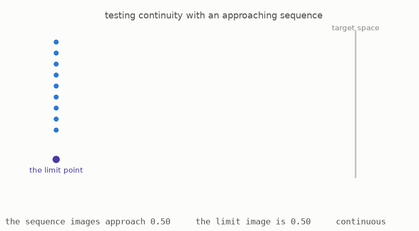
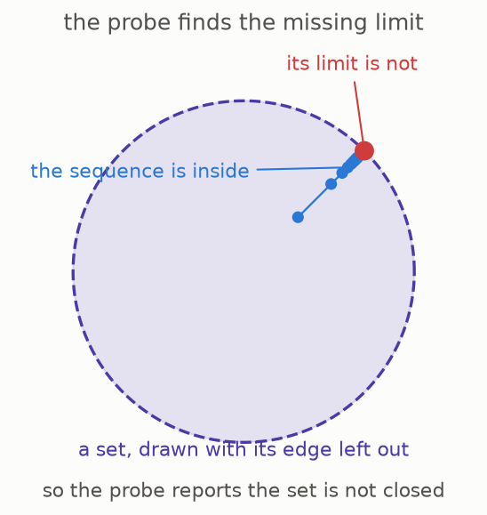

# 3 · What a shape says to a probe

*Part 1 of three: Shapes You Can Only See By Probing Them. Retells Lectures I to III of Scholze's [Lectures on Condensed Mathematics](https://arxiv.org/abs/2605.03658).*

We can now use a probe to examine a space. A probe **lands** in a space when its points are mapped there continuously. Continuity means that the map respects the nearness already carried by the probe. In particular, if probe points approach a limit, their images must approach the image of that limit.

The animation tests two attempted landings of the approaching probe. In the first, the sequence of images approaches the image of the limit point, so the landing is continuous. In the second, the sequence approaches one place while the limit point is sent elsewhere. That break in continuity causes the landing to be rejected.

This suggests a new way to describe a space. For every possible probe, record every continuous way that probe can land in the space. The resulting record is like an answer sheet: each probe poses a test, and the space answers with its set of legal landings. This answer sheet remembers not only which points exist but also which compact families of points fit together continuously.

An answer sheet satisfying the two compatibility rules in the next section is called a **condensed set** ([Definition 1.2, page 6](https://arxiv.org/pdf/2605.03658v1#page=6)). If the original space has addition, its landings can be added point by point, producing a condensed group. If it also has multiplication, the same construction produces a condensed ring ([Example 1.3, page 7](https://arxiv.org/pdf/2605.03658v1#page=7)).

This description immediately distinguishes the two real lines. The approaching probe has many continuous landings in the ruler, because any convergent sequence of real numbers and its limit gives one. In the dust, a convergent sequence must eventually remain at one value, so nearly all of those landings disappear. Although the dust and ruler have the same individual points, their answer sheets are different.

For spaces with a distance, the approaching probe already contains enough information to detect the topology. Such a space is determined by its convergent sequences, and this probe tests exactly those sequences ([Remark 1.6, page 9](https://arxiv.org/pdf/2605.03658v1#page=9)). More general spaces require all profinite probes, but this small example explains why probes can see information that points alone miss.

**[Play with this](https://muchmirul.github.io/conjectures/condensed-math/condensed-math01/play/03.html)** to move the images of a convergent sequence and see exactly when the proposed landing stops being continuous.

---

[← Probes that branch](../02-branching-probes/README.md)  ·  [Cut, and glue →](../04-cut-and-glue/README.md)  ·  [all of part 1 on one page](../../ARTICLE.md)
