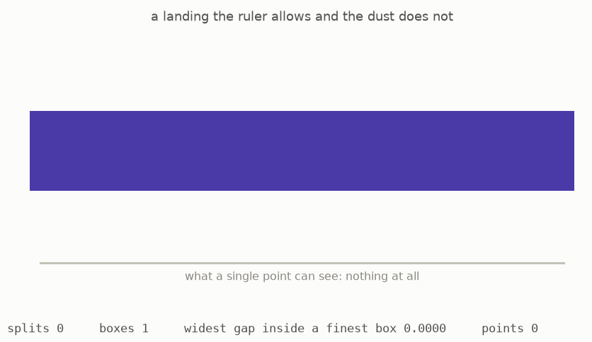

# 5 · The quotient with no points

*Part 1 of three: Shapes You Can Only See By Probing Them. Retells Lectures I to III of Scholze's [Lectures on Condensed Mathematics](https://arxiv.org/abs/2605.03658).*

We can now revisit the map from the dust to the ruler. Their answer sheets are different because probes detect continuous families on the ruler that do not exist in the dust. Condensed groups therefore allow us to form a meaningful cokernel of the map. This guide calls that cokernel **the ghost**.

At a single point, the ghost looks like zero: the dust and ruler contain exactly the same real numbers, so their point-level quotient has nothing left. A branching probe gives a different result. It can move continuously through the ruler in ways that are not locally constant and therefore cannot come from the discrete real line.



The animation constructs such a landing on the halving probe. Values are assigned on increasingly fine boxes in a compatible way. In the limit, the resulting map to the ruler is continuous but never becomes constant on a finite collection of boxes. Maps from a compact probe to the dust must be locally constant, so this landing cannot come from the dust. It therefore gives a nonzero element of the ghost ([Example 1.9, page 9](https://arxiv.org/pdf/2605.03658v1#page=9)).

The ghost is consequently nonzero even though its value on the one-point probe is zero. This explains why the original kernel-and-cokernel test failed: it examined individual points and missed a quotient visible only to larger probes. In the condensed setting, that missing quotient becomes an ordinary algebraic object instead of disappearing.

The general result can now be stated in the form needed for algebra:

> Condensed abelian groups form an abelian category. In this category, a map with zero kernel and zero cokernel is an isomorphism.

This is the opening theorem of the lectures ([Theorem 1.10, page 9](https://arxiv.org/pdf/2605.03658v1#page=9), restated with the size bound fixed as [Theorem 2.2, page 11](https://arxiv.org/pdf/2605.03658v1#page=11)). In standard language, condensed abelian groups form an abelian category with especially strong closure properties. The usual machinery of kernels, cokernels, and exact sequences therefore works here, including for topological information that ordinary topological groups fail to record algebraically.

### The mathematics

The map from the discrete to the usual real line has a condensed cokernel $Q$. [Example 1.9, page 9 of the lectures](https://arxiv.org/pdf/2605.03658v1#page=9) identifies it by

```math
Q(S)=C(S,\mathbb{R})/C_{\mathrm{lc}}(S,\mathbb{R}),
\qquad Q(*)=0,
\qquad Q\neq0.
```

The surrounding theorem places this example in a reliable algebraic category. [Theorem 1.10, page 9](https://arxiv.org/pdf/2605.03658v1#page=9) states in particular that

```math
\operatorname{Cond}(\mathrm{Ab})\text{ is an abelian category.}
```

**Reading the symbols.** The letter $Q$ names the ghost, and $Q(S)$ is what the probe $S$ sees. The notation $C(S,\mathbb{R})$ means continuous real-valued maps. The subscript $\mathrm{lc}$ means locally constant, so the denominator contains the maps that already come from the discrete reals. The slash forms the quotient. The star is the one-point probe. Thus $Q(*)=0$ says that points see nothing, while $Q\neq0$ says that the condensed group itself is not zero. The notation $\operatorname{Cond}(\mathrm{Ab})$ means condensed objects in the category of abelian groups, and “abelian category” is the standard setting where kernels, cokernels, and exact sequences work together.

**Why it matters.** The formula displays the information that pointwise algebra lost. A continuous map that is not locally constant represents a nonzero class in $Q(S)$, even though every class vanishes on the one-point probe.

**In the simulation.** The wobble control builds an element of $C(S,\mathbb{R})$. At zero wobble the map is locally constant and its quotient class is zero. A nonzero wobble makes the displayed map vary through every refinement, so it survives in $Q(S)$ while the point count $Q(*)$ stays zero.

**[Play with this](https://muchmirul.github.io/conjectures/condensed-math/condensed-math01/play/05.html)** to build a probe-level element of the ghost while its value on individual points remains zero.

---

[← Cut, and glue](../04-cut-and-glue/README.md)  ·  [Probes that never need folding →](../06-unfoldable-probes/README.md)  ·  [all of part 1 on one page](../../ARTICLE.md)
