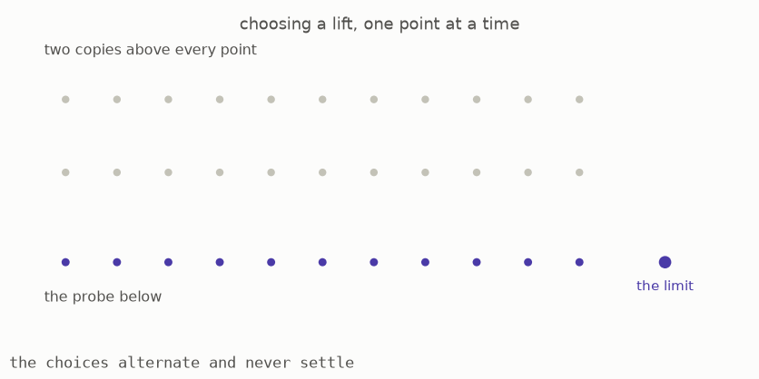
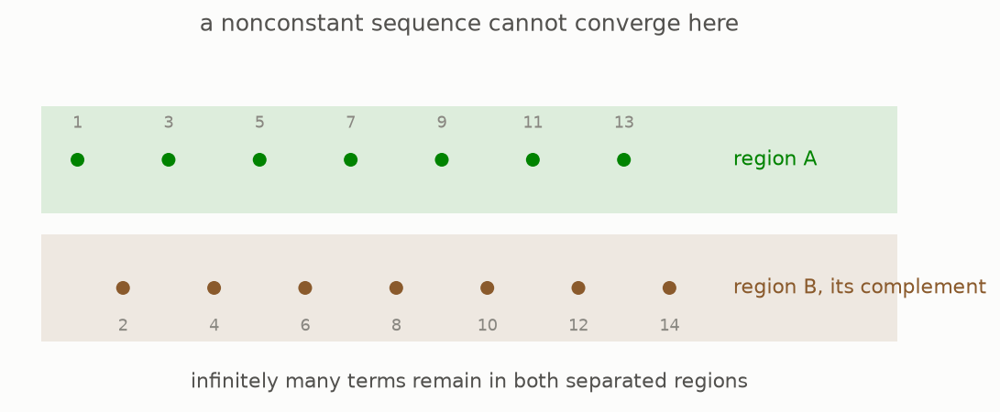

# 6 · Probes on which every cover splits

*Part 1 of three: Understanding Spaces Through Probes. Retells Lectures I to III of Scholze's [Lectures on Condensed Mathematics](https://arxiv.org/abs/2605.03658).*

Some probes are especially easy to use. Suppose a probe $S'$ covers another probe $S$, meaning that every point of $S$ has at least one point above it in $S'$. A **section** chooses one point above every point of $S$. It must also make that choice continuously.



A continuous section does not always exist. In the animation, the choices alternate while the points approach a limit. Choosing either alternating branch forces a jump at the limit. The cover cannot be continuously undone.

A compact Hausdorff probe is **extremally disconnected** when every cover onto it has a continuous section ([Definition 2.4, page 11](https://arxiv.org/pdf/2605.03658v1#page=11)). One source of these probes is the Stone-Čech compactification of a discrete set. It adds enough limit information so that every map from the original discrete points into a compact space extends continuously. Choosing a lift over each original point and then extending it gives a section ([Example 2.5, page 11](https://arxiv.org/pdf/2605.03658v1#page=11)).



These probes do not behave like familiar geometric spaces. Every convergent sequence in one is eventually constant ([Warning 2.6, page 12](https://arxiv.org/pdf/2605.03658v1#page=12)). If a nonconstant sequence alternated between two groups of terms, the groups could be separated into open-and-closed regions. Infinitely many terms would remain on each side, so the sequence could not converge. The same warning says that a product of two infinite extremally disconnected probes is never extremally disconnected.

Their main advantage comes from the glue rule. Every cover has a section, so compatible data can descend along the section. As a result, a condensed set is determined by its values on these probes, and only the cut rule needs to be checked there ([Proposition 2.8, page 12](https://arxiv.org/pdf/2605.03658v1#page=12)). Parts two and three use these probes as convenient building blocks.

### The mathematics

[Definition 2.4, page 11 of the lectures](https://arxiv.org/pdf/2605.03658v1#page=11) says that a compact Hausdorff space $S$ is extremally disconnected when every surjection onto it splits:

```math
\forall\,q:S'\twoheadrightarrow S,\quad
\exists\,s:S\to S'\quad\text{such that}\quad q\circ s=\operatorname{id}_S.
```

[Proposition 2.8, page 12](https://arxiv.org/pdf/2605.03658v1#page=12) then reduces the conditions for a condensed set on these probes to

```math
T(\varnothing)=*,
\qquad
T(S_1\sqcup S_2)\xrightarrow{\sim}T(S_1)\times T(S_2),
```

The glue condition follows from the fact that every cover splits. A section provides the map needed to bring compatible data back to the original probe.

**Reading the symbols.** The symbol $\forall$ means “for every,” and $q$ is any surjective map from $S'$ onto $S$. The symbol $\exists$ means “there exists.” The map $s$ is a section, which continuously chooses one point above every point of $S$. The composition $q\circ s$ first goes up by $s$ and then back down by $q$. The expression $\operatorname{id}_S$ is the identity map on $S$, so the equality says that every point returns to itself. The symbol $\varnothing$ is the empty probe, and $*$ is its single possible answer. The symbols $\sqcup$, $\times$, and $\sim$ mean disjoint union, product, and bijection.

**Why it matters.** A section lets us undo a cover continuously. On extremally disconnected probes, the glue rule follows automatically, so only the rule for finite disjoint unions remains to be checked.

**In the simulation.** The chosen points define a proposed section $s$. It works only if the choices stay continuous at the limit and satisfy $q\circ s=\operatorname{id}_S$. The extremally disconnected option represents a probe for which some continuous section exists for every cover.

**[Play with this](https://muchmirul.github.io/conjectures/condensed-math/condensed-math01/play/06.html)** to try a section on an approaching sequence and locate the break in continuity.

---

[← A quotient that points cannot detect](../05-the-ghost/README.md)  ·  [Recovering familiar spaces →](../07-nothing-was-lost/README.md)  ·  [all of part 1 on one page](../../ARTICLE.md)
