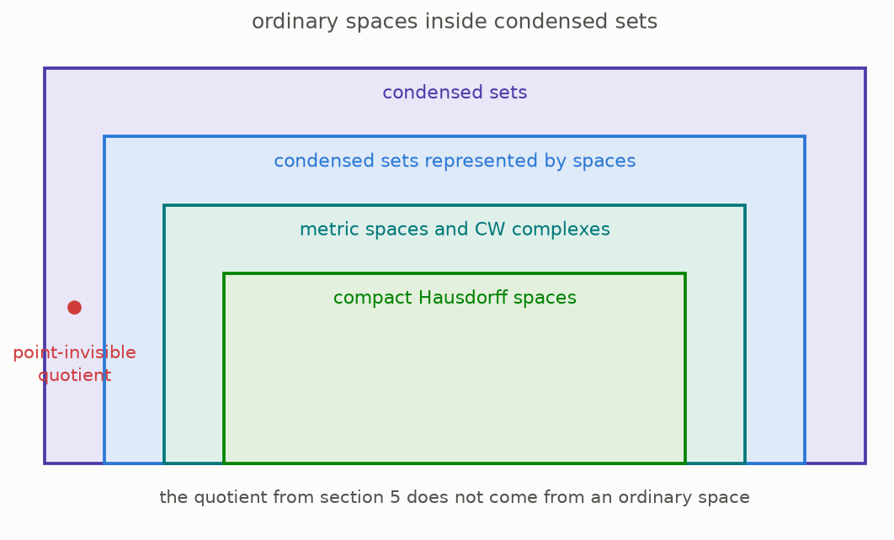
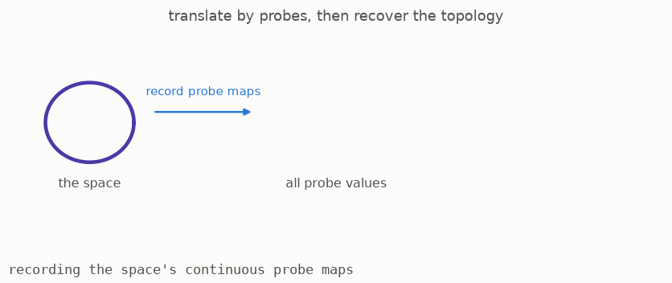

# 7 · Nothing was lost

*Part 1 of three: Shapes You Can Only See By Probing Them. Retells Lectures I to III of Scholze's [Lectures on Condensed Mathematics](https://arxiv.org/abs/2605.03658).*

Changing from spaces to answer sheets is useful only if familiar spaces and continuous maps can still be recovered. The concern is natural because an answer sheet contains far more entries than a point set. The relevant comparison theorem says that, for a broad class of ordinary spaces, the new description preserves exactly the original maps and keeps distinct spaces distinct.

Read the picture from the centre outward. Compact Hausdorff spaces correspond exactly to condensed sets that satisfy the matching compactness condition ([Theorem 2.16, page 17](https://arxiv.org/pdf/2605.03658v1#page=17)). In familiar Euclidean examples, these are the closed and bounded shapes. A larger surrounding class contains all metric spaces and spaces built from cells. On this larger class, the translation is fully faithful: different spaces have different answer sheets, and maps of answer sheets are exactly the continuous maps of spaces ([Proposition 1.7, page 9](https://arxiv.org/pdf/2605.03658v1#page=9)). Condensed sets extend beyond this image, as the ghost from section 5 demonstrates.

There is also a return construction. Begin with the point entries of an answer sheet, and declare a subset closed when every probe detects it as closed. For the broad class just described, translating a space into an answer sheet and then applying this construction returns the original topology. The animation follows that round trip.

The comparison has limits, and the lectures state them explicitly. If a topological space has a point that is not closed, its probe data do not define a condensed set of the required kind ([Warning 2.14, page 16](https://arxiv.org/pdf/2605.03658v1#page=16)). In the other direction, the return to ordinary topology can identify condensed information that topology cannot retain. One example involves compact objects built as increasing unions of strictly smaller closed pieces. The lectures interpret this as a limitation of ordinary topology, and note that the issue does not occur for countable colimits.

**[Play with this](https://muchmirul.github.io/conjectures/condensed-math/condensed-math01/play/07.html)** to follow a space through the translation and compare the recovered result with the starting space.

---

[← Probes that never need folding](../06-unfoldable-probes/README.md)  ·  [Counting holes →](../08-counting-holes/README.md)  ·  [all of part 1 on one page](../../ARTICLE.md)
