# Infinite Sums That Finally Land

*Part two of three on condensed mathematics. Endless sums are the reason topology was dragged into algebra in the first place. This part builds the rule that says when an endless sum has exactly one answer, finds the building blocks of everything obeying that rule, and ends by solidifying a doughnut and watching its holes fall out. Part one is assumed, and nothing else.*

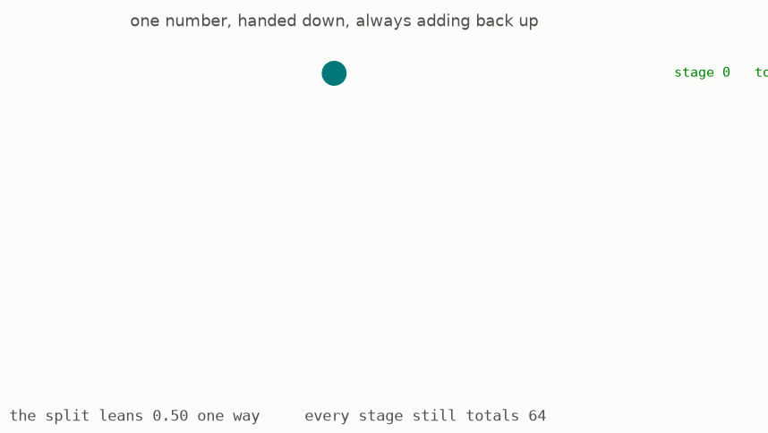

The animation shows the object this part is built on. Take a probe, the branching thing from part one, and put a number on each box. Then refine: split each box and split its number between the pieces, any way you like, as long as the pieces add back up to what the box had. Refine forever. What you are left with is called a **weighting** in this guide, and the surprise of this part is that weightings are the entire answer to a question about infinite sums that took a century to ask properly.

This is part two of three, covering Lectures IV to VI of Peter Scholze's *Lectures on Condensed Mathematics* ([arXiv:2605.03658](https://arxiv.org/abs/2605.03658), May 2026), joint work with Dustin Clausen. [Part one](../condensed-math01/ARTICLE.md) built probes and answer sheets and is assumed here. Part three carries all of this to rings and geometry.

Most sections have a [page you can play with](https://muchmirul.github.io/conjectures/condensed-math/condensed-math02/play/index.html).

```
    the problem again           1  sums with nowhere to land
    the answer                  2  weights that agree
                                3  every function is a stack of steps
                                4  products in, sums out
    the rule                    5  the solid rule
    two consequences            6  where the real line goes
                                7  the multiplication table
    the payoff                  8  solidify a shape, get its holes
```

**[Play with this](https://muchmirul.github.io/conjectures/condensed-math/condensed-math02/play/00.html)** to hand out weights yourself and watch the totals keep agreeing.

## 1 · Sums with nowhere to land

Part one repaired subtraction. It did not add anything up.

Consider adding one, then two, then four, then eight, doubling forever. In ordinary arithmetic the running totals are 1, 3, 7, 15, 31, and they run away. There is no answer. Every schoolchild knows this sum has no value.

Now measure size differently. Say a whole number is **small when it is divisible by a high power of two**: so 16 is smaller than 4, and 1024 is very small indeed. This is a real and consistent notion of size, used constantly in number theory, and it is exactly the size the counting-in-base-two probe from part one carries.

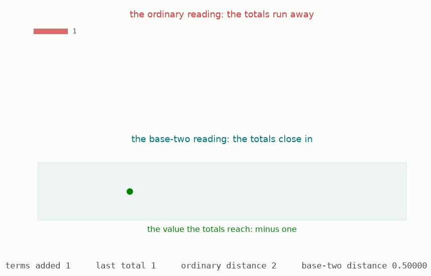

Under that size the running totals do something else entirely. The gaps between them are 2, 4, 8, 16, each one smaller than the last, and the totals close in on a single point. The animation shows both readings side by side: on the ordinary ruler the totals fly apart, and in the probe they nest into one box after another and converge.

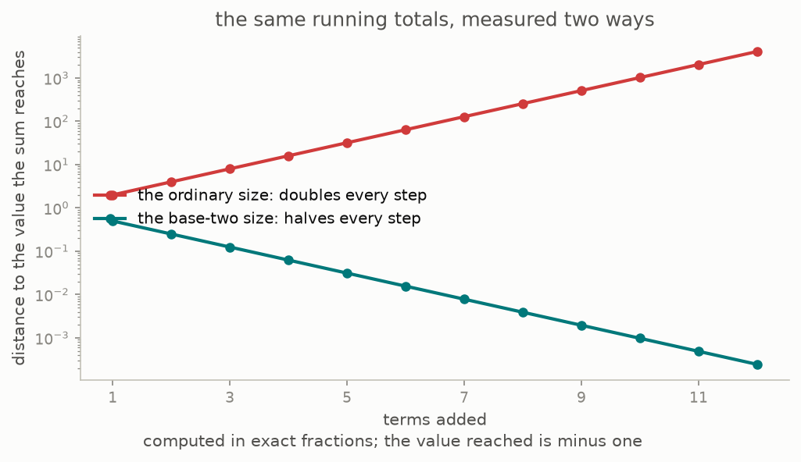

The chart is computed in this repository, in exact arithmetic. The ordinary distance doubles at every step. The base-two distance halves at every step, and the point the totals close in on is minus one. Adding an endless string of positive numbers and getting minus one is not a trick: it is what the doubling sum genuinely converges to under this size, and the tests here recompute both columns.

So the same endless sum has no answer under one notion of size and exactly one answer under another. This is the whole difficulty. An infinite sum is not a property of the numbers being added. It is a property of the numbers plus a decision about what near means, and that decision is precisely the topology that part one had to swallow into the answer sheet.

The question of this part is therefore: having swallowed the topology, how do we get the infinite sums back out?

**[Play with this](https://muchmirul.github.io/conjectures/condensed-math/condensed-math02/play/01.html)** to change the base and the number of terms, and watch the two size readings disagree.

## 2 · Weights that agree

Here is the answer, and it is the animation from the top of this page.

Take a probe. At the coarsest stage there is one box; give it a number. Split the box; split the number between the two new boxes, however you like, as long as the two add back to the original. Keep going forever. The result is a **weighting**: one number per box at every stage, with the rule that a box's number is always the total of the boxes inside it.

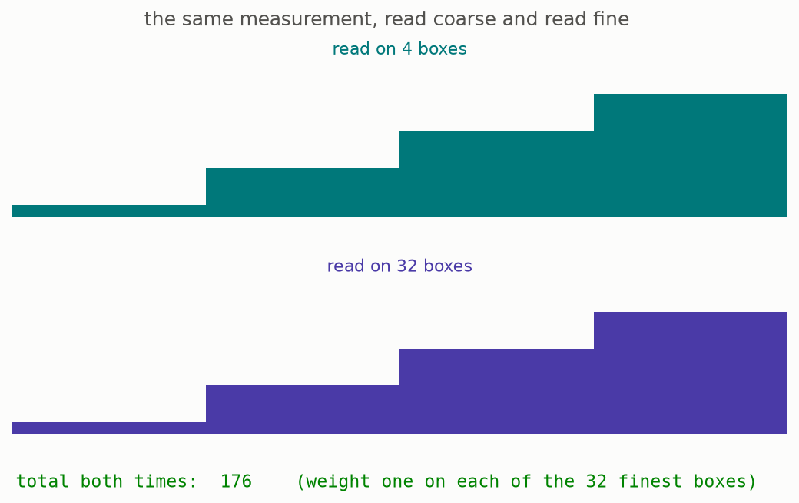

A weighting is exactly what you need to add things up. Suppose someone hands you a value for each box, and you want a single total. Multiply each box's value by the box's weight, and add. The picture shows the one property that makes this well posed: if you refine, and read the same values on the smaller boxes, the total does not change. This repository computes both readings and the tests check they agree, on the halving probe and on the base-p probe.

That is genuinely an infinite sum. The probe has infinitely many points, the weighting spreads a finite total across all of them, and the answer is a single number.

The lectures write the collection of all weightings on a probe as the free solid group on that probe, and build it as exactly this: the limit of the finite pictures, one copy of the whole numbers per box at each stage, fitting together down the levels ([Definition 5.1, page 33](https://arxiv.org/pdf/2605.03658v1#page=33)). Its elements are called measures on the probe, which is the ordinary word for a rule that assigns a size to every region.

Two things about weightings are worth carrying forward.

First, the simplest weighting is one unit sitting on a single point of the dust, and it is what you get by following one branch all the way down and putting every unit there. This repository builds those, checks the agreement rule holds, and uses them as the starting point of every picture that follows.

Second, and this is the move the whole part turns on: **a weighting is built entirely out of finite data**. At each stage it is a finite list of whole numbers. Nothing about it requires limits, completeness, convergence, or any of the apparatus that made the original problem hard. The infinite sum has been rebuilt out of finite bookkeeping.

**[Play with this](https://muchmirul.github.io/conjectures/condensed-math/condensed-math02/play/02.html)** to place weights, refine, and watch the agreement rule refuse an inconsistent split.

## 3 · Every function is a stack of steps

To understand weightings, understand what they are weighing.

A continuous whole-number-valued measurement on a probe is a simple thing. Because the values are whole numbers they cannot drift smoothly, so continuity forces the measurement to be constant on small enough boxes. In other words, every such measurement is decided at some finite stage, and is a plain function on a finite list of boxes.

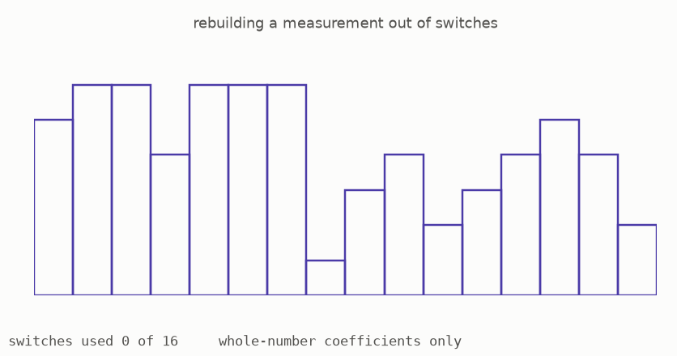

The animation takes such a measurement apart. Each step function is one box switched on and everything else switched off, or a product of a few such switches, and the original is rebuilt by stacking them with whole-number coefficients. The rebuild uses each step exactly once and needs no fractions.

That is a stronger statement than it looks, and it is a genuine theorem. The measurements on a probe form a group under addition, and the claim is that this group has a basis: a list of measurements such that everything is a whole-number combination of finitely many of them, in exactly one way. Groups with a basis are called free, and most groups are not.

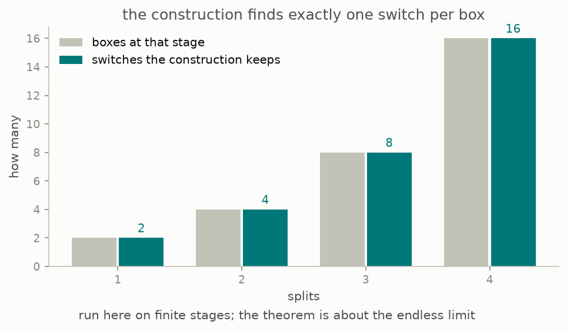

The theorem that this always works is due to Nöbeling, building on Specker, and the lectures give Bergman's proof of it ([Theorem 5.4, page 34](https://arxiv.org/pdf/2605.03658v1#page=34)). This repository runs that construction: it orders the products of switch functions, keeps each one that is not already a combination of earlier ones, and checks the result is a basis. The chart shows the count coming out equal to the number of boxes at every level, which is what a basis must give.

One honesty note. At any single finite stage, freeness is automatic and the computation checks only that the *construction* behaves. The theorem's content is entirely in the infinite limit, where it is not automatic and where nothing in this repository can reach. The tests say what they check and no more.

**[Play with this](https://muchmirul.github.io/conjectures/condensed-math/condensed-math02/play/03.html)** to draw a measurement on the probe and watch it get taken apart into steps.

## 4 · Products in, sums out

Now the shape of a weighting becomes visible, and it is startling.

Two different ways of having infinitely many whole numbers at once:

A **product** is an endless row of dials, each set independently, with no restriction at all. Every dial may be nonzero, forever.

A **sum** is the same endless row, but with a rule: only finitely many dials may be off zero. Everything past some point must be blank.

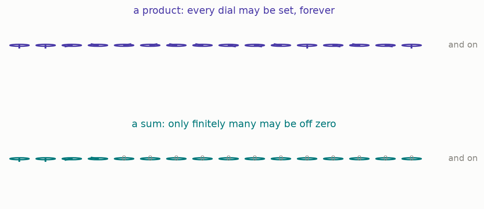

These are wildly different objects. Now the striking part: they are each other's mirror image, and the mirror is the operation of asking for a number.

Ask an endless product for a single whole number, in a way that respects addition. You might expect that such a question could sample all the dials at once, weighting them somehow. It cannot. Any such question reads only finitely many dials and ignores the rest.

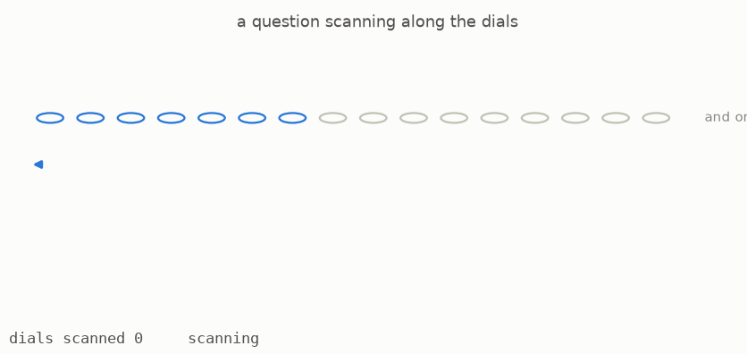

That is Specker's theorem from 1950, and the lectures use it constantly. The shape of the reason is worth a sentence, because it is the shape of section 6 below as well: a legal question is destroyed by divisibility. Settings that live only in the far tail of the row can be made divisible by as high a power of a number as you like, so the answer they force would have to be divisible by every such power, and the only whole number like that is zero. Making that precise is more work than one sentence, and this guide leaves it to the sources.

Ask an endless sum for a number, and the opposite happens: you may choose an answer for every dial independently, since only finitely many are ever on, so nothing diverges. The questions on a sum form a product.

Put these together with the previous section and the shape of a weighting falls out. The measurements on a probe form a free group, so they are a sum of copies of the whole numbers. The weightings are exactly the questions one can ask of the measurements. Therefore:

> Every collection of weightings on a probe is an endless product of copies of the whole numbers.

That is the lectures' Corollary 5.5 ([page 34](https://arxiv.org/pdf/2605.03658v1#page=34)). It is worth pausing on how blunt it is. Whatever probe you started with, however intricately it branched, the weightings on it are just a row of dials. All the structure has been pushed into how many dials there are.

**[Play with this](https://muchmirul.github.io/conjectures/condensed-math/condensed-math02/play/04.html)** to set dials in a product and a sum, and try to build a question that reaches past the end.

## 5 · The solid rule

Everything is now in place to state the rule this part is named for. Nothing new is needed: only weightings, from section 2.

A group is **solid** when it knows how to be summed against a weighting, and knows it in exactly one way.

Precisely: take any probe, and any way of placing the probe's points into the group. Then there must be exactly one way to extend that placement so that weightings can be integrated against it, agreeing with the placement on single points.

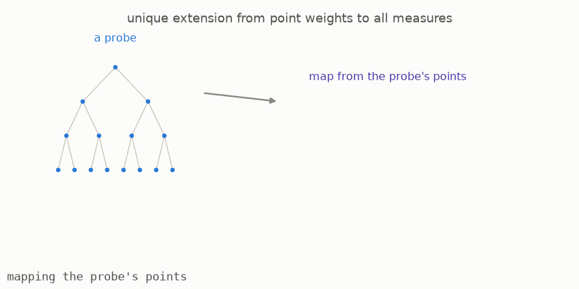

The animation shows what "exactly one way" buys. Once the extension exists, every weighting has a value, so every infinite sum the probe describes has an answer, and there is no ambiguity about which answer. Existence gives you the sums; uniqueness stops you inventing two different theories of the same sum.

The lectures state the rule in one line ([Definition 5.1, page 33](https://arxiv.org/pdf/2605.03658v1#page=33)) and spend a lecture and a half establishing that it behaves. What comes out is a full toolkit, and this is the central result of this part:

> The solid groups form a self-contained setting for algebra, closed under everything one wants to do. Its building blocks are exactly the endless products of copies of the whole numbers. Any group at all can be pushed into a solid one, in a best-possible way, and pushing is compatible with everything else.

That is Theorem 5.8 ([page 35](https://arxiv.org/pdf/2605.03658v1#page=35)) together with Corollary 6.1 ([page 42](https://arxiv.org/pdf/2605.03658v1#page=42)). The operation of pushing a group into a solid one is called solidification here; the lectures write it with a small square.

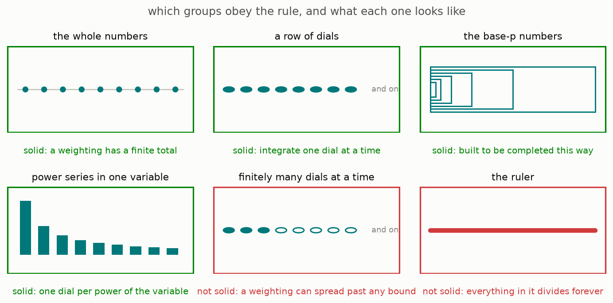

The picture sorts the guide's stock examples. The whole numbers are solid. Any endless product of copies of them is solid, and by the previous section that is every collection of weightings. The base-p numbers are solid, which is the promise of section 1 kept. Power series in a variable are solid. The real numbers are not, and the next section is about what happens to them.

**[Play with this](https://muchmirul.github.io/conjectures/condensed-math/condensed-math02/play/05.html)** to test candidate groups against the rule and see each verdict's reason.

## 6 · Where the real line goes

Solidify the real numbers and nothing comes out. Not a small thing: nothing at all.

That is not a defect being confessed. It is a precise statement in the lectures ([Corollary 6.1 (iii), page 42](https://arxiv.org/pdf/2605.03658v1#page=42)), and the reason is visible in one picture.

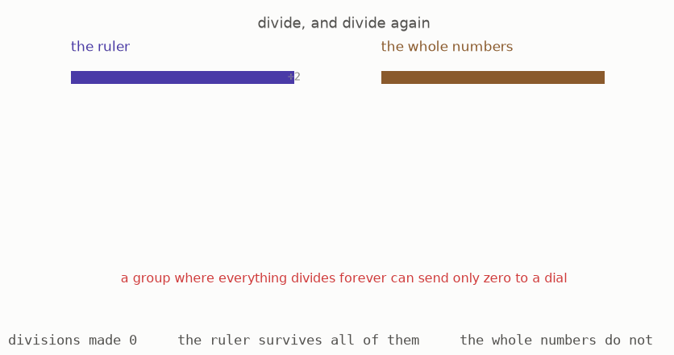

Every real number can be divided by two, and by three, and by every whole number, and the answer is again a real number. The animation shows a real number surviving division forever while a whole number falls off the lattice at the first step. A group where every element can always be divided like this is called divisible.

Now the collision. Section 5 said the building blocks of solid groups are rows of dials, and each dial holds a whole number. Ask what a divisible group can send into a single dial. Whatever a real number is sent to must itself be divisible by two, and by three, and by everything, because the sending respects division. The only whole number divisible by everything is zero. So every dial receives zero, and the whole row receives zero.

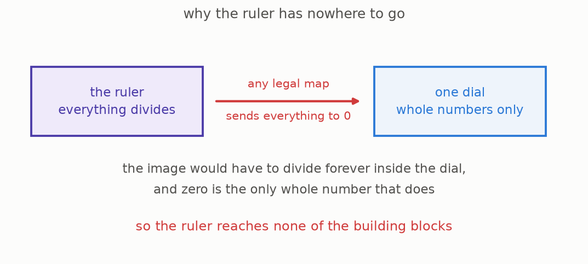

That settles the building blocks, and it is as far as this argument reaches on its own: the real line cannot touch a single one of the pieces solid groups are assembled from. Going from there to the full statement, that the solidification is zero and not merely small, is the lectures' step and it needs one more input, the computation of Lecture IV ([Theorem 4.3, page 25](https://arxiv.org/pdf/2605.03658v1#page=25)). With that in hand the conclusion is exactly what the picture suggests: the real numbers solidify to nothing.

Two things must be said plainly here, because this is where a reader is most likely to conclude the theory is broken.

**The theory is not claiming the real numbers are unimportant.** It is saying that this particular notion of completion is a nonarchimedean one, tuned to sizes like the base-p size of section 1, where near means divisible by a high power. The real line's notion of near is a different kind, and it needs a different completion. The lectures flag this in a footnote at the very moment solidity is defined ([page 33](https://arxiv.org/pdf/2605.03658v1#page=33)), and part three of this guide builds the real version.

**The collapse is useful, not merely tolerated.** Because real-valued measurements vanish, they cannot obstruct anything, and calculations that would otherwise carry an unbounded real-valued correction term simply lose it. Section 8 of part one already met this: real-valued hole counting returns nothing above the zeroth. That vanishing is what makes the key computation of Lecture IV go through ([Theorem 4.3, page 25](https://arxiv.org/pdf/2605.03658v1#page=25)), and that computation is what everything in this part rests on.

**[Play with this](https://muchmirul.github.io/conjectures/condensed-math/condensed-math02/play/06.html)** to divide numbers repeatedly and watch which groups survive it.

## 7 · The multiplication table

Solid groups can be multiplied together, in the sense that two of them combine into a third that handles pairs. The combination is called the completed tensor product, and its table is the most quotable thing in the lectures.

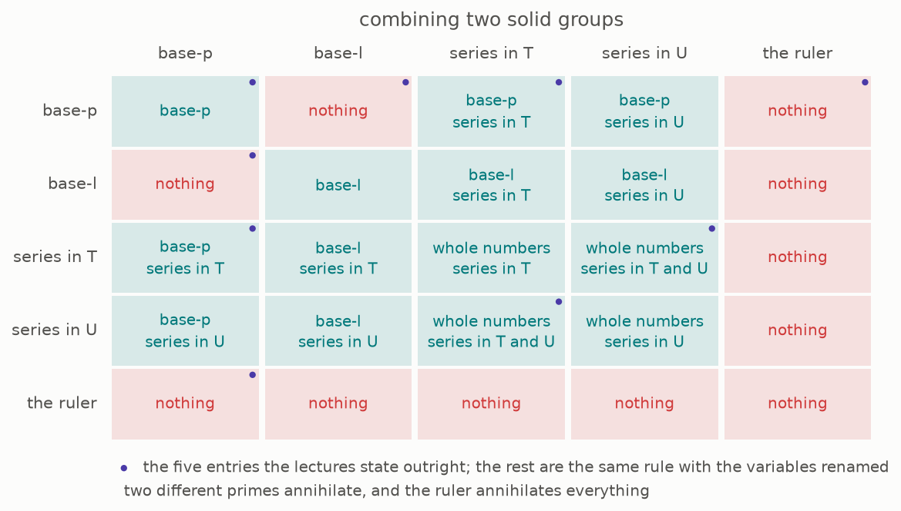

Read the grid. The base-two numbers combined with the base-three numbers give zero. The base-two numbers combined with themselves give the base-two numbers back. The base-two numbers combined with the real numbers give zero, which section 6 already explains. Power series in one variable combined with power series in another give power series in both.

The two-and-three entry is the surprising one, and it has a picture.

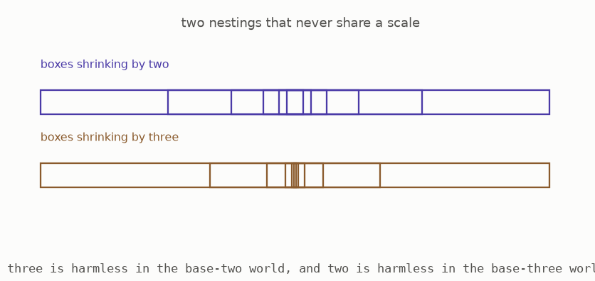

The base-two numbers are built by a nesting whose boxes shrink by twos, and the base-three numbers by a nesting whose boxes shrink by threes. Neither nesting can see the other's boxes: three is a unit in the base-two world, so dividing by three is harmless there, and two is a unit in the base-three world. Asking the two to agree on anything at all leaves nothing standing, and the product is zero.

The lectures summarise the pattern in a sentence worth quoting: the completed tensor product asks both sides which nesting they carry, and then keeps all of them ([Example 6.4, page 44](https://arxiv.org/pdf/2605.03658v1#page=44)). Two compatible nestings combine, two incompatible ones annihilate.

The one entry in the grid that this repository derives rather than transcribes is the power series row. Section 4 said a collection of weightings is a row of dials, and the lectures show that combining two such rows gives the row indexed by all pairs ([Proposition 6.3, page 43](https://arxiv.org/pdf/2605.03658v1#page=43)). A power series in one variable has one dial per power of that variable, so pairs of dials are pairs of powers, which is exactly a power series in two variables. The tests check that pairing, and mark the rest of the grid as quoted from the lectures.

**[Play with this](https://muchmirul.github.io/conjectures/condensed-math/condensed-math02/play/07.html)** to pick any two entries and see the product, with the nesting that explains it.

## 8 · Solidify a shape, get its holes

The last section of this part is the payoff, and it is a magic trick with a short explanation.

Take an ordinary shape: a circle, a doughnut surface, a sphere. Turn it into a group the cheapest possible way, by taking formal combinations of its points, with no relations imposed. Then solidify.

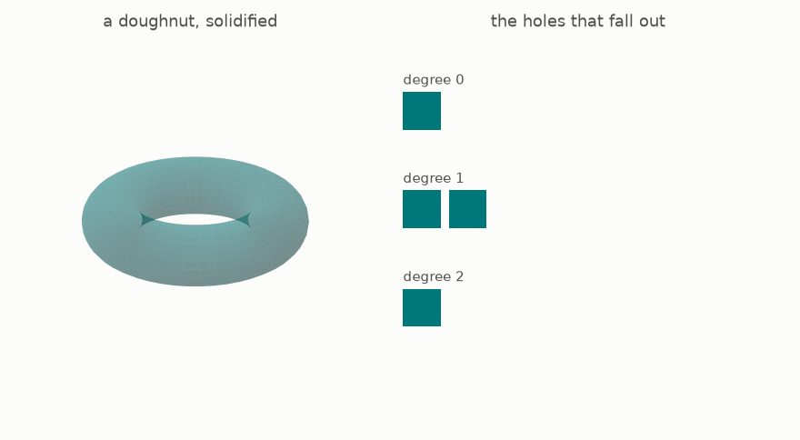

Out comes the shape's holes.

Not a shadow of them, not something related to them: the hole counts exactly, in every degree, torsion included. Solidification, an operation defined purely to make infinite sums behave, hands back the classical topology of the shape ([Example 6.5, page 44](https://arxiv.org/pdf/2605.03658v1#page=44)).

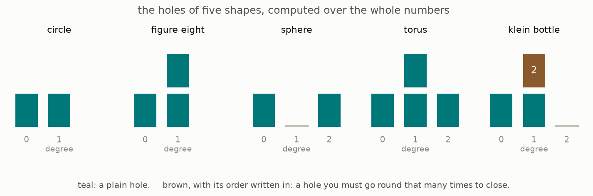

The bars are computed in this repository from cell-by-cell boundary data, over the whole numbers, using Smith normal form, so the torsion is genuine and not rounded away. A circle has one hole in degree one. A figure eight has two. A sphere has none in degree one and one in degree two. A doughnut has two and one. A Klein bottle has one hole in degree one plus a piece of order two, which is a hole you have to go round twice to close, and the computation finds it.

Why this happens is short. Part one, section 8 showed that counting holes with whole numbers is the same whether you count classically or inside the world of answer sheets. Solidification is defined by how it answers questions from rows of dials, and questions asked of a shape's formal combinations are exactly whole-number measurements on the shape, which is hole counting. The two descriptions meet, and the lectures make the identification precise in half a page.

The consequence worth keeping is the direction the information travels. Nobody put topology into the definition of solidity. Solidity was defined by a rule about infinite sums, section 5, and the topology came out anyway. That is the sense in which the subject is not a repackaging: it is one notion that turns out to be several.

**[Play with this](https://muchmirul.github.io/conjectures/condensed-math/condensed-math02/play/08.html)** to pick a shape, turn it in three dimensions, and read the holes that fall out.

## Where part two leaves you

Infinite sums have a home. A weighting is finite bookkeeping repeated forever; solid groups are the ones where weightings can be integrated, in exactly one way; their building blocks are rows of dials; and the operation that produces them recovers classical topology for free.

The real numbers are the declared casualty, and part three repairs them.

Everything so far has been about groups, which is to say about adding. Multiplication has not appeared. Adding a multiplication turns groups into rings, rings into spaces, and this whole apparatus into geometry, which is part three.

**[Part three: Rings That Know How To Integrate](../condensed-math03/ARTICLE.md)**

## How this part lines up with the lectures

| this guide | in the lectures |
|---|---|
| section 1, sums with nowhere to land | the motivation opening Lecture V, page 33 |
| section 2, weights that agree | Definition 5.1, page 33, the free solid group |
| section 3, every function is a stack of steps | Theorem 5.4, page 34, Nöbeling's theorem with Bergman's proof |
| section 4, products in, sums out | Corollary 5.5, page 34, and the biduality inside Proposition 5.7, page 35 |
| section 5, the solid rule | Definition 5.1, page 33; Theorem 5.8, page 35; Corollary 6.1, page 42 |
| section 6, where the real line goes | Corollary 6.1 (iii), page 42; Theorem 4.3, page 25; the footnote on page 33 |
| section 7, the multiplication table | Theorem 6.2 and Proposition 6.3, page 43; Example 6.4, page 44 |
| section 8, solidify a shape | Example 6.5, page 44 |

## Checking it yourself

```
cd condensed-math
make venv
make test
make figures
```

For this part, the tests:

- recompute the running totals of the doubling sum in exact arithmetic and confirm the ordinary distance doubles while the base-two distance halves, converging to minus one
- build weightings on the halving probe and the base-p probe and confirm the agreement rule at every level
- confirm that integrating a measurement read at a coarse level and at a refined one gives the same total
- run Bergman's basis construction and confirm the basis size equals the box count at each level
- check the pairing behind the power series row of the multiplication table: the dials of a two-variable series correspond exactly to pairs of dials of one-variable series
- confirm the transcribed multiplication table is symmetric and consistent with the nesting rule the lectures describe
- compute the holes of five shapes from boundary data by Smith normal form over the whole numbers, torsion included, and confirm the Klein bottle's piece of order two

What is quoted rather than computed: Nöbeling's theorem in the infinite case, the solid category's structure, the vanishing of the solidified real line, and the identification of solidification with hole counting. These are statements about whole categories or genuinely infinite objects, and no finite program reaches them. `notes/research-content.md` marks each one.

## Glossary

| this guide's plain phrase | the standard mathematical term |
|---|---|
| a weighting | a measure on a profinite set, an element of the free solid abelian group |
| the agreement rule | compatibility in the inverse limit |
| small when divisible by a high power | the p-adic absolute value |
| the base-p numbers | the p-adic integers |
| a row of dials, a product | a product of copies of the integers |
| a sum | a direct sum of copies of the integers |
| a question | a group homomorphism to the integers |
| solid | solid, in the lectures' sense |
| solidification | the left adjoint to the inclusion of solid groups |
| the completed tensor product | the solid tensor product |
| a nesting | an adic topology |
| divisible | divisible |
| the holes of a shape | the singular homology groups |
| a hole you go round twice | a torsion class of order two |
| the building blocks | the compact projective generators |

## Further reading

- The lectures: Peter Scholze, "Lectures on Condensed Mathematics", [arXiv:2605.03658](https://arxiv.org/abs/2605.03658), May 2026, joint work with Dustin Clausen. Lectures IV to VI are this part.
- For section 4: E. Specker, "Additive Gruppen von Folgen ganzer Zahlen" (1950), and G. Nöbeling, "Verallgemeinerung eines Satzes von Herrn E. Specker" (1968), both cited in the lectures for Theorem 5.4.
- `notes/research-content.md` marks every claim above as computed here or quoted.
