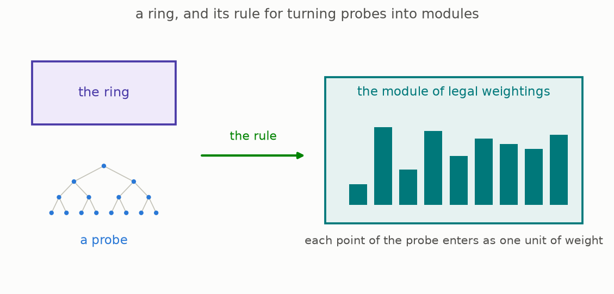
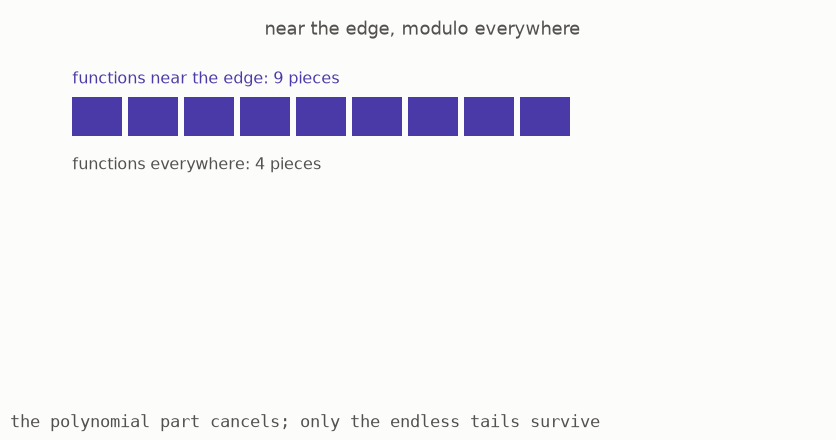
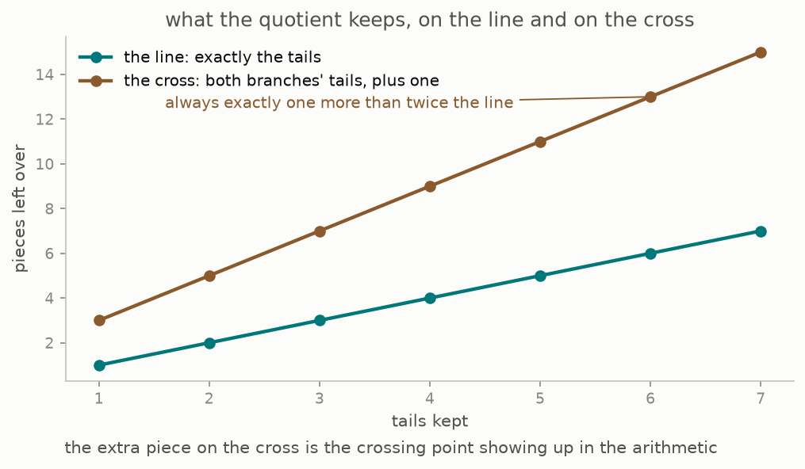

# Rings That Know How To Integrate

*Part three of three on condensed mathematics. Carry the rule of part two from adding to multiplying, and geometry follows: a ring that comes with its own notion of integration, the real line finally given a rule that fits it, functions living near the edge of a space, and a duality that used to be assembled by hand falling out of a single adjoint. Parts one and two are assumed.*


The animation is one number turning, and the shape it controls decides whether an entire theory exists. The shape is the set of measures of size at most one, and the number is the exponent used to measure them. Above one the shape bulges. At exactly one it is a diamond. Below one it caves inward and stops being convex. Section 3 shows why the boundary at one is not a matter of taste: past it, merging two boxes can make a measure bigger, and the whole construction of part two falls apart.

This is part three of three, covering Lectures VII to XI of Peter Scholze's *Lectures on Condensed Mathematics* ([arXiv:2605.03658](https://arxiv.org/abs/2605.03658), May 2026), joint work with Dustin Clausen. [Part one](../condensed-math01/ARTICLE.md) built probes; [part two](../condensed-math02/ARTICLE.md) built weightings and the solid rule. Both are assumed here, and nothing else is.

Most sections have a [page you can play with](https://muchmirul.github.io/conjectures/condensed-math/condensed-math03/play/index.html).

```
    the general notion          1  a ring with a rule for sums
                                2  two rules that work
                                3  the real line's own rule
    geometry appears            4  functions near the edge
                                5  cohomology with compact support
                                6  gluing the local pictures
    what it was all for         7  the six operations
                                8  duality, watched
```

**[Play with this](https://muchmirul.github.io/conjectures/condensed-math/condensed-math03/play/00.html)** to turn the exponent and watch the ball change shape.

## 1 · A ring with a rule for sums

Part two attached a rule for infinite sums to the whole numbers. This section says what that rule is in general, so it can be attached to anything.

A ring is a place where you can add, subtract and multiply. Part two's rule was about adding only. Now suppose we want the same service over a ring: given a probe, and a placement of the probe's points into a module over the ring, we want to integrate weightings against the placement.

The general notion needs two pieces of data ([Definition 7.1, page 45](https://arxiv.org/pdf/2605.03658v1#page=45)):

**The ring**, as an answer sheet in the sense of part one, so it may carry a topology without that topology sitting outside the algebra.

**A rule**, which for each probe hands back the module of legal weightings on it, together with the requirement that every point of the probe already counts as a weighting: the unit sitting on that point alone.



That is not yet enough. The pair must be well behaved, meaning roughly that the modules it produces really do form a self-contained world of their own, the way solid groups did in part two. A pair passing that test is called an **analytic ring** ([Definition 7.4, page 46](https://arxiv.org/pdf/2605.03658v1#page=46)), and this guide will simply say *a ring with a rule*.

The definition is short and the content is entirely in which pairs pass. It is genuinely possible to write down a ring and a plausible-looking rule that fails, and section 3 is about the most important such failure.

**[Play with this](https://muchmirul.github.io/conjectures/condensed-math/condensed-math03/play/01.html)** to assemble a rule and watch the requirements be checked one at a time.

## 2 · Two rules that work

Nothing new is needed here: the two rules that work are the two objects part two already built.

**The base-p rule.** Take the base-p numbers, and let the legal weightings be the ones part two built on the base-p probe. This passes ([Proposition 7.8, page 48](https://arxiv.org/pdf/2605.03658v1#page=48)).

**The solid rule over any plain ring.** Take any ring with no topology at all, and let the legal weightings be the solid ones from part two, carried across. This passes as well, by the same argument, and it is the workhorse of everything that follows.


The second one deserves a comment because it looks like it says nothing. A ring with no topology has nothing to complete; why does attaching a rule for infinite sums change anything?

The reason is that the modules are not required to be plain. The ring is discrete, but the things it acts on are answer sheets, and those can carry as much topology as they like. So the rule is a statement about the modules, not about the ring, and it says: among all the ways a module over this plain ring might carry a topology, these are the ones where infinite sums behave. That is exactly the setting in which the rest of this part does geometry, and the ring being plain is a feature, because it means no choices were made about the ring's own topology.

There is also a version for the fractions of the base-p numbers, where the legal weightings are the bounded ones, and more generally a rule attached to any pair consisting of a ring and a chosen subring of things of size at most one ([Remark 7.9, page 49](https://arxiv.org/pdf/2605.03658v1#page=49)). Section 6 uses that generality.

**[Play with this](https://muchmirul.github.io/conjectures/condensed-math/condensed-math03/play/02.html)** to compare what each rule lets you add up.

## 3 · The real line's own rule

Part two ended by solidifying the real line to nothing. Here is the repair, and it is the most concrete mathematics in this part.

To give the real numbers a rule, the legal weightings should be real-valued measures rather than whole-number ones, and they need a size, so that "bounded" means something. The obvious size adds up the absolute values of the weights. Call the exponent used to combine them **the exponent**: at exponent one you add the absolute values, at exponent two you add their squares and take a square root, and so on.

Now the crucial constraint, and it is forced by part two's agreement rule.

A weighting lives on a probe, so it exists at every level at once, and going up a level means merging boxes and adding their weights. If a weighting is small at a fine level, it must still be small after merging, or the levels cannot fit together at all. So merging must never make a measure bigger.


The chart is computed here and settles it. Merge a number of equal boxes into one and compare the size before and after. The ratio is at most one exactly when the exponent is at most one, and it grows without bound as the exponent rises. At exponent two, merging four equal boxes doubles the size. There is nothing to negotiate: the exponent must not pass one ([Example 7.10, page 49](https://arxiv.org/pdf/2605.03658v1#page=49)).


And here is the cost, which is the reason this is hard. Below exponent one the unit ball is no longer convex, as the picture shows: the straight line between two points of the ball leaves the ball. Convexity is exactly what classical functional analysis is built on, so the natural region is the one where the theory is *not* classical.

Now the trap. The obvious first try is exponent exactly one, the ordinary bounded measures, which are convex and completely standard. That rule **fails** ([Example 7.10, page 49](https://arxiv.org/pdf/2605.03658v1#page=49)). The obstruction is a 1979 construction of Ribe: an extension of one complete convex space by another which is itself complete but not convex. It cannot be argued away, and it survives at every exponent below one as well, so no single exponent gives a working rule.

The fix is to refuse to pick one. Take a target exponent and allow every weighting that is bounded at *some* smaller exponent, sweeping over all of them.

> With the exponents swept rather than fixed, the real numbers do get a rule that works, for every target exponent up to one.

That is Theorem 7.11 ([page 50](https://arxiv.org/pdf/2605.03658v1#page=50)), proved in the companion paper rather than in the lectures themselves. The lectures state it and move on, and this guide does the same. In the literature the resulting objects are called liquid rather than solid, and they are how analysis over the real and complex numbers enters this subject.

One thing to notice about the shape of this argument, since it is the shape of the whole subject: the constraint came from bookkeeping, not from analysis. Nothing about limits or completeness forced the exponent below one. What forced it was that boxes merge and weights add.

**[Play with this](https://muchmirul.github.io/conjectures/condensed-math/condensed-math03/play/03.html)** to turn the exponent, merge boxes, and watch the size ratio cross one.

## 4 · Functions near the edge

Geometry starts here, and it starts with a question about edges.

Take the simplest space with an edge: an endless line, with coordinates running out forever in one direction. The polynomials are the functions defined on all of it. Now stand very far out and ask what functions look like *there*, near the edge, ignoring everything in the middle.


Far out, the coordinate is huge, so its reciprocal is tiny, and the natural thing to expand in is that reciprocal. A function near the edge is a series in one-over-the-coordinate, allowed finitely many positive powers and endlessly many negative ones. Call this the **edge ring**. The lectures write it as the formal Laurent series in the inverse coordinate and it is the central object of Lecture VIII.

Two features matter. Every polynomial is also a function near the edge, by just reading it out there, so the polynomials sit inside the edge ring. And the edge ring is much bigger, because of all the endless negative tails.

The quotient, functions near the edge modulo functions everywhere, is the object that does the work. Its elements are exactly the endless tails, with the polynomial part discarded as irrelevant.


The picture shows the example the lectures compute in full ([Remark 8.5, page 54](https://arxiv.org/pdf/2605.03658v1#page=54)): the coordinate cross, two lines glued at a single point. It has an edge at each end, each end contributes its own tails, and the shared point ties the two branches together in exactly one place. This repository computes the quotient's size for that shape by truncation, and the count comes out as the tails from each branch plus a single extra piece left over from the shared point, which is the arithmetic fingerprint of the crossing.

Why any of this is worth doing is the next section.

**[Play with this](https://muchmirul.github.io/conjectures/condensed-math/condensed-math03/play/04.html)** to slide out to the edge and watch which terms of a function survive.

## 5 · Cohomology with compact support

There are two natural ways to collect up the functions on a space.

**Everything.** Take all the functions, on the whole space, and record them. This is the ordinary one and it always works.

**Only what dies at the edge.** Take the functions that vanish near the edge, or more precisely the ones that can be pushed off the edge, and record those. This is the compactly supported one, and classically it is much harder to define for the kind of functions algebraic geometry uses.



Here it is nearly free. Section 4 built functions near the edge and the functions everywhere sitting inside them. The compactly supported collection is assembled from exactly that comparison, and the construction goes through because both sides are modules over a ring with a rule, so infinite sums behave in every step ([Theorem 8.1, page 53](https://arxiv.org/pdf/2605.03658v1#page=53)).

What comes out is stronger than the construction:

> The compactly supported collection has a partner: a second operation that is its exact counterweight, meaning that maps out of anything the first operation produces correspond exactly, and in only one way, to maps into what the second produces. Applying that partner to the simplest possible input returns one specific object, and that object is the classical dualizing complex.

That is Theorem 8.2 ([page 53](https://arxiv.org/pdf/2605.03658v1#page=53)). The dualizing complex is the gadget classical duality theory needs and which classically has to be constructed by hand, with cases and choices. Here it is whatever the counterweight produces, with no choices at all.



The lectures make this concrete on the cross of section 4 and get a formula for its dualizing complex directly out of the tails ([Remark 8.5, page 54](https://arxiv.org/pdf/2605.03658v1#page=54)). This repository reproduces the counting side of that formula by truncation.

Two remarks in the lectures are worth carrying, because they say what was gained.

The compactly supported operation does not preserve ordinary discrete objects, and it *cannot*, since the tails are genuinely infinite. So it does not exist, even naively, in the classical setting: this operation is only available because the modules are allowed to be answer sheets. Yet its counterweight does land back among ordinary objects, which is why the classical theory could see the answer without being able to see the route ([the discussion under Theorem 8.2, page 53](https://arxiv.org/pdf/2605.03658v1#page=53)).

And the finiteness statements of classical coherent cohomology, that certain collections of functions are finitely generated, become the statement that this operation preserves a purely formal notion of smallness ([Remark 8.3, page 54](https://arxiv.org/pdf/2605.03658v1#page=54)).

**[Play with this](https://muchmirul.github.io/conjectures/condensed-math/condensed-math03/play/05.html)** to form the quotient yourself on the line and on the cross.

## 6 · Gluing the local pictures

So far the spaces have been affine: one ring, one coordinate patch. Real geometry is patches glued together, so the machinery has to survive gluing.

The patches used here are slightly richer than a plain ring. Along with the ring of functions you carry a chosen subring: the functions you have decided to call **size at most one**. The pair determines a space of valuations, meaning a space whose points are the consistent ways of measuring how big each function is ([Proposition 9.2, page 63](https://arxiv.org/pdf/2605.03658v1#page=63)).


The picture shows the effect of the choice. Every choice of subring cuts out a region of the valuation space, and the lectures prove the correspondence runs exactly both ways: the subring determines the region and the region determines the subring, with nothing lost either way. Choosing a subring is choosing how much of the space you are looking at.


Then the gluing theorem ([Theorem 9.8, page 65](https://arxiv.org/pdf/2605.03658v1#page=65)): the assignment sending each patch to its theory of modules is a sheaf, so local theories that agree on overlaps determine exactly one theory on the union. That is what licenses everything global.

Two honest notes.

Gluing derived categories in the old-fashioned sense does not work: one has to track homotopies between homotopies, without end, and the classical derived category has thrown that information away. The lectures pass to the higher-categorical version at precisely this point and say so plainly. The statement is unchanged; the technology underneath it is not.

And the proof is the same proof as classical Zariski descent: cover the space by the places where one function is invertible, and check exactness there, where the cover splits. Nothing exotic enters. The whole of Lecture X is spent making the two supporting lemmas, that localisations commute and that a module which is locally zero is zero, hold in this setting.

**[Play with this](https://muchmirul.github.io/conjectures/condensed-math/condensed-math03/play/06.html)** to choose which functions count as small and watch the region move.

## 7 · The six operations

Everything now assembles into the standard shape that modern geometry organises itself around. Nothing new is required: the six operations are the ones already built.


Reading the diagram. To each space one attaches a category of sheaves. Then there are three pairs, each pair being an operation and its exact counterweight:

**Combine and separate.** A way of multiplying two sheaves together, and its partner that asks what one sheaf does to another.

**Pull back and push forward.** Given a map of spaces, a way of dragging a sheaf backwards along it, and its partner pushing forwards.

**Push forward with compact support, and its counterweight.** Section 5's operation, and the one that produced the dualizing object.

The lectures state plainly which of these is the difficulty. The first four are easy; constructing the third pair is where the work is, and it is the only reason condensed mathematics was needed at all in this story ([the discussion after Theorem 11.1, page 72](https://arxiv.org/pdf/2605.03658v1#page=72)).

Two rules pin the third pair down. When the map is proper, meaning nothing escapes to the edge, pushing forward with compact support is just pushing forward. When the map is an open inclusion, the counterweight is just the pullback. Between them these force the definition everywhere, by factoring any reasonable map into an open inclusion followed by a proper map. The lectures note the standard consequence: since the definition is forced, the real content is checking it does not depend on how you factored.

**[Play with this](https://muchmirul.github.io/conjectures/condensed-math/condensed-math03/play/07.html)** to move a sheaf around a map with each operation and see where it lands.

## 8 · Duality, watched

The last section is what the whole course was pointing at.

Duality is a pairing. Take a space, take a collection of functions on it, and duality says: this collection and that other collection fit together into a single number, perfectly, with no slack. Knowing one determines the other. On a surface it relates the functions to the differentials, and on a curve it is the reason the classical Riemann-Roch bookkeeping works.


The camera goes round so the surface is genuinely three-dimensional, and the two partners are drawn on it: one class in a low degree, one in the complementary degree, and the number they produce together.

Here is the statement the lectures reach ([Theorem 11.1, page 71](https://arxiv.org/pdf/2605.03658v1#page=71)). For a nice map from a space down to a base, there is a compactly supported pushforward, it agrees with ordinary pushforward when nothing escapes, and there is a **trace**: one canonical way of turning the top-degree compactly supported classes into a single number on the base. Pairing against that trace is a perfect duality, with no conditions attached.


Three things about this are worth stating flatly, because they are what the guide has been building towards.

**The duality is not assembled.** Classically the dualizing object is constructed, case by case, and duality is then proved. Here the dualizing object is defined as whatever the counterweight of section 5 produces, and the duality is the adjointness that defines it. There is nothing left to prove about its existence.

**Finiteness comes out rather than in.** The classical theorem that the cohomology of a proper map is finitely generated is recovered, in the lectures' framing, as the statement that the compactly supported operation preserves formal smallness, combined with the fact that ordinary pushforward keeps things discrete ([Remark 8.3, page 54](https://arxiv.org/pdf/2605.03658v1#page=54)).

**The route does not exist classically.** The compactly supported operation genuinely leaves the world of ordinary modules, because functions near the edge are endless tails. It comes back at the end. The middle of the argument lives somewhere the classical language cannot express, which is the entire reason for the apparatus of parts one and two.

**[Play with this](https://muchmirul.github.io/conjectures/condensed-math/condensed-math03/play/08.html)** to pair classes yourself and watch the trace collapse them to a number.

## Where this leaves you

Three parts, one idea. A space is what it says to probes. A group is solid when it knows how to sum weightings, in exactly one way. A ring plus a rule for weightings is enough to do geometry, and doing geometry that way makes duality an adjointness rather than a construction.

What is honestly outstanding is worth saying, since the lectures say it themselves. These notes are a record of a 2019 course, published in this stable form in May 2026, and the subject moved on: the general theory of analytic rings, the real and complex case, the light variant, and analytic stacks all live in later work by Clausen and Scholze that the preface points at. The lectures also flag results used without full published proofs, in particular the universal resolution of Lecture IV, which the lectures prove in an appendix precisely because the literature does not contain one ([Remark 4.6, page 25](https://arxiv.org/pdf/2605.03658v1#page=25)).

This guide is a reading aid for those notes, not a substitute for them, and every section points at the numbered result it retells.

## How this part lines up with the lectures

| this guide | in the lectures |
|---|---|
| section 1, a ring with a rule | Definition 7.1, page 45; Definition 7.4, page 46 |
| section 2, two rules that work | Proposition 7.8, page 48; Remark 7.9, page 49 |
| section 3, the real line's own rule | Example 7.10, page 49; Theorem 7.11, page 50 |
| section 4, functions near the edge | Lecture VIII from page 53; Remark 8.5, page 54 |
| section 5, cohomology with compact support | Theorem 8.1 and Theorem 8.2, page 53; Remarks 8.3 to 8.5, page 54 |
| section 6, gluing the local pictures | Proposition 9.2, page 63; Theorem 9.8, page 65; Lecture X from page 66 |
| section 7, the six operations | the discussion after Theorem 11.1, page 72 |
| section 8, duality, watched | Theorem 11.1, page 71; Remark 8.4, page 54 |

## Checking it yourself

```
cd condensed-math
make venv
make test
make figures
```

For this part, the tests:

- compute how a measure's size changes when boxes are merged, and confirm the ratio is at most one exactly when the exponent is at most one
- confirm the closed form for the worst case: merging a number of equal boxes changes the size by that number raised to one minus the reciprocal of the exponent
- confirm the unit ball is convex at and above exponent one and not convex below it
- count the tails on the line and on the coordinate cross by truncation, and confirm the cross keeps one extra piece beyond the two branches' tails
- confirm the counts are stable as the truncation is pushed further out

Everything categorical here is quoted: the definition of an analytic ring passing its test, the gluing theorem, the six operations, and the duality theorem. These are statements about categories and no program checks them. `notes/research-content.md` marks each claim.

## Glossary

| this guide's plain phrase | the standard mathematical term |
|---|---|
| a ring with a rule | an analytic ring |
| the rule | the theory of measures |
| the exponent | the p of the ell-p norm on measures |
| swept exponents | the colimit over exponents below the target, the liquid theory |
| the edge ring | the formal Laurent series in the inverse coordinate |
| functions near the edge | sections over the complement of the compact part |
| tails | the strictly negative part of a Laurent expansion |
| compactly supported collection | cohomology with compact support, the lower-shriek pushforward |
| the counterweight | the right adjoint, upper-shriek |
| the dualizing object | the dualizing complex |
| size at most one | a chosen integrally closed subring, the plus part of a Huber pair |
| valuation space | the space of equivalence classes of valuations |
| the trace | the trace map of coherent duality |
| the six operations | tensor, internal hom, pullback, pushforward, and the compactly supported pair |
| nothing escapes to the edge | properness |

## Further reading

- The lectures: Peter Scholze, "Lectures on Condensed Mathematics", [arXiv:2605.03658](https://arxiv.org/abs/2605.03658), May 2026, joint work with Dustin Clausen. Lectures VII to XI are this part. The preface lists the later work where each thread continues.
- For section 3: M. Ribe, "Examples for the nonlocally convex three space problem" (1979), and N. Kalton's follow-up, both cited in the lectures at Example 7.10.
- For section 6: R. Huber's work on adic spaces, cited in the lectures for the local structure results of Lecture X.
- `notes/research-content.md` marks every claim above as computed here or quoted.
