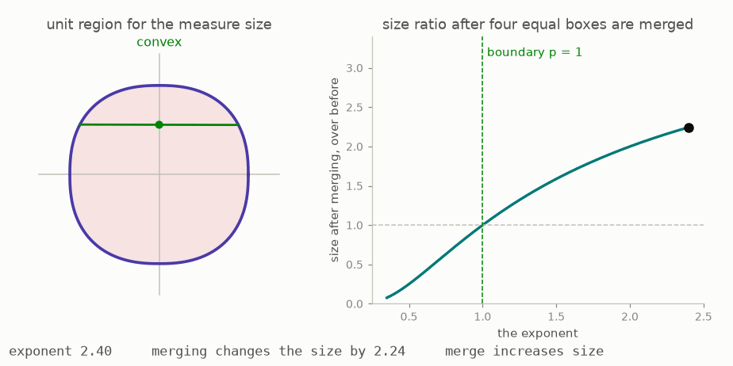

# Start here

*Part 3 of three: Rings That Know How To Integrate. Retells Lectures VII to XI of Scholze's [Lectures on Condensed Mathematics](https://arxiv.org/abs/2605.03658).*

*Part three of three on condensed mathematics. Part two gave abelian groups a rule for integrating integer-valued measures. This final part lets each ring carry an appropriate theory of measures, including one suited to the real numbers. With multiplication and integration available together, the same framework builds functions near a boundary, compactly supported cohomology, the six operations, and coherent duality. Parts one and two are assumed.*



The animation previews the central example. Each shape contains the pairs of weights whose size is at most one, and the exponent determines how that size is measured. For exponents above one, the region is convex and rounded. At one it becomes a diamond, while below one it bends inward and is no longer convex. At the same time, merging several boxes preserves the size bound only when the exponent is at most one. The real theory must therefore work in the nonconvex range, which explains why ordinary functional analysis is not sufficient.

This is part three of three, covering Lectures VII to XI of Peter Scholze's *Lectures on Condensed Mathematics* ([arXiv:2605.03658](https://arxiv.org/abs/2605.03658), May 2026), joint work with Dustin Clausen. [Part one](../condensed-math01/ARTICLE.md) introduced probes and condensed sets, while [part two](../condensed-math02/ARTICLE.md) developed integer-valued measures and solid groups. Both parts are used here, but no other background is assumed. Most sections include a [page you can play with](https://muchmirul.github.io/conjectures/condensed-math/condensed-math03/play/index.html) that turns the main abstract choice into a finite activity.

```
    the general notion          1  a ring with a rule for sums
                                2  two rules that work
                                3  the real line's own rule
    geometry appears            4  functions near the edge
                                5  cohomology with compact support
                                6  gluing the local pictures
    what it was all for         7  the six operations
                                8  duality, watched
```

**[Play with this](https://muchmirul.github.io/conjectures/condensed-math/condensed-math03/play/00.html)** to vary the exponent and compare convexity with the effect of merging boxes.

---

[A ring with a rule for sums →](../01-a-ring-with-a-rule/README.md)  ·  [all of part 3 on one page](../../ARTICLE.md)
