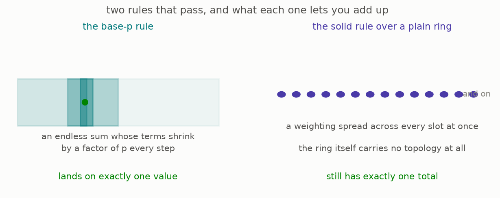

# 2 · Two rules that work

*Part 3 of three: Rings That Know How To Integrate. Retells Lectures VII to XI of Scholze's [Lectures on Condensed Mathematics](https://arxiv.org/abs/2605.03658).*

Nothing new is needed here, because the two rules that work are the two objects part two already built:

**The base-p rule.** Take the base-p numbers, and let the legal weightings be the ones part two built on the base-p probe. This passes ([Proposition 7.8, page 48](https://arxiv.org/pdf/2605.03658v1#page=48)).

**The solid rule over any plain ring.** Take any ring with no topology at all, and let the legal weightings be the solid ones from part two, carried across. This passes as well, by the same argument, and it is the workhorse of everything that follows.

The second one deserves a comment because it looks like it says nothing. A ring with no topology has nothing to complete, so attaching a rule for infinite sums seems to add nothing either.

The reason it does add something is that the modules are not required to be plain. The ring is discrete, but the things it acts on are answer sheets, and an answer sheet can carry any amount of topology. This means that the rule is a statement about the modules rather than about the ring: among all the ways a module over this plain ring might carry a topology, these are the ones where infinite sums behave. That is exactly the setting in which the rest of this part does geometry, and the ring being plain helps, because it means no choices were made about the ring's own topology.

There is also a version for the fractions of the base-p numbers, where the legal weightings are the bounded ones, and more generally a rule attached to any pair consisting of a ring and a chosen subring of things of size at most one ([Remark 7.9, page 49](https://arxiv.org/pdf/2605.03658v1#page=49)). Section 6 uses that generality.

**[Play with this](https://muchmirul.github.io/conjectures/condensed-math/condensed-math03/play/02.html)** to compare what each rule lets you add up.

---

[← A ring with a rule for sums](../01-a-ring-with-a-rule/README.md)  ·  [The real line's own rule →](../03-the-real-lines-own-rule/README.md)  ·  [all of part 3 on one page](../../ARTICLE.md)
