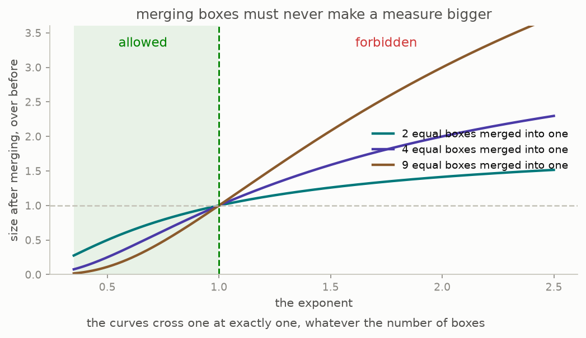
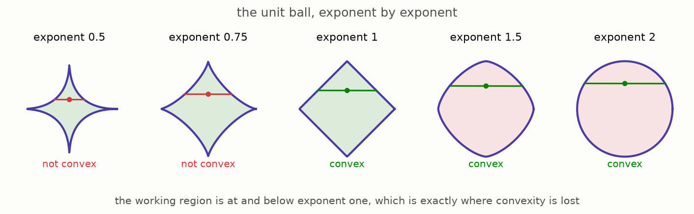

# 3 · The real line's own rule

*Part 3 of three: Rings That Know How To Integrate. Retells Lectures VII to XI of Scholze's [Lectures on Condensed Mathematics](https://arxiv.org/abs/2605.03658).*

Part two ended by solidifying the real line to nothing. Here is the repair, and it is the most concrete mathematics in this part.

To give the real numbers a rule, the legal weightings should be real-valued measures rather than whole-number ones, and they need a size, so that "bounded" means something. The obvious size adds up the absolute values of the weights. Call the exponent used to combine them **the exponent**: at exponent one you add the absolute values, at exponent two you add their squares and take a square root, and so on.

Now the crucial constraint, and it is forced by part two's agreement rule.

A weighting lives on a probe, so it exists at every level at once, and going up a level means merging boxes and adding their weights. If a weighting is small at a fine level, it must still be small after merging, or the levels cannot fit together at all. So merging must never make a measure bigger.

The chart is computed here and settles it. Merge a number of equal boxes into one and compare the size before and after. The ratio is at most one exactly when the exponent is at most one, and it grows without bound as the exponent rises. At exponent two, merging four equal boxes doubles the size. There is nothing to negotiate: the exponent must not pass one ([Example 7.10, page 49](https://arxiv.org/pdf/2605.03658v1#page=49)).

And here is the cost, which is the reason this is hard. Below exponent one the unit ball is no longer convex, as the picture shows: the straight line between two points of the ball leaves the ball. Convexity is exactly what classical functional analysis is built on, so the natural region is the one where the theory is *not* classical.

Now the trap. The obvious first try is exponent exactly one, the ordinary bounded measures, which are convex and completely standard. That rule **fails** ([Example 7.10, page 49](https://arxiv.org/pdf/2605.03658v1#page=49)). The obstruction is a 1979 construction of Ribe: an extension of one complete convex space by another which is itself complete but not convex. It cannot be argued away, and it survives at every exponent below one as well, so no single exponent gives a working rule.

The fix is to refuse to pick one. Take a target exponent and allow every weighting that is bounded at *some* smaller exponent, sweeping over all of them.

> With the exponents swept rather than fixed, the real numbers do get a rule that works, for every target exponent up to one.

That is Theorem 7.11 ([page 50](https://arxiv.org/pdf/2605.03658v1#page=50)), proved in the companion paper rather than in the lectures themselves. The lectures state it and move on, and this guide does the same. In the literature the resulting objects are called liquid rather than solid, and they are how analysis over the real and complex numbers enters this subject.

One thing to notice about the shape of this argument, since it is the shape of the whole subject: the constraint came from bookkeeping, not from analysis. Nothing about limits or completeness forced the exponent below one. What forced it was that boxes merge and weights add.

**[Play with this](https://muchmirul.github.io/conjectures/condensed-math/condensed-math03/play/03.html)** to turn the exponent, merge boxes, and watch the size ratio cross one.

---

[← Two rules that work](../02-two-that-work/README.md)  ·  [Functions near the edge →](../04-functions-near-the-edge/README.md)  ·  [all of part 3 on one page](../../ARTICLE.md)
