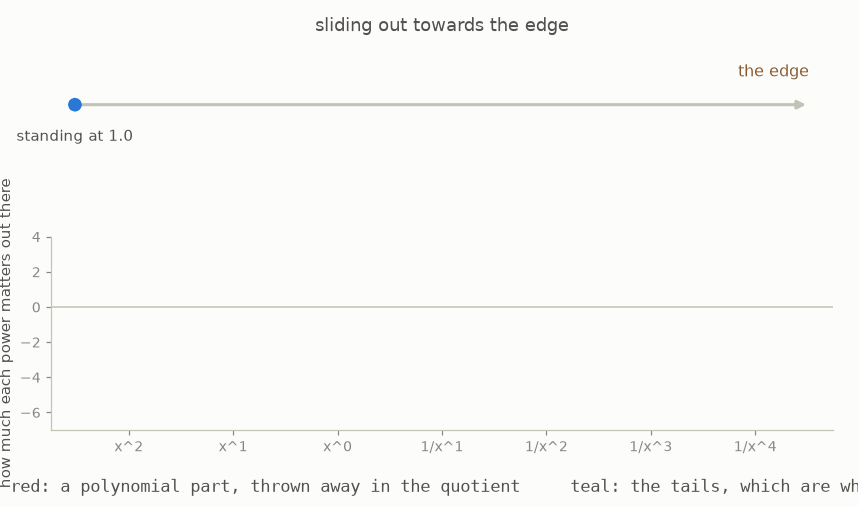
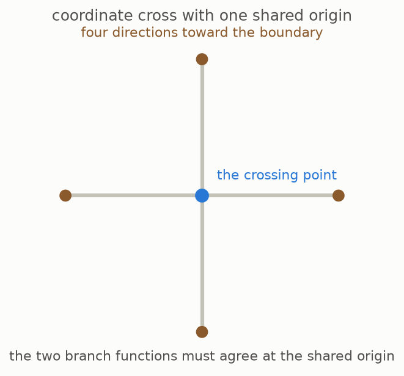

# 4 · Functions near the edge

*Part 3 of three: Rings That Know How To Integrate. Retells Lectures VII to XI of Scholze's [Lectures on Condensed Mathematics](https://arxiv.org/abs/2605.03658).*

We now turn from analysis to geometry. Begin with the affine line, whose global functions are polynomials in one coordinate. To study what happens far from its finite part, introduce the reciprocal coordinate. When the original coordinate is large, its reciprocal is small, so series in the reciprocal describe functions in a formal neighbourhood of infinity.



Such a series may contain finitely many positive powers of the original coordinate and infinitely many negative powers. The lectures call the resulting ring of formal Laurent series the functions near the boundary. This guide calls it the **edge ring**. The animation moves toward the boundary while assembling the terms that remain meaningful there.

Every polynomial has an expansion near infinity, so the polynomial ring maps into the edge ring. The edge ring also contains infinite negative-power tails that no polynomial can have. Comparing the two rings separates information defined everywhere from information that exists only near the boundary.

The quotient of the edge ring by the polynomial ring discards every global polynomial contribution. What remains consists of the boundary tails. This quotient is the concrete object used in the next section to build compactly supported cohomology.



The lectures work out the coordinate cross, defined by two coordinate axes meeting at one point ([Remark 8.5, page 54](https://arxiv.org/pdf/2605.03658v1#page=54)). Each branch contributes its own Laurent tails, while the shared value at the crossing imposes one relation between the global functions. The finite truncation in this repository counts the quotient as the tails from both branches plus one additional piece associated with that shared point. The count stabilizes as the truncation is extended.

### The mathematics

Begin with the affine line and its coordinate $T$. Lecture VIII uses the boundary ring

```math
A=\mathbb Z[T],
\qquad
A_\infty=\mathbb Z((T^{-1})),
\qquad
A_\infty/A=\mathbb Z((T^{-1}))/\mathbb Z[T].
```

The coordinate cross has two branches and one shared origin. [Remark 8.5, page 54 of the lectures](https://arxiv.org/pdf/2605.03658v1#page=54) writes

```math
A=\mathbb Z[X,Y]/(XY),
\qquad
A_\infty=\mathbb Z((X^{-1}))\times\mathbb Z((Y^{-1})),
```

```math
A_\infty/A=
\frac{\mathbb Z((X^{-1}))\times\mathbb Z((Y^{-1}))}
{\mathbb Z[X,Y]/(XY)}.
```

**Reading the symbols.** The ring $A=\mathbb Z[T]$ contains polynomials in the coordinate $T$. The double parentheses in $\mathbb Z((T^{-1}))$ mean formal Laurent series in the inverse coordinate: infinitely many negative powers of $T$ are allowed, but only finitely many positive powers. The subscript $\infty$ marks functions near the boundary. The quotient $A_\infty/A$ identifies two boundary series when they differ by a global polynomial. For the cross, $X$ and $Y$ are its two coordinates, and the relation $XY=0$ forces points to lie on one axis or the other. The product sign $\times$ keeps one Laurent tail for each branch.

**Why it matters.** The quotient removes every function already defined globally and retains only boundary information. On the cross, the relation at the shared point couples the two branches and accounts for the extra piece in the finite truncation.

**In the simulation.** Moving toward the edge increases $T$ and decreases the inverse coordinate $T^{-1}$. The term controls separate polynomial powers, which lie in $A$ and vanish in the quotient, from inverse-power tails, which remain in $A_\infty/A$.

**[Play with this](https://muchmirul.github.io/conjectures/condensed-math/condensed-math03/play/04.html)** to move toward the boundary and see which polynomial and tail terms survive in the quotient.

---

[← The real line's own rule](../03-the-real-lines-own-rule/README.md)  ·  [Cohomology with compact support →](../05-compact-support/README.md)  ·  [all of part 3 on one page](../../ARTICLE.md)
