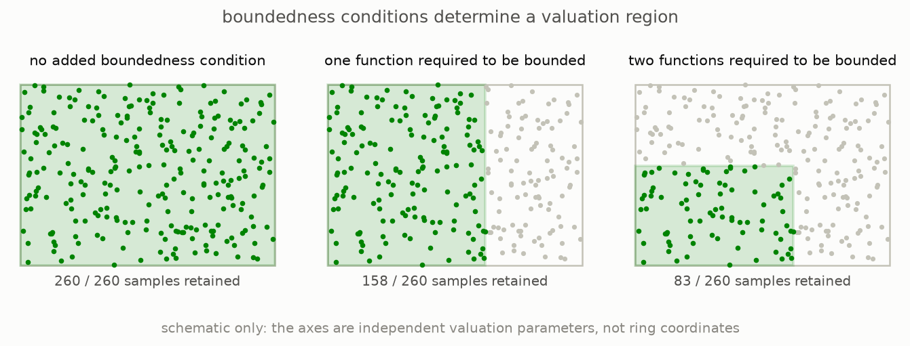
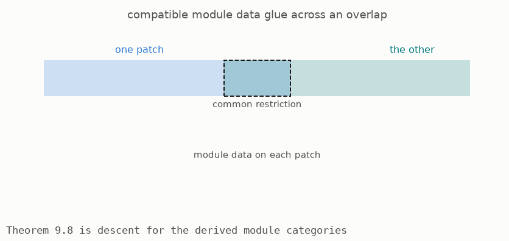

# 6 · Gluing the local pictures

*Part 3 of three: Rings That Know How To Integrate. Retells Lectures VII to XI of Scholze's [Lectures on Condensed Mathematics](https://arxiv.org/abs/2605.03658).*

The preceding construction used one ring, so geometrically it described one affine patch. A general space requires many such patches joined along overlaps. To glue them, each patch must remember both its ring of functions and the local rule that decides which functions are bounded.

The local data form a Huber pair: a ring A together with an integrally closed subring A-plus whose elements are declared to have size at most one. From this pair one forms a valuation space. A point of that space is a consistent multiplicative way to assign sizes to all elements of A, subject to the requirement that every element of A-plus has size at most one ([Proposition 9.2, page 63](https://arxiv.org/pdf/2605.03658v1#page=63)).



Choosing A-plus cuts out the region of valuations that treat its elements as small. Conversely, the allowed region recovers A-plus as exactly the functions whose size is at most one at every point in that region. Within the class stated in the proposition, the algebraic choice and geometric region therefore determine one another.



The gluing theorem says that the derived category of complete modules varies as a sheaf over these patches ([Theorem 9.8, page 65](https://arxiv.org/pdf/2605.03658v1#page=65)). If local module objects and all their comparison data agree on overlaps, they determine one global object, uniquely up to the appropriate equivalence. This result allows the affine construction of compactly supported cohomology to be used on spaces assembled from many affines.

The theorem requires a higher-categorical version of the derived category. Ordinary derived categories record maps only up to homotopy, but gluing also needs coherent homotopies between those homotopies and further levels of compatibility. An infinity-category retains that information. The need for this language appears at the gluing step rather than in the earlier finite pictures.

Despite that technical language, the proof follows the familiar pattern of Zariski descent. Cover a space by patches where chosen functions become invertible, check the statement after localizing to each patch, and use the fact that the localized cover splits. Lecture X establishes the two required facts in this setting: localizations commute with one another, and a module that vanishes on every patch is globally zero.

### The mathematics

For a ring $A$, [Proposition 9.2, page 63 of the lectures](https://arxiv.org/pdf/2605.03658v1#page=63) gives the correspondence between an integrally closed subring $A^+$ and its valuation region:

```math
\operatorname{Spa}(A,A^+)
=\{x\in\operatorname{Spv}(A)\mid |f(x)|\le1\text{ for every }f\in A^+\},
```

```math
A^+=\{f\in A\mid |f(x)|\le1\text{ for every }x\in\operatorname{Spa}(A,A^+)\}.
```

[Theorem 9.8, page 65](https://arxiv.org/pdf/2605.03658v1#page=65) states the gluing result:

```math
U=\operatorname{Spa}(A,A^+)
\longmapsto
D((A,A^+)^{\blacksquare})
\quad\text{is a sheaf of }\infty\text{-categories on }X.
```

**Reading the symbols.** The ring $A^+$ contains the elements declared to have size at most one. The space $\operatorname{Spv}(A)$ contains equivalence classes of valuations on $A$, and $\operatorname{Spa}(A,A^+)$ is the region where every element of $A^+$ is bounded by one. Braces mean “the set of,” $\in$ means “belongs to,” and the vertical bar means “such that.” The absolute-value notation $|f(x)|$ is the size assigned to $f$ by the valuation $x$. The open patch is $U$, and $D((A,A^+)^{\blacksquare})$ is its derived category of complete modules. A sheaf means that compatible local objects glue uniquely, including all their higher compatibility data. The infinity symbol indicates that these higher homotopies are retained.

**Why it matters.** The first two formulas say that the algebraic bounded subring and the geometric valuation region determine each other. The theorem then allows the local module categories attached to those regions to assemble into one global category.

**In the simulation.** Selecting bounded functions changes $A^+$. The highlighted dots are the valuations satisfying the first formula. In the overlap view, the two patches display local categories that glue only when their restrictions agree.

**[Play with this](https://muchmirul.github.io/conjectures/condensed-math/condensed-math03/play/06.html)** to change the chosen bounded functions and watch the corresponding region of valuations change.

---

[← Cohomology with compact support](../05-compact-support/README.md)  ·  [The six operations →](../07-six-operations/README.md)  ·  [all of part 3 on one page](../../ARTICLE.md)
