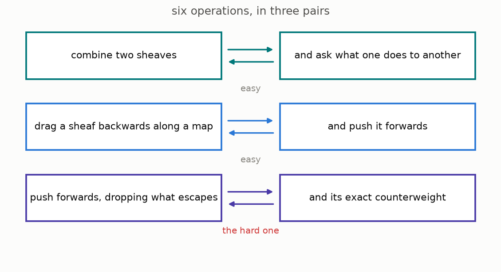

# 7 · The six operations

*Part 3 of three: Measure Rules for Rings and Geometry. Retells Lectures VII to XI of Scholze's [Lectures on Condensed Mathematics](https://arxiv.org/abs/2605.03658).*

The local and global constructions fit into the **six-operations formalism**, a standard framework for cohomology theories. Each space receives a category of sheaf-like objects. A map of spaces then gives operations that combine these objects or move them between the source and target.



The six operations form three pairs. In each pair, the left operation is adjoint to the right one. This means that maps formed after applying one operation correspond naturally to maps formed with its partner.

**Tensor product and internal Hom.** Tensor product combines two objects on the same space. Internal Hom records maps from one object into another.

**Pullback and ordinary pushforward.** For a map of spaces, pullback moves an object from the target to the source. Ordinary pushforward moves information from the source back to the target and is the right adjoint of pullback.

**Compactly supported pushforward and upper shriek.** Lower shriek pushes information forward while controlling what happens at the boundary. Upper shriek is its right adjoint. Applied to the unit, upper shriek gives the dualizing object.

The first four operations already exist in ordinary derived algebraic geometry. The difficult construction is compactly supported pushforward, which uses the boundary theory from chapter 5. Once $f_!$ exists, its right adjoint $f^!$ completes the third pair ([the discussion after Theorem 11.1, page 72](https://arxiv.org/pdf/2605.03658v1#page=72)).

Two special cases guide the definition. If a map is proper, no support can escape through a boundary, so compactly supported pushforward equals ordinary pushforward. For an open inclusion, lower shriek is extension by zero. Nagata compactification expresses a separated finite-type map as an open inclusion followed by a proper map. These rules determine a candidate for $f_!$, while the theorem must still prove that it does not depend on the chosen factorization and that it behaves coherently under composition.

### The mathematics

The discussion after [Theorem 11.1, page 72 of the lectures](https://arxiv.org/pdf/2605.03658v1#page=72) arranges the operations into three adjoint pairs:

```math
-\otimes_X B\dashv R\!\operatorname{Hom}_X(B,-),
\qquad
f^*\dashv f_*,
\qquad
f_!\dashv f^!.
```

Two required identities are

```math
f_!\cong f_*\quad\text{when }f\text{ is proper},
\qquad
f^!\cong f^*\quad\text{when }f\text{ is étale}.
```

The projection formula is

```math
f_!(A\otimes_X f^*B)\cong f_!A\otimes_Y B.
```

**Reading the symbols.** The tensor product $\otimes_X$ combines objects on $X$. The derived internal Hom $R\!\operatorname{Hom}_X$ records maps from $B$. The map of spaces is $f:X\to Y$. Its pullback is $f^*$, ordinary pushforward is $f_*$, compactly supported pushforward is $f_!$, and the right adjoint of $f_!$ is $f^!$. The symbol $\dashv$ means that the left operation is left adjoint to the right one. The symbol $\cong$ means naturally isomorphic. Proper maps have no escaping boundary contribution. Étale maps satisfy the local condition under which upper shriek agrees with pullback. In the projection formula, $A$ is an object on $X$ and $B$ is an object on $Y$.

**Why it matters.** The first four operations are already available in ordinary derived geometry. The boundary construction supplies $f_!$, and its adjoint supplies $f^!$. The listed identities make this new pair compatible with the existing operations.

**In the simulation.** Choose one of the six operations to see its source, target, and adjoint partner. Proper and nonproper examples show when $f_!$ agrees with $f_*$ and when boundary contributions must be removed.

**[Play with this](https://muchmirul.github.io/conjectures/condensed-math/condensed-math03/play/07.html)** to follow each operation and compare the directions of the three adjoint pairs.

---

[← Gluing affine patches](../06-gluing-the-pictures/README.md)  ·  [Coherent duality →](../08-duality-watched/README.md)  ·  [all of part 3 on one page](../../ARTICLE.md)
