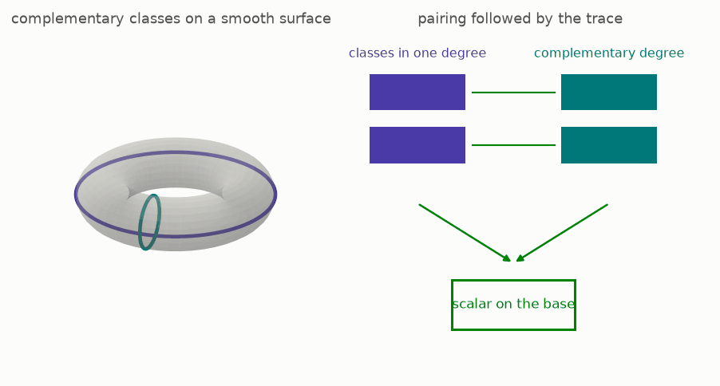
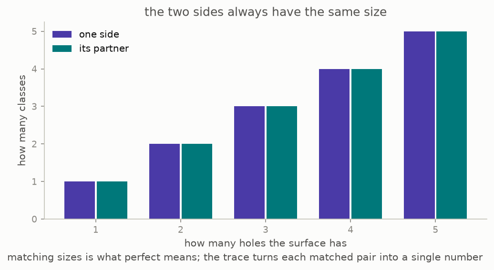

# 8 · Duality, watched

*Part 3 of three: Rings That Know How To Integrate. Retells Lectures VII to XI of Scholze's [Lectures on Condensed Mathematics](https://arxiv.org/abs/2605.03658).*

The last section is what the whole course was pointing at.

Duality is a pairing. Take a space, take a collection of functions on it, and duality says: this collection and that other collection fit together into a single number, perfectly, with no slack. Knowing one determines the other. On a surface it relates the functions to the differentials, and on a curve it is the reason the classical Riemann-Roch bookkeeping works.

The camera goes round so the surface is genuinely three-dimensional, and the two partners are drawn on it: one class in a low degree, one in the complementary degree, and the number they produce together.

Here is the statement the lectures reach ([Theorem 11.1, page 71](https://arxiv.org/pdf/2605.03658v1#page=71)). For a nice map from a space down to a base, there is a compactly supported pushforward, it agrees with ordinary pushforward when nothing escapes, and there is a **trace**: one canonical way of turning the top-degree compactly supported classes into a single number on the base. Pairing against that trace is a perfect duality, with no conditions attached.

Three things about this are worth stating flatly, because they are what the guide has been building towards.

**The duality is not assembled.** Classically the dualizing object is constructed, case by case, and duality is then proved. Here the dualizing object is defined as whatever the counterweight of section 5 produces, and the duality is the adjointness that defines it. There is nothing left to prove about its existence.

**Finiteness comes out rather than in.** The classical theorem that the cohomology of a proper map is finitely generated is recovered, in the lectures' framing, as the statement that the compactly supported operation preserves formal smallness, combined with the fact that ordinary pushforward keeps things discrete ([Remark 8.3, page 54](https://arxiv.org/pdf/2605.03658v1#page=54)).

**The route does not exist classically.** The compactly supported operation genuinely leaves the world of ordinary modules, because functions near the edge are endless tails. It comes back at the end. The middle of the argument lives somewhere the classical language cannot express, which is the entire reason for the apparatus of parts one and two.

**[Play with this](https://muchmirul.github.io/conjectures/condensed-math/condensed-math03/play/08.html)** to pair classes yourself and watch the trace collapse them to a number.

---

[← The six operations](../07-six-operations/README.md)  ·  [all of part 3 on one page](../../ARTICLE.md)
