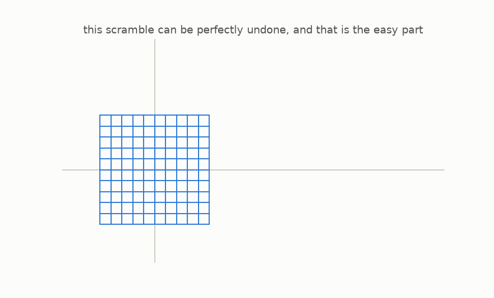

# Zero to the Jacobian Conjecture

*A visual, step-by-step journey from "what is a function?" to one of the most famous problems of modern mathematics, no math background required.*

One topic inside [conjectures](../README.md). Read it online: [muchmirul.github.io/conjectures/jacobian-conjecture](https://muchmirul.github.io/conjectures/jacobian-conjecture/)



In 1939 Ott-Heinrich Keller asked a question so innocent it fits on a postcard, about the tamest machines in mathematics, polynomials. It resisted every proof for **87 years**. It collected a famous graveyard of *wrong* published proofs. And in **July 2026**, the very week this guide was built, it finally cracked, in a way nobody predicted, in every dimension except the one where it was born.

This repo teaches you the whole story from absolute zero: pictures first, simple sentences second, symbols last. At the end you will verify the historic counterexample **with your own hands**.

## The guide

| | Chapter | The one idea |
|---|---|---|
| 0 | [Start here](guide/00-start-here/README.md) | The promise, and the map of the journey |
| 1 | [Functions are machines](guide/01-functions-are-machines/README.md) | One input, one output, and a machine can move *every* number at once |
| 2 | [The undo machine](guide/02-the-undo-machine/README.md) | Inverses; collisions and gaps are the only two ways undo can fail |
| 3 | [Polynomials](guide/03-polynomials/README.md) | The machines built from + and × alone |
| 4 | [Maps of the plane](guide/04-maps-of-the-plane/README.md) | Machines that eat points: the plane as a rubber sheet |
| 5 | [Straight maps and area](guide/05-straight-maps-and-area/README.md) | The determinant = the area factor; factor 0 destroys information |
| 6 | [Bending the grid](guide/06-bending-the-grid/README.md) | Shears bend without crushing; stacked shears make tame monsters |
| 7 | [The microscope](guide/07-the-microscope/README.md) | The Jacobian: every smooth map is straight up close |
| 8 | [Local vs global](guide/08-local-vs-global/README.md) | Perfect under every microscope, and still broken |
| 9 | [The conjecture](guide/09-the-conjecture/README.md) | Keller's 1939 question, assembled piece by piece |
| 10 | [Kicking the tires](guide/10-kicking-the-tires/README.md) | Test it yourself with exact computer algebra |
| 11 | [Why it was so hard](guide/11-why-it-was-so-hard/README.md) | Three trapdoors: the reals lie, clock arithmetic lies, infinity leaks |
| 12 | [The fall](guide/12-the-fall/README.md) | July 2026: the counterexample, check it by hand |

**Start reading: [chapter 0 →](guide/00-start-here/README.md)**

Prefer one continuous page? The whole guide is also assembled as a single article, in three formats:

- **[docs/jacobian-conjecture/index.html](../docs/jacobian-conjecture/index.html)**, the polished web version: real LaTeX math (MathJax), playing animations, article typography. Published at [muchmirul.github.io/conjectures/jacobian-conjecture](https://muchmirul.github.io/conjectures/jacobian-conjecture/).
- **[docs/jacobian-conjecture/x-article.html](../docs/jacobian-conjecture/x-article.html)**, the X (Twitter) Article source: all math converted to clean Unicode text, no markup to clean up, open it in a browser, select all below the instructions box, and paste into X's article editor; upload each GIF at its orange marker.
- **[ARTICLE.md](ARTICLE.md)**, plain GitHub-flavored Markdown.

These three live at the repository root under `docs/`, not in this folder, because GitHub Pages can only publish from the root or from `/docs`.

## Run the code

Every figure and animation in the guide is produced by a script in this repo, and **every mathematical claim about the example maps is enforced by a test**:

```bash
cd jacobian-conjecture
make venv       # create the shared ../.venv and install (numpy, matplotlib, sympy)
make test       # re-verify every claim: Jacobians, inverses, Pinchuk, the 2026 counterexample
make figures    # re-render every PNG/GIF in guide/
```

The virtualenv sits at the repository root and is shared by every topic, so `make venv` from the root works too.

Play: open any `src/viz/chNN_*.py`, change a map's recipe, re-run, and watch your own monster.

## Layout

```
guide/      the 13 chapters (each folder: README.md + its images/GIFs)
src/
  jacobian_guide/   core.py (sympy: Jacobians, dets, inverses)  examples.py  plotting.py
  viz/              one figure script per chapter
tests/      symbolic verification of everything the guide asserts
manim/      optional Manim CE scenes (fancier renders; not required)
notes/      research notes: content, sources, Pinchuk data, curriculum design
```

## The ethos

Distrust, and verify. The guide's tone is friendly, but its claims are not hand-waved: the shear inverses, the Nagata automorphism, Pinchuk's sum-of-squares identity, and the July 2026 counterexample (announced days before this was written; attributed to Levent Alpöge, produced with the AI model Claude Fable; peer review pending) are all re-checked from scratch by `tests/` in exact rational arithmetic, on your machine, not on anyone's authority.

The two-variable case, Keller's original question, **is still open.** Maybe it's waiting for you.
