# Kakeya's Needle, from Zero

*A step-by-step guide, starting from nothing, to a question asked in 1917 about turning a needle around, whose answer broke everyone's intuition and whose sequel stayed open until February 2025. Every idea is shown as a picture first, and the final proof of the grid version is one you can run yourself.*


Look at that needle. It is one unit long. It is turning, and by the end it will have pointed in every direction there is. The whole time it stays inside that ragged green shape, whose area is under a quarter of a square unit.

Here is the part that broke people: **the shape can be made smaller than any size you name.** A millionth. A trillionth. And a close cousin of it has area exactly **zero** and still contains a needle pointing every possible way.

This article explains the whole story from zero. You do not need any math background. Each section is one small idea, explained with a picture first.

Everything here is backed by an open repository. It contains the code for every animation and a test suite that re-computes every number, in exact arithmetic. Where a claim cannot be checked by a computer, the text says so plainly.

## 1 · The needle and its directions

Take a straight piece of wire, one unit long. Call it a **needle**. It has two facts attached: where it is, and which way it points. For this whole story the "where" is scenery and the "which way" is the plot.


Point the needle east, then west. Nothing changed: a needle has no head and no tail. So its directions run from 0 degrees to 180, and then repeat.


Turning a needle through a half circle takes it through every direction that exists.

Two questions will come back again and again:

1. **Does this shape hold a needle in every direction?** A shape that passes is a **Kakeya set**.
2. **Can the needle turn from one direction to the next without leaving the shape?** A shape that passes that is a **Kakeya needle set**.

The second is stricter than the first, the way a road network is stricter than a set of parking spaces. Half the surprises in this story come from the gap between them.

## 2 · Turning around

You want to turn a needle right around. Easy: draw a circle around its middle and spin it. The needle is 1 long, so the disc has diameter 1 and area $\pi/4 \approx 0.7854$.

Can you do better? Here are three rooms, with the needle really turning in each one.


**The triangle.** An equilateral triangle of height 1 works, area $1/\sqrt{3} \approx 0.5774$. The motion is a three point turn: pivot 60 degrees about a corner, slide along a side, pivot about the next corner. Three pivots make a half circle. In 1921 Julius Pal proved this is the smallest room with no dents in it.

**The deltoid.** Allow dents and you do better. Roll a circle of radius 1/4 inside a circle of radius 3/4 and trace one point: you get a three cusped curve whose every tangent line cuts off a chord of length exactly 1. The needle can be that chord and slide around inside. Area $\pi/8 \approx 0.3927$, half the triangle.


In 1917 Soichi Kakeya asked how small the room can be. He suspected the deltoid was the answer. To see what actually happens you need two ordinary looking ideas.

## 3 · How much space

Two shapes cover a region. How much area is that? Not the sum: the ground they share is one patch of ground, and it does not get counted twice.

That sounds like a technicality. It is the whole trick.

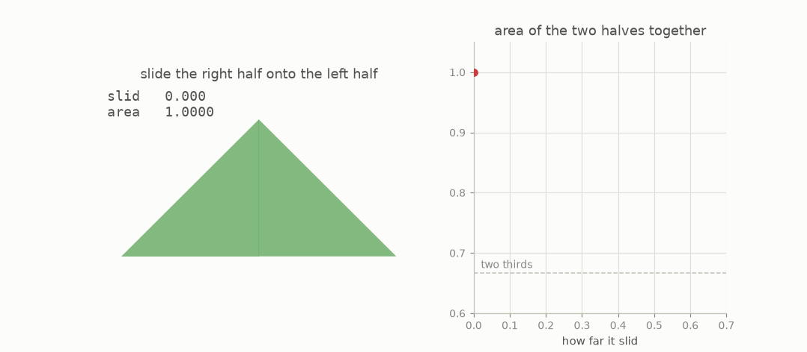

Split a triangle down the middle and slide the right half onto the left. The pieces do not shrink. Nothing is thrown away. Every direction the triangle held is still held, because sliding a piece sideways does not turn it. And yet the ink on the page **drops**.

Slide by the right amount and the two halves together cover exactly **two thirds** of what the whole triangle covered. The area after sliding by $t$ is exactly $1 - t + \tfrac34 t^2$, smallest at $t = 2/3$.

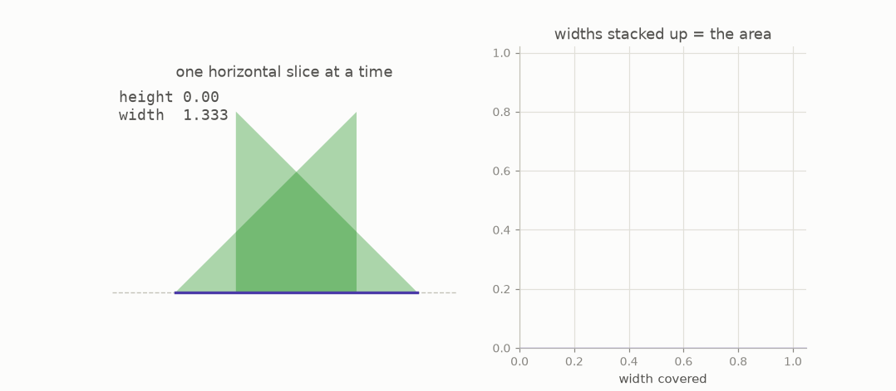

That is also how the areas in this article are computed: sweep a horizontal line up the figure, measure the width covered at each height with overlaps counted once, and add it all up. The code does this in exact fractions, so the numbers quoted are not rounded estimates.

A needle only cares about direction, and overlapping pieces hold all the directions they held apart. So overlap is free storage.

## 4 · The free slide

Move a needle sideways and it sweeps a rectangle. Move it along the line it already lies on and it sweeps a line, which has no area.


So a needle can travel any distance you like along its own direction, for free. Pivoting about one end through an angle $\theta$ sweeps a pie slice of area $\theta/2$. That is the entire price list.

Now the move that changes everything. Your needle is on one line and you want it on a different, parallel line.


Slide far out along your own line (free), pivot by a small angle $\theta$ (cost $\theta/2$), slide along the slightly slanted line until it meets the other line (free), pivot back (cost $\theta/2$). Total area: $\theta$, as small as you please. This is a **Pal join**.


The price is distance. To cross a fixed gap with a pivot of $\theta$ you travel about $1/\theta$. Halve the area, double the trip. Nothing here is a cheat: "long and thin" and "small area" are perfectly compatible, and our eyes are simply not built to believe that.

## 5 · The Perron tree

Cutting once gave two thirds. Cut again, and again.

Take the triangle with base from 0 to 1 and apex at height 1. Cut the base into $2^k$ equal pieces and join each to the apex: you get $2^k$ thin **slivers**, and between them they hold every direction the triangle held. Now slide the slivers into each other, in stages: neighbours, then neighbouring pairs, then quadruples.


Nothing is rotated. Nothing is resized. So the pile still holds a needle in every direction of the fan. This is a **Perron tree**, after Oskar Perron, who in 1928 turned Besicovitch's original construction into this picture.

There is a trap. The obvious thing is to use the best single merge at every stage, overlapping each pair to two thirds.


The steady squeeze makes a **bowtie**: every sliver passes through one point, and the solid triangle below it never thins. Its area is exactly $\frac16 + \frac{1}{3 \cdot 2^k}$, which falls, and falls, and then **stops** at one sixth. Cut into a billion slivers and a third of the original area is still there.

The fix is to squeeze hard where the slivers are thin and gently where they are fat: at stage $j$, overlap each pair to $(j+1)/(j+4)$ of its width.


| slivers | steady squeeze | varying squeeze |
|---|---|---|
| 1 | 0.500000 | 0.500000 |
| 16 | 0.187500 | 0.244289 |
| 64 | 0.171875 | 0.166697 |
| 256 | 0.167969 | 0.129469 |
| 512 | 0.167318 | 0.118088 |

One honest note: this falls slowly. The known theory says the best a tree of $n$ slivers can do is about $1/\log n$, and that rate is sharp. To push the area below one percent you would need something like $2^{100}$ slivers. That slowness is a large part of why this subject was hard, and why the picture in your head refuses to believe the next section.

## 6 · Area zero

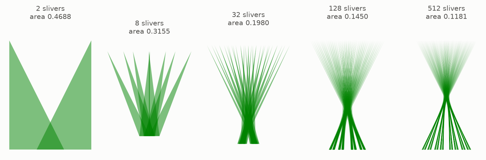

Same fan of directions in every picture. Less and less ground. Besicovitch proved in 1919 that this never stops. For any small number you name there is a figure holding a needle in every direction whose area is below it, and in the limit you get a set of area exactly **zero** that still contains a full unit needle pointing every possible way. Such a thing is called a **Besicovitch set**.

One step hides inside that sentence. A tree only holds the directions of the triangle it was cut from, a fan of about 53 degrees, not the full 180. Closing that gap is cheap: lay down four copies of the tree, each turned to cover a different part of the circle. Four small areas added together are still small, and now every direction is there. That is the only place in this whole construction where anything is rotated, and it is worth remembering, because the same repair comes back in section 12.

He was not even working on Kakeya's problem. He was in Perm, in Russia, working on a question about Riemann integration, and he needed a set like this as a tool.

Turning the needle is a stronger demand, and this is where the free slide earns its keep.

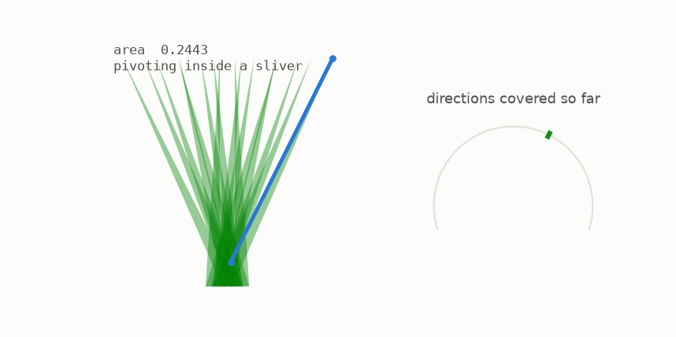

Inside one sliver the needle pivots about the apex and sweeps that sliver's wedge of directions. To reach the next sliver it changes lines with a Pal join, which costs as little as you like. Perron tree plus Pal joins gives Besicovitch's 1928 theorem:

> For every $\varepsilon > 0$ there is a set of area less than $\varepsilon$ inside which a unit needle can be turned continuously through 180 degrees.

The smallest room does not exist. There is no smallest. Ask for a room of area one billionth and you get one. The deltoid was not close to the answer; there was no answer to be close to.

## 7 · Zero, but big

Area is now useless as a measure of these sets. A Besicovitch set has area 0. So does a dot. So does a segment. A sharper ruler is needed, and the one mathematicians use is **dimension**: not the space the set lives in, but how it fills space as you zoom in.

Cover the set with boxes of side $\varepsilon$ and count them. A dot needs 1 box always. A segment needs about $1/\varepsilon$. A square needs about $1/\varepsilon^2$. The exponent is the dimension.

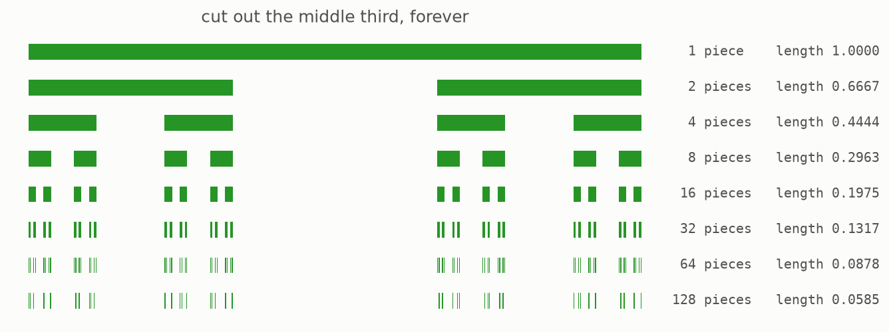

Now a set that is neither. Start with the interval from 0 to 1 and remove the middle third, then the middle third of what is left, forever. Its length after $m$ rounds is exactly $(2/3)^m$, so the finished set has length **0**.

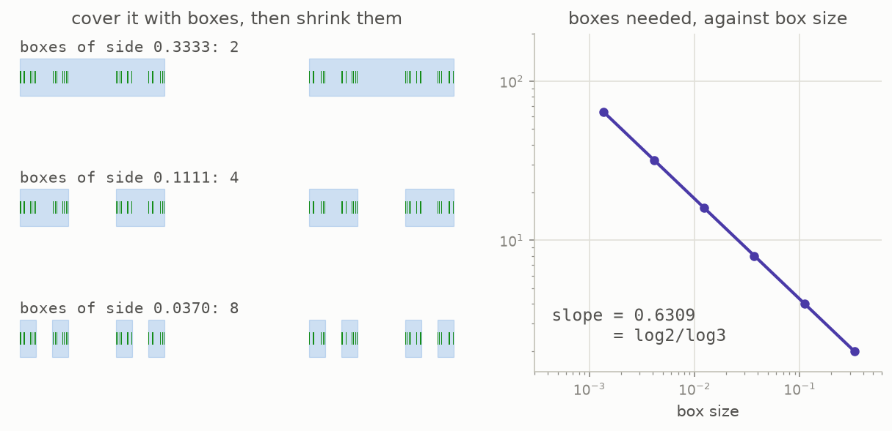

But at box size $3^{-m}$ the count is exactly $2^m$. Read that as a rate: make the boxes three times finer and you need only **twice** as many, where a full line would need three times as many and a dot would need no more at all. That rate is the dimension, and here it works out to $\log 2 / \log 3 = 0.6309\ldots$. Length zero, dimension 0.63. Bigger than a dot, smaller than a line.

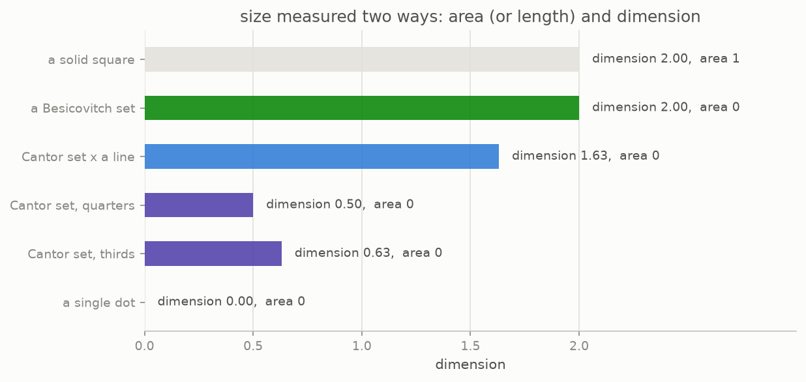

And a Besicovitch set in the plane? Area 0, like everything here. Dimension **2**, the same as a solid square. That is a theorem of Roy Davies from 1971.

## 8 · The conjecture

You now have every piece. A Kakeya set holds a unit needle in every direction. It can have zero volume. Dimension measures size in a way that survives that. And in the plane, every Kakeya set has the largest dimension possible.

So the question asks itself. In three dimensions, in four, in $n$: the volume can still be squeezed to zero. Can the **dimension** be squeezed at all?

> a set in n-dimensional space<br>
> **holding a unit needle in every direction**<br>
> may have zero volume (Besicovitch),<br>
> **but it must still have dimension n**

That is the **Kakeya set conjecture**.


It does not predict a value to be discovered. It says every value except the maximum is impossible. Squeezing on volume works perfectly; squeezing on dimension is claimed to be blocked completely.

### Every direction, in every dimension

The words doing the work are "every direction", and what they mean changes with the dimension you are in.


All three panels are real three dimensional scenes and the camera goes round all of them, which is the only way a flat screen can tell the truth about depth. In the plane the directions make a circle, and seen edge on it is visibly flat. In space they make a sphere, which is exactly why the problem got harder. In four dimensions they make a shape nobody can look at, so the picture turns them in the fourth axis and projects the result down to three, the way a cube's shadow is drawn on paper. The breathing you see, needles growing and shrinking as they swing, is the fourth axis passing through the projection: no rotation of a three dimensional object can do that.

## 9 · Why it matters

A needle is infinitely thin and nothing real is. Fatten it into a **tube** of thickness $\delta$.


The moment you say "tube", analysts recognise the object. A wave travelling in some direction over some stretch of time lives in a tube. Adding waves that go in many directions is exactly asking how much their tubes can pile up.

That is why this puzzle became load bearing: the restriction problem in Fourier analysis, Bochner-Riesz summation, local smoothing for wave equations, dispersive PDE, exponential sums in number theory, and randomness extractors in computer science all lean on Kakeya-type estimates. Kakeya sits at the bottom of that hierarchy. It is the easiest of the family, and it was still open for a century.

## 10 · On a grid

Continuous space is hard. So in 1999 Thomas Wolff suggested the same question in the simplest possible universe: arithmetic modulo a prime $q$.

Points are pairs $(x, y)$ with coordinates in $\{0, \ldots, q-1\}$ and everything wraps around. A **line** is the $q$ points $a + tb$. There are exactly $q+1$ directions. A **Kakeya set** holds a whole line in every direction.

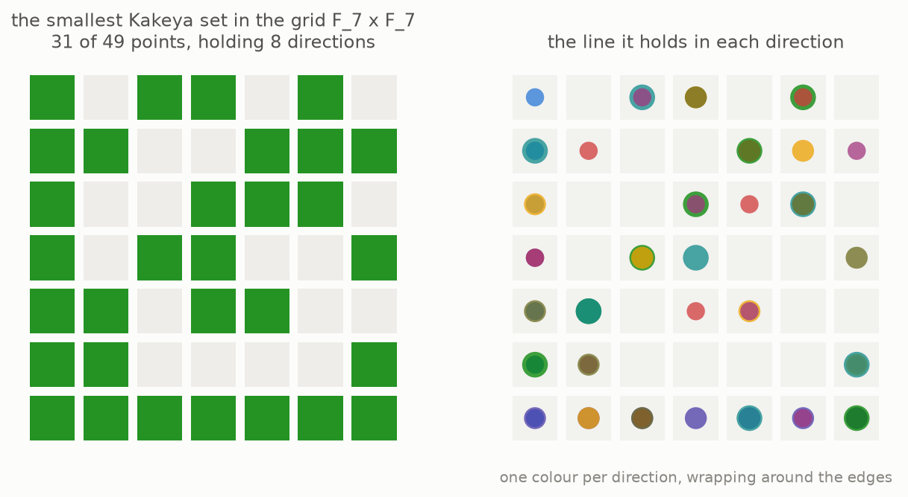

For small $q$ you can simply search all the possibilities:

| grid | points | directions | smallest Kakeya set | Dvir's floor |
|---|---|---|---|---|
| q=2 | 4 | 3 | 3 | 3 |
| q=3 | 9 | 4 | 7 | 6 |
| q=5 | 25 | 6 | 17 | 15 |
| q=7 | 49 | 8 | 31 | 28 |

About half the grid. Not a tiny corner of it.

Dvir's argument is written for any dimension, so it is worth seeing the grid in three dimensions first.

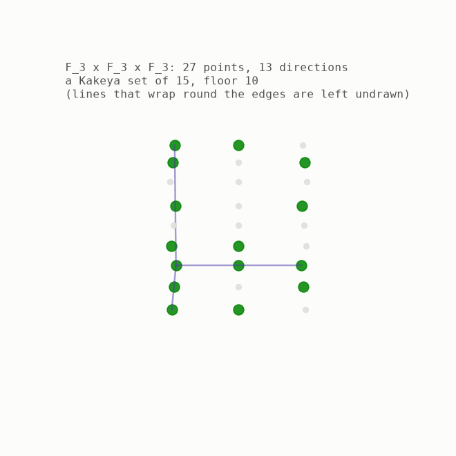

Twenty seven points, thirteen directions through them, a Kakeya set of fifteen points found by a greedy sweep, and Dvir's floor of ten. The camera turns because a flat drawing of a cube of points lies about which points are near each other.

What comes next is the steepest part of this article, so here is a promise before you climb: it needs nothing new. A polynomial is what it was in school, a sum of terms like $3x^2y$. Everything else is counting, how many terms a polynomial can have and how many points sit on a line. Every step below is run on a small grid by the repository, so anything that does not land as words can be watched happening as numbers.

In 2008 Zeev Dvir proved the general statement in about half a page. Suppose $K$ is a Kakeya set in the grid and suppose it is small.

1. A polynomial of degree at most $q-1$ in $n$ variables has a fixed number of coefficients, written $\binom{q+n-1}{n}$, which is nothing more exotic than a count of how many terms it can have. Asking it to vanish at a point is one linear equation on those coefficients.
2. If $K$ has fewer points than that, some **nonzero** polynomial $g$ of degree at most $q-1$ vanishes on all of $K$.
3. $K$ contains a whole line in each direction $b$. Along that line $g$ becomes a one variable polynomial of degree at most $q-1$ with $q$ roots, so it is identically zero there.
4. The top coefficient along that line is exactly the top part of $g$ evaluated at $b$. So the top part dies in every direction.
5. A homogeneous polynomial dying in every direction dies everywhere, and nothing nonzero of degree below $q$ can vanish on the whole grid.
6. Contradiction. So $|K| \geq \binom{q+n-1}{n} \geq q^n/n!$.

Every one of those steps is a computation on small grids, and the repository runs all of them: finding the vanishing polynomial by linear algebra over the field, restricting it to a line and watching every coefficient come out zero, comparing top coefficients with top parts, and computing the rank that closes the argument.

## 11 · Why it was hard

Here is the whole assault on three dimensions as one number: the best dimension anyone could prove a Kakeya set in space must have.


| year | who | what was proved |
|---|---|---|
| 1919 | Besicovitch | dimension at least 2 |
| 1991 | Bourgain | the first modern advance, past (n+1)/2 in every dimension |
| 1995 | Wolff | 5/2 in three dimensions |
| 2000 | Katz, Laba, Tao | 5/2 plus a ten billionth |
| 2019 | Katz, Zahl | 5/2 plus epsilon, Hausdorff too |
| 2025 | Wang, Zahl | 3 |

Read the fourth row again. A whole paper by three of the strongest people in the field, to move the number by a ten billionth.


Wolff's idea shows what "hard" means here. The naive move is to find a point where many tubes meet, a **bush**, and count the room they need. Wolff instead found a whole *tube* that many tubes cross, a **hairbrush**, which forces far more room. That one idea was worth half a dimension and stood as the record for a quarter of a century.

And the grid proof does not carry over. On a grid two lines share at most one point, and a line is either wholly in your set or not. In the plane two tubes pointing in nearly the same direction can hug each other along their whole length, and a set can be almost made of lines without containing any. Polynomials do not notice "almost".

## 12 · The proof

On 24 February 2025, Hong Wang and Joshua Zahl posted a 127 page paper, *Volume estimates for unions of convex sets, and the Kakeya set conjecture in three dimensions*. Its main theorem:

> Every Kakeya set in three dimensional space has Hausdorff and Minkowski dimension 3.

Those are two different rulers for the same idea. Minkowski dimension is the box counting of section 7. Hausdorff dimension is a finer one that can give a smaller answer, so proving the statement for both is the stronger result, and it leaves no room for a set that is thin in the subtler sense.

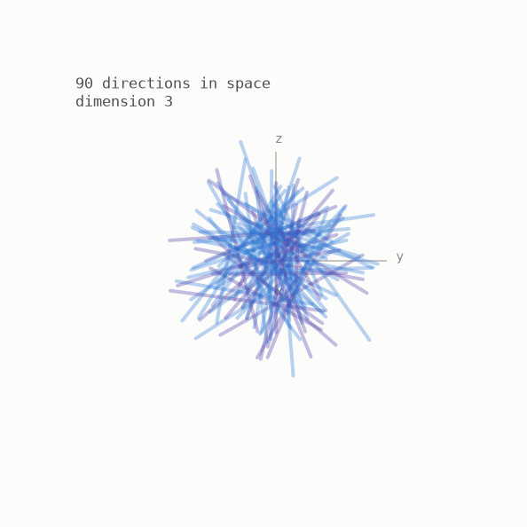

The engine is a statement about tubes: take thin tubes in space, limit how many can be crammed into any one convex region, and their union must have almost the largest volume it could. The needle statement follows.

The camera turns because it has to. This is a claim about three dimensions, and a still picture hides the point: those tubes run over a whole sphere of directions, not a circle of them.

You can build a Kakeya set of space yourself, out of the flat tree of section 5, by pushing it sideways into a slab.

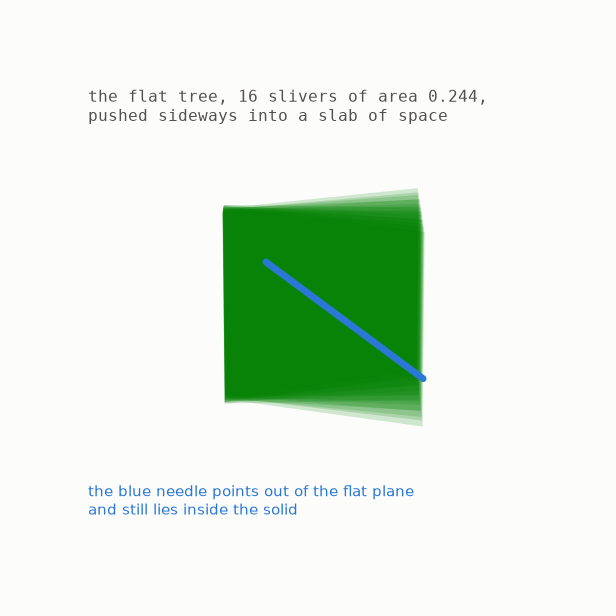

A unit needle of space pointing along (a, b, c) casts a shadow on the plane shorter than one unit, so it fits inside the segment the flat tree already holds in that direction, while the height it needs is covered by the slab. The blue needle above is checked point by point by the repository's tests: every point of it lies inside a sliver and inside the slab.

The slab on its own is not the finished object. It inherits the tree's fan, so it holds a direction only when that direction's shadow lands inside the fan, and the repository keeps a test whose only job is to fail the directions outside it. Four turned copies finish it, exactly the repair from section 6. What the picture really shows is that height comes free, in the same way sliding sideways came free, which is why the volume can still be squeezed to zero once you move up into space. Dimension is the part that got harder.

| year | who | what |
|---|---|---|
| 1917 | Kakeya | asks for the smallest room a needle can turn in |
| 1919 | Besicovitch | builds a set of area zero holding every direction |
| 1921 | Pal | smallest convex room: the triangle of height 1 |
| 1928 | Besicovitch | turns the needle in a room of any size you name |
| 1928 | Perron | the tree: a short proof anyone can draw |
| 1971 | Davies | in the plane, area zero still means dimension 2 |
| 1971 | Cunningham | arbitrarily small rooms with no holes, inside a disc |
| 1991 | Bourgain | dimension beats (n+1)/2, the modern assault begins |
| 1995 | Wolff | the hairbrush, so 5/2 in 3D |
| 1999 | Wolff | poses the finite field version |
| 2000 | Katz, Laba, Tao | 3D nudged past 5/2, by a ten-billionth |
| 2008 | Dvir | finite fields fall to the polynomial method |
| 2019 | Katz, Zahl | the same nudge for the finer ruler, Hausdorff dimension |
| 2025 | Wang, Zahl | every Kakeya set in 3D has dimension 3 |

| dimension | status |
|---|---|
| 1 | trivial |
| 2 | proved by Davies, 1971 |
| 3 | proved by Wang and Zahl, February 2025 |
| 4 and up | **open** |

The result is specifically three dimensional: it uses the geometry of lines in space, where two directions span a plane and the third dimension is the only room left over. In four dimensions there is more room, the configurations multiply, and the known bounds fall well short.

So the conjecture is settled in exactly the dimensions where you can draw a picture.

## What you can check yourself

A 127 page proof cannot be checked by running a script, and nothing in the repository pretends to. What you can run is everything underneath it: the exact areas of the Perron trees and the closed form that makes a fixed squeeze stall at one sixth, the deltoid's unit chord and the triangle's three point turn, the box dimension of the Cantor set, the smallest Kakeya sets on grids up to 7 by 7, and every step of Dvir's proof.

```bash
make venv && make test && make figures
```

For a century this was a story about shrinking: how small, how much smaller, is there a floor. Besicovitch answered that in the strongest way available, by removing the floor. Everyone agreed on the replacement question and then could not answer it for another hundred years, while it quietly became a wall holding up Fourier analysis.

The answer, when it came, was not a trick. It was thirty years of accumulated ability to talk about structure at many scales at once, finally sharp enough to close the gap.

And the needle, the actual physical needle from 1917, turns in a room of any size you name. That part was true the whole time.

## The plain words, and the real ones

This guide used everyday words on purpose. Everything else written about Kakeya uses the other set of words, so here they are side by side. Nothing new is being introduced, only renamed.

| what this guide called it | what everyone else calls it |
|---|---|
| a room | a Kakeya needle set: a set a unit needle can be turned inside |
| a shape holding a needle in every direction | a Kakeya set, or a Besicovitch set when its area is zero |
| a tree | a Perron tree |
| a sliver | one of the thin triangles the base was cut into |
| the fan | the interval of directions a triangle holds |
| the free slide | a translation of the needle along its own line |
| ground covered, ink on the page | measure: area in the plane, volume in space |
| the box counting ruler of section 7 | Minkowski dimension, also called box dimension |
| the finer ruler of section 12 | Hausdorff dimension |
| a fattened needle, a tube | a $\delta$ neighbourhood of a unit segment |
| the grid of section 10 | the finite field $\mathbb{F}_q^n$ |

## Where to go next

- **The companion repository**, [github.com/muchmirul/conjectures](https://github.com/muchmirul/conjectures/tree/main/kakeya-conjecture), has the code for every figure, the exact-arithmetic geometry, Dvir's proof run step by step, the full test suite, and research notes listing which claims are checked here and which are quoted.
- H. Wang and J. Zahl, *Volume estimates for unions of convex sets, and the Kakeya set conjecture in three dimensions* (arXiv:2502.17655), the 2025 proof itself.
- T. Tao's blog post, *The three-dimensional Kakeya conjecture, after Wang and Zahl*, a readable account of the strategy, written the day after the paper appeared.
- J. Zahl, *A survey of the Kakeya conjecture, 2000 to 2025* (arXiv:2512.09397), for where the field stands and what is still open.
- Z. Dvir, *On the size of Kakeya sets in finite fields* (2008), the half page proof of section 10.
- K. Falconer, *The Geometry of Fractal Sets*, for Besicovitch sets and dimension built up from the ground.
- Quanta Magazine, *'Once in a Century' Proof Settles Math's Kakeya Conjecture* (March 2025), the story with no equations in it.
- The Wikipedia article *Kakeya set*, for current status and further references.
