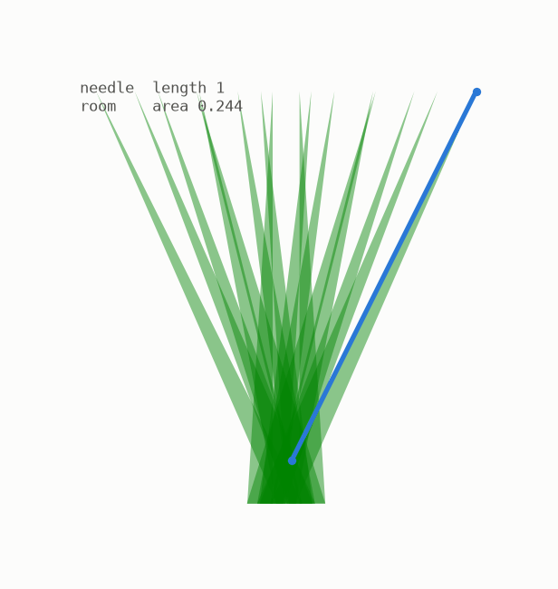

# Start here



Look at that needle.

It is one unit long. It is turning, and by the end of its journey it will have pointed in **every direction there is**. And the whole time it stays inside that ragged green shape, whose total area is smaller than a quarter of a square unit.

That already feels tight, and what broke people's intuition for a hundred years is that **the shape can be made smaller than any size you name.** A millionth. A trillionth. And a close cousin of it has an area of exactly **zero**, while still containing a needle pointing every possible way.

In 1917 a Japanese mathematician, Soichi Kakeya, asked how small such a room could be. He expected a pretty answer. He got one of the strangest facts in geometry, and then a question that stayed open for a century, whose answer arrived in **February 2025**.

## What you need

- Nothing. Every idea is built from pictures first, words second, symbols last.
- Each chapter is one small idea, readable in about 5 minutes.
- Optional: Python, if you want to re-create and play with every picture here. Each chapter tells you how.

## The journey

```
    1 the needle          5 the tree            9 why it matters
    2 turning around      6 area zero          10 on a grid
    3 how much space      7 zero but big       11 why it was hard
    4 the free slide      8 the conjecture     12 the proof
```

Chapters 1 to 7 build the ideas. Chapter 8 states the famous question. Chapters 9 to 12 tell you what it was worth, why it was hard, and how it ended.

## How to read

Read in order. Look at each picture before reading the text around it. If a sentence feels obvious, good, that is the design, not an accident.

Every number quoted in this guide is computed by the code in this repository, in exact arithmetic, and re-checked by its tests. Where something cannot be checked by a computer, the text says so plainly.

---

[Begin: chapter 1, the needle and its directions →](../01-the-needle/README.md)
