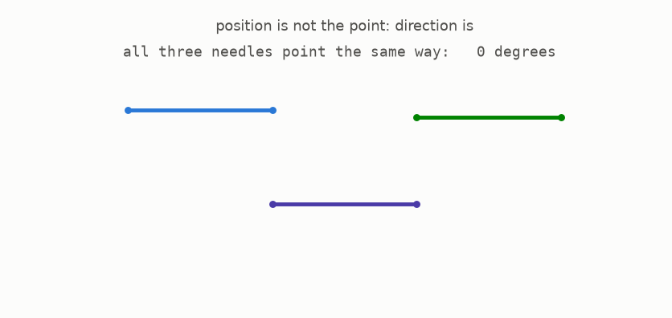
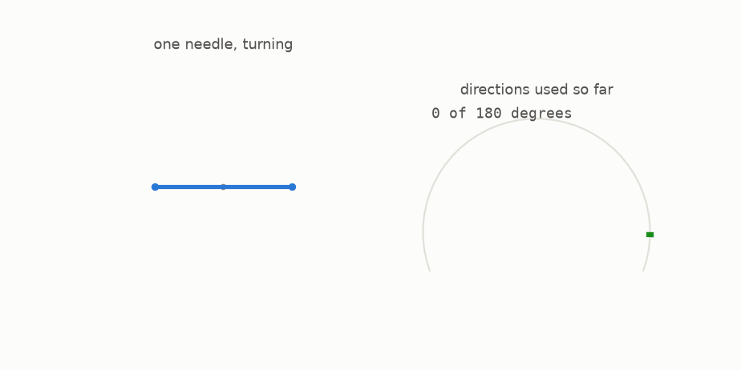

# 1 · The needle and its directions

*By the end of this page you will know exactly what the puzzle is about, and the one word that carries the whole story: direction.*

## A needle is a segment

Take a straight piece of wire, one unit long. Where the unit comes from does not matter. Call it a **needle**.

A needle in the plane has two facts attached to it, which are **where** it is and **which way** it points. Only the second of them will matter.



Three needles, three different places, one direction. For this whole guide, the "where" is scenery. The "which way" is the plot.

## Half a circle is all the directions there are

Point the needle east. Now point it west. Nothing changed: a needle has no head and no tail, so those are the same direction.

The directions of a needle therefore run from 0 degrees up to 180, and then they start repeating. Half a circle already holds all of them.



Turning the needle through a half circle takes it through **every direction that exists**. That is what "turning the needle around" means from here on, and it is what Kakeya's question asks about.

## The two things we will keep asking

Every chapter after this one is about one of these two questions:

1. **Does this shape hold a needle in every direction?** That is, for each of the 180 degrees of direction, is there room somewhere inside the shape for a full unit needle pointing that way? A shape that passes this test is called a **Kakeya set**.
2. **Can the needle actually get from one direction to the next without leaving the shape?** A shape that passes *that* test is called a **Kakeya needle set**: you can turn the needle right around inside it, continuously, like a plank in a hallway.

Question 2 is stricter than question 1. Holding every direction is not the same as being able to swing between them, which is the difference between a set of parking spaces and a road network.

Keep the two apart in your head. Half the surprises in this story come from the gap between them.

## Try it

```bash
python src/viz/ch01_the_needle.py     # re-render this chapter's animations
```

---

> **The one thing to remember:** a needle is a unit segment, all its possible directions fit into a half circle, and the two questions are "does the shape hold every direction?" and "can the needle turn between them?"

[← Start here](../00-start-here/README.md) · [Next: turning around →](../02-turning-around/README.md)
