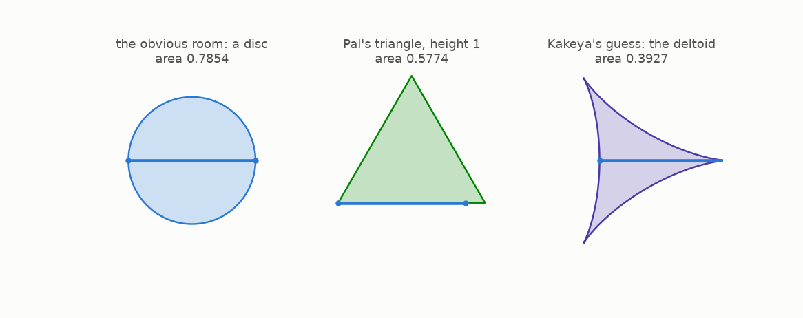
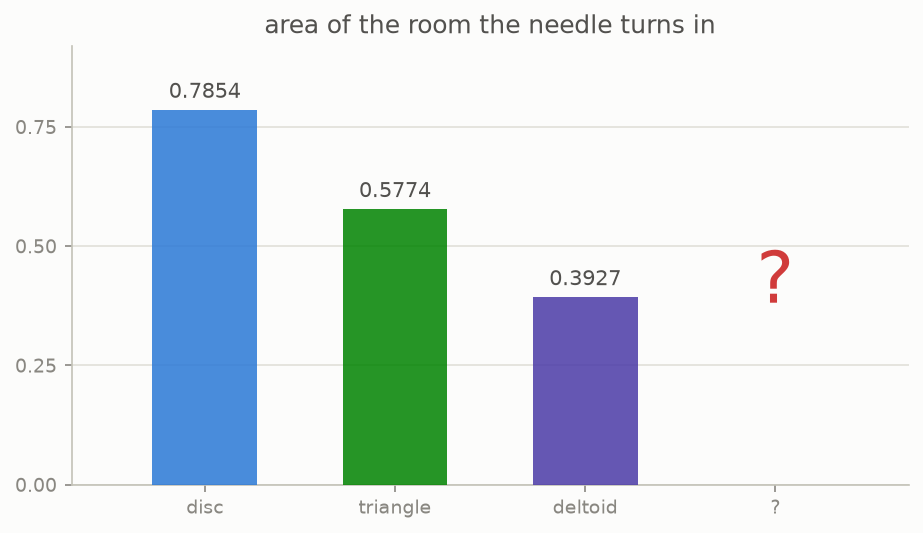

# 2 · Turning around

*By the end of this page you will have seen the three rooms everyone thinks of first, watched a needle turn inside each one, and met the 1917 question.*

## The lazy answer

You want to turn a needle right around. Easy: draw a circle around its middle and spin it.

The needle is 1 long, so the disc needs diameter 1. That fixes its area:

```math
\pi \left(\tfrac12\right)^2 = \frac{\pi}{4} \approx 0.7854 .
```

Whether you can do better is the question, and the figure shows three rooms at once. In each one the needle really does turn, and the pale blue trails are where it has been.



**The triangle.** An equilateral triangle of height 1 works, and its area is $1/\sqrt3 \approx 0.5774$. The motion is a three point turn: pivot 60 degrees about a corner, slide along a side, pivot about the next corner, and after three pivots the needle has turned a full half circle. In 1921 Julius Pal proved this triangle is the smallest **convex** room possible. If your room has no dents, you cannot beat 0.5774.

**The deltoid.** Drop convexity and you can do better. Roll a circle of radius 1/4 inside a circle of radius 3/4 and follow one point: you get a three cusped curve. Every tangent line of it cuts off a chord of length exactly 1, so the needle can *be* that chord and slide around the inside. Area: $\pi/8 \approx 0.3927$, half the triangle.

## Kakeya's question



Soichi Kakeya asked in 1917 **how small that room can be**. He suspected the deltoid was the answer, or close to it. It is a natural guess. Each improvement so far had come from a cleverer shape, and shapes seem to run out.

The three numbers above are computed and checked by this repo, in `tests/test_shapes.py`. The areas come from the shoelace formula on the actual curves, and the turning motions are checked frame by frame, verifying that the needle is always exactly 1 long, always inside the room, and that it really does come back rotated by 180 degrees.

The answer to Kakeya's question, which took two years to arrive and which nobody was ready for, is in chapter 6. To understand it you need two ordinary looking ideas first: what area really counts (chapter 3), and what moving a needle really costs (chapter 4).

## Try it

```bash
python src/viz/ch02_turning_around.py
python -m pytest tests/test_shapes.py -q
```

---

> **The one thing to remember:** disc 0.7854, triangle 0.5774 and it is the best convex room, deltoid 0.3927. Kakeya asked in 1917 how far down this goes.

[← The needle](../01-the-needle/README.md) · [Next: how much space →](../03-how-much-space/README.md)
