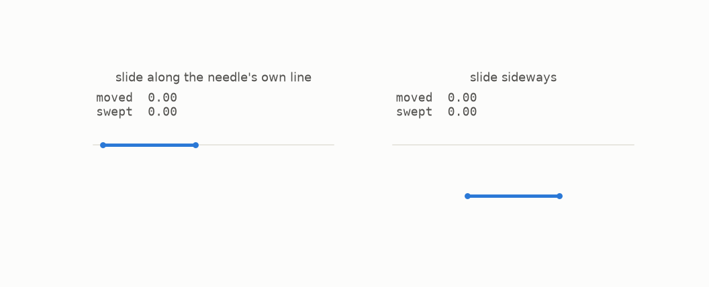
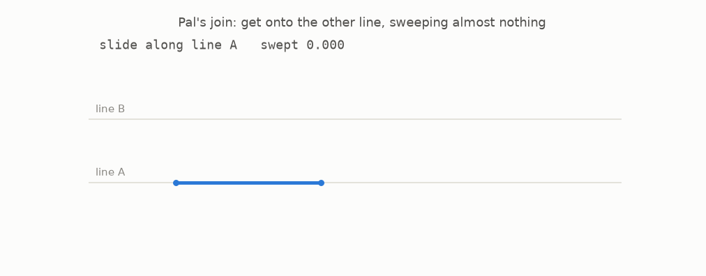
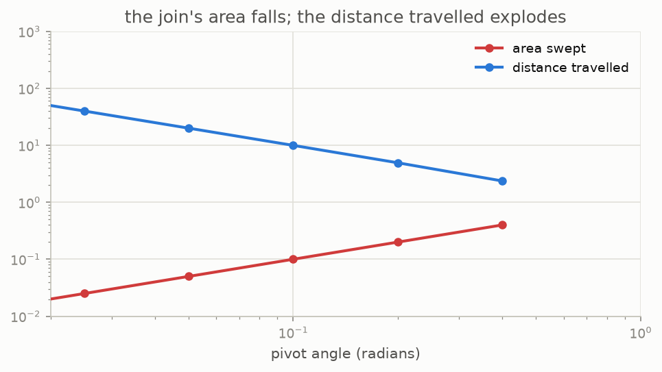

# 4 · The free slide

*By the end of this page you will know why a needle can wander anywhere it likes for almost no cost, which is the second half of the loophole.*

## Sliding along your own line costs nothing

Move a needle sideways and it sweeps a rectangle. Move it along the line it already lies on and it sweeps... the line it already lies on. A line has no area.



So a needle can travel any distance you like along its own direction, for free. Only *turning* and *sideways* motion cost area.

## Turning costs a slice of pie

Pivot a needle about one end through an angle $\theta$ and it sweeps a circular sector, of area

```math
\tfrac12 \theta \cdot 1^2 = \tfrac{\theta}{2}.
```

Small angle, small cost. This is the only price list in the problem: **free to slide along yourself, $\theta/2$ to pivot through $\theta$.**

## Pal's trick

Now the move that changes everything. A needle lies on one line. You want it on a different, parallel line. Naively that is a sideways shove, and sideways is expensive.



Instead: slide the needle far out along its own line (free), pivot through a small angle $\theta$ (cost $\theta/2$), slide along that slightly slanted line until it arrives at the other line (free), pivot back (cost $\theta/2$). Total area:

```math
\theta ,
```

and $\theta$ can be as small as you please. This is called a **Pal join**, after the same Julius Pal from chapter 2.

There is a price, and it is worth staring at:



To cross a fixed gap with a pivot of $\theta$ you must travel a distance of about $1/\theta$. Halve the area and you double the trip. The needle takes an enormous detour, sweeping a long thin whisker of almost nothing, and comes back on the line you wanted.

Nothing about this is a cheat. The set is still a set. The needle really moves continuously through it. It is just that "long and thin" and "small area" are perfectly compatible, and our eyes are not built to believe that.

## Where this leaves us

Two facts, now in hand:

1. Pieces that overlap are charged once (chapter 3).
2. A needle can hop between parallel lines for as little area as you like (this chapter).

Fact 1 says you can pile up directions cheaply. Fact 2 says the needle can then get from pile to pile. Put them together and Kakeya's question is about to get an answer nobody wanted.

## Try it

```bash
python src/viz/ch04_the_free_slide.py
```

```python
from kakeya_guide.shapes import pal_join_area, pal_join_travel

pal_join_area(0.001)          # -> 0.001   the whole join, area
pal_join_travel(1.0, 0.001)   # -> 1000.0  how far the needle must wander
```

---

> **The one thing to remember:** sliding along its own line is free, pivoting through $\theta$ costs $\theta/2$, so a needle can change lines for any tiny area you name, if it is willing to travel far enough.

[← How much space](../03-how-much-space/README.md) · [Next: the Perron tree →](../05-the-perron-tree/README.md)
