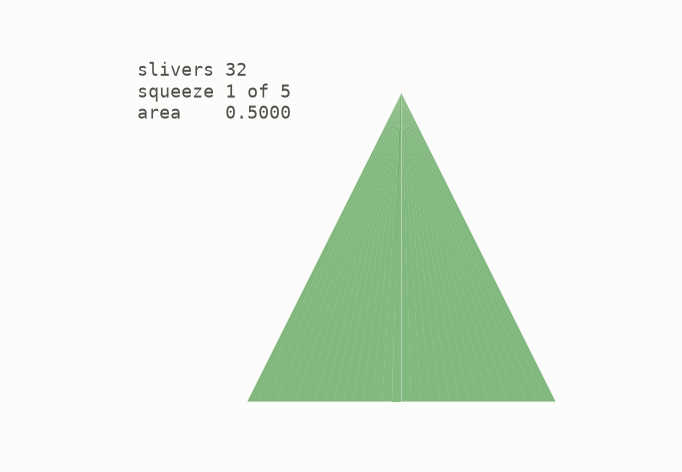
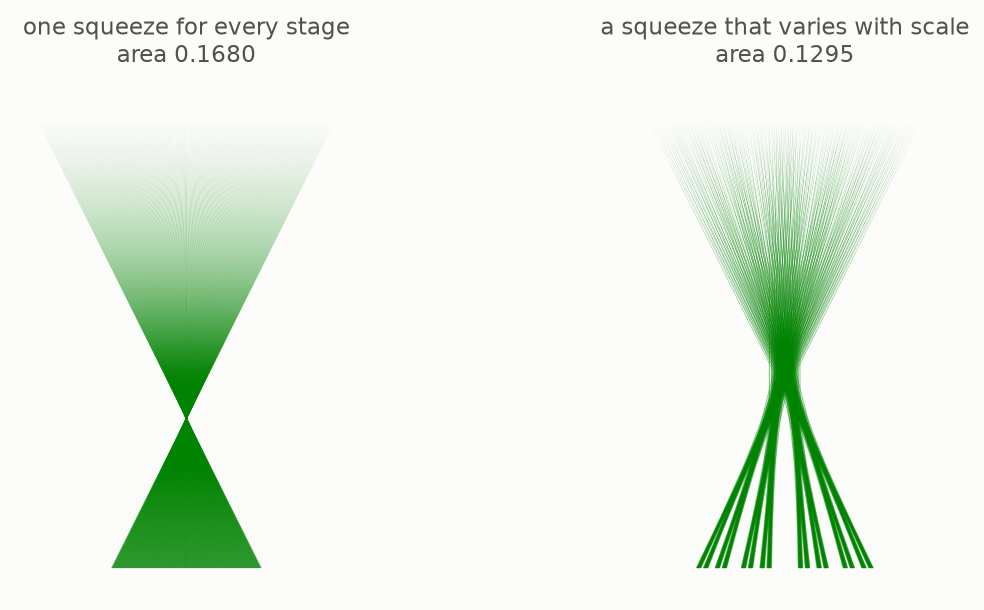
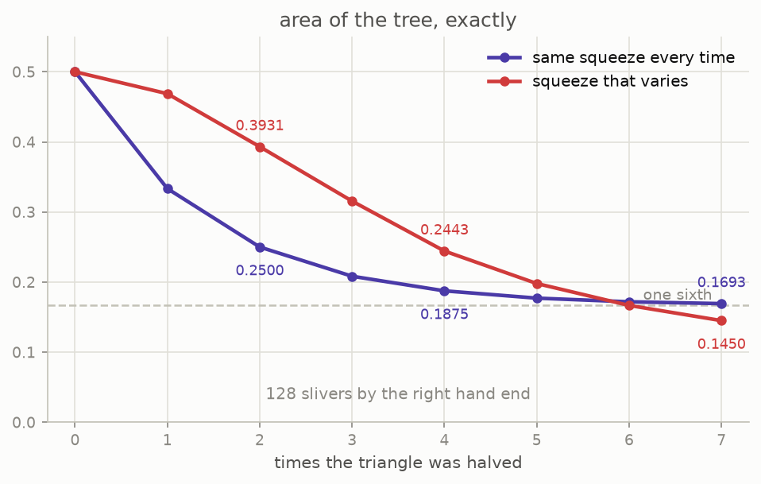

# 5 · The Perron tree

*By the end of this page you will have built the object at the centre of the whole story, and watched its area fall, in exact numbers.*

## Cut, then slide

Chapter 3 cut a triangle once and got two thirds. Do it again. And again.

Take the triangle with base from 0 to 1 and apex at height 1. Cut its base into $2^k$ equal pieces and join each piece to the apex. You now have $2^k$ thin **slivers**, and between them they hold every direction the triangle held: sliver number $i$ holds exactly the directions pointing from the apex into its own piece of the base.

Now slide the slivers into each other, in stages. Neighbours first, then neighbouring pairs, then neighbouring quadruples.



Nothing is rotated. Nothing is resized. Nothing is thrown away. So the pile still holds a needle in every direction of the original fan, and the tests in this repo check exactly that: after every stage, each sliver is still a translate of the one it came from, and the directions covered still run over the whole fan.

The result is called a **Perron tree**, after Oskar Perron, who in 1928 turned Besicovitch's original construction into this picture.

## The trap: squeeze the same way every time

The obvious thing is to use the best single merge from chapter 3 at every stage: overlap each pair to two thirds. Watch what happens.



The steady squeeze makes a **bowtie**. All the slivers pass through one point, and below that point sits a solid triangle that never gets any thinner. The area is exactly

```math
\frac16 + \frac{1}{3\cdot 2^k},
```

which the repo verifies as an exact fraction for every $k$ it can compute. Look at what that formula does: it falls, and falls, and then it stops. It converges to $1/6$. Cut the triangle into a billion slivers and you still have a third of the original area sitting there.

## Squeeze differently at different scales

The fix is to squeeze hard where the slivers are thin and gently where they are fat. At stage $j$ overlap each pair to $(j+1)/(j+4)$ of its width: a quarter at the finest scale, then 2/5, then 1/2, then 4/7, easing towards 1.



| slivers | steady squeeze | varying squeeze |
|---|---|---|
| 1 | 0.500000 | 0.500000 |
| 4 | 0.250000 | 0.393125 |
| 16 | 0.187500 | 0.244289 |
| 64 | 0.171875 | 0.166697 |
| 256 | 0.167969 | 0.129469 |
| 512 | 0.167318 | 0.118088 |

The steady column is heading for 0.1667 and will never leave. The varying column is slower off the line and then walks straight through the wall.

Two honest notes. First, the exact area of these trees is a fraction with a hundred digits underneath by the time you reach 256 slivers, so the table shows the decimals; the repo computes both. Second, the varying schedule here was found by scanning, not by theory, and it is not optimal. The known theory (Perron, Schoenberg, and Keich in 1999, who proved the rate is sharp) says the best a tree of $n$ slivers can do is about $1/\log n$, and $1/\log n$ goes to zero **very** slowly. To get the area below 1 percent you need something like $2^{100}$ slivers.

That slowness is a large part of why this whole subject was so hard, and why the picture in your head refuses to believe the theorem in the next chapter.

## Try it

```bash
python src/viz/ch05_the_perron_tree.py
python -m pytest tests/test_core.py -q
```

```python
from fractions import Fraction
from kakeya_guide.core import perron_tree, union_area, ramped_alphas

union_area(perron_tree(4, Fraction(2, 3)))     # -> Fraction(3, 16), the stall
union_area(perron_tree(4, ramped_alphas(4)))   # -> Fraction(13133, 53760)
```

---

> **The one thing to remember:** cut a triangle into slivers and slide them together and the area falls while every direction survives, but only if you squeeze differently at different scales; one fixed squeeze stalls forever at a sixth.

[← The free slide](../04-the-free-slide/README.md) · [Next: area zero →](../06-area-zero/README.md)
