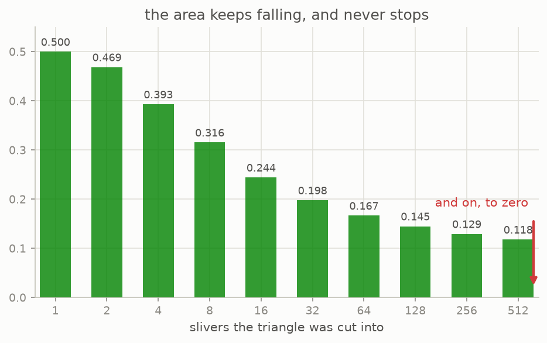

# 6 · Area zero

*By the end of this page you will know the answer to Kakeya's 1917 question, and it is not a number.*

## Keep cutting

The tree of chapter 5 holds every direction of its fan, and its area falls as you cut finer.


Same fan of directions in every picture. Less and less ground.



Besicovitch proved in 1919 that this never stops: for **any** small number you name, there is a figure holding a unit needle in every direction whose area is below it. Take the limit properly and you get a set of area exactly **zero** which still contains a full unit needle pointing in every one of the 180 degrees. Such a thing is called a **Besicovitch set**, or a **Kakeya set**.

He was not even working on Kakeya's problem. He was in Perm, in Russia, working on a question about Riemann integration, and needed a set like this as a tool. Kakeya's question reached him later, and he noticed his tool answered it.

## Turning the needle inside almost nothing

A set of area zero holding every direction is one thing. Actually **turning** a needle inside a small set is a stronger demand, and it is what Kakeya asked for. This is where chapter 4 earns its keep.


Inside one sliver, the needle pivots about the apex and sweeps that sliver's little wedge of directions. To reach the next sliver's wedge it needs to change lines, and by Pal's trick that costs as little area as you like, at the price of a long detour along thin whiskers.

Perron tree plus Pal joins gives the answer to Kakeya's question:

> **Besicovitch, 1928.** For every $\varepsilon > 0$ there is a set of area less than $\varepsilon$ inside which a unit needle can be turned continuously through 180 degrees.

The smallest room a needle can turn in does not exist. There is no smallest. Ask for a room of area one billionth and you get one. The deltoid was not close to the answer; there was no answer to be close to.

Two footnotes people usually want. Those needle sets sprawl: the joins push the whiskers far away, so the sets are small in area but wide across. And in 1971 Cunningham showed you can have both, an arbitrarily small needle set with no holes in it, sitting inside a disc of radius 1.

## What the repo can and cannot show you

The animations above are honest but finite. What the code checks (`tests/test_core.py`) is everything that can be checked exactly:

- the areas of the trees, as exact fractions, and that they keep falling;
- that after all the sliding, the pile still holds every direction of the fan;
- that no sliver was ever rotated or resized, only slid;
- that a Pal join really costs $\theta$ and really travels $1/\tan\theta$.

What no computer can check is the limit itself: "for every $\varepsilon$ there is a set" is a statement about infinitely many cases, and it is a proof, not a computation. The line between what is verified here and what is quoted from the literature is drawn at that limit, and stated again in [notes/research-content.md](../../notes/research-content.md).

## Try it

```bash
python src/viz/ch06_area_zero.py
```

```python
from kakeya_guide.examples import tree
from kakeya_guide.core import union_area, holds_every_direction
from fractions import Fraction

t = tree(8)                                            # 256 slivers
float(union_area(t))                                   # -> 0.129469...
holds_every_direction(t, Fraction(-1, 2), Fraction(1, 2))   # -> True
```

---

> **The one thing to remember:** there is no smallest room. A needle can be turned right around inside a set of area smaller than anything you name, and a set of area exactly zero can still point in every direction.

[← The Perron tree](../05-the-perron-tree/README.md) · [Next: zero but big →](../07-zero-but-big/README.md)
