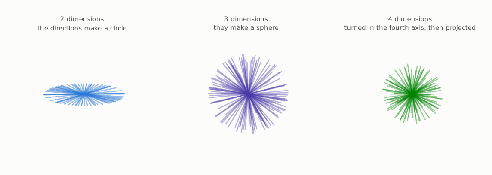
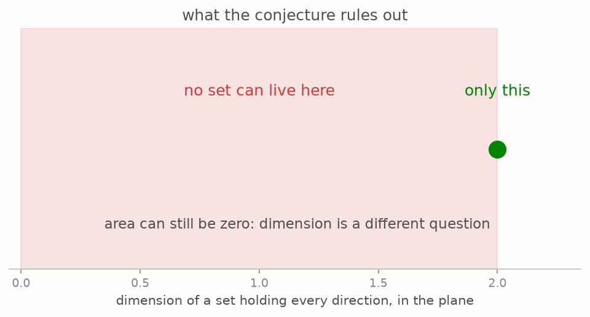

# 8 · The conjecture

*By the end of this page you will understand, fully and with nothing hidden, a question that stood for over a century.*

## Assemble the pieces

You now own every part:

1. A **Kakeya set** is a set holding a full unit needle in every direction (chapter 1).
2. Such a set can have area **zero** (chapter 6).
3. **Dimension** measures size in a way that survives area being zero (chapter 7).
4. In the plane, every Kakeya set has dimension **2**, the largest possible. Davies proved it in 1971.

Point 4 is the interesting one. Area could be squeezed to nothing. Dimension could not be squeezed at all.

The question then follows on its own. In three dimensional space, in four, and in $n$, you can still make the volume zero, since that much carries over, and what nobody knew was whether the **dimension** could be made smaller than $n$.

> a set in n-dimensional space<br>
> **holding a unit needle in every direction**<br>
> may have zero volume (Besicovitch),<br>
> **but it must still have dimension n**

That statement is the **Kakeya set conjecture**. Written out, it says that a set in $n$ dimensional space containing a unit segment in every direction must have dimension $n$.

## Every direction, in every dimension

The word doing the work is "every direction". What that means changes with the dimension you are in, and the figure below turns each case so the change can be seen.



All three panels are real three dimensional scenes, and the camera goes round all of them, because a still image of a three dimensional scene makes distant points look adjacent. Watch what each one does:

- **In the plane**, the directions make a circle. Seen edge on it is visibly flat, because it is.
- **In space**, they make a sphere. Far more directions to cover, and that is exactly why the problem got harder.
- **In four dimensions**, they make a 3-sphere, which nobody can look at. So the picture does the honest thing: it turns the directions in the fourth axis and projects the result down to three, the same way a cube's shadow is drawn on paper. The breathing you see, needles growing and shrinking as they swing, is the fourth axis passing through the projection. No rotation of a three dimensional object can do that.

The same code makes any of these. Directions are drawn as normalised random vectors, which are spread evenly over the sphere in **every** dimension, so the panel for $n = 5$ or $n = 10$ is one argument away.

## What it forbids



The conjecture does not predict a value to be discovered. It says every value except the maximum is impossible. Squeezing on volume works perfectly; squeezing on dimension is claimed to be blocked completely.

Two pieces of fine print, both worth one read:

- **Which dimension?** There are two rulers in common use. Box dimension counts covering boxes, as in chapter 7. Hausdorff dimension is a finer measure that can be smaller. The conjecture is usually stated for the Hausdorff one, which makes it the stronger claim, and a proof of it implies the box version.

- **Why "dimension $n$" and not "volume more than zero"?** Because volume zero is already settled and true, in every dimension, by chapter 6. If the conjecture had been about volume it would have been dead in 1919. Dimension is the surviving question.

## Why it looks winnable

The plane case is a theorem. The finite grid version (chapter 10) is a theorem with a half page proof. Every known construction of a small Kakeya set turns out to have full dimension. Nobody ever exhibited a thin one, or came close.

It looks like a ripe apple. It hung there from 1971 to 2025 in three dimensions, and it is still hanging in four.

## Try it

```bash
python src/viz/ch08_the_conjecture.py
```

---

> **The one thing to remember, the Kakeya conjecture:** *a set holding a unit needle in every direction of $n$ dimensional space may have zero volume, but it must have dimension $n$.*

[← Zero, but big](../07-zero-but-big/README.md) · [Next: why it matters →](../09-why-it-matters/README.md)
