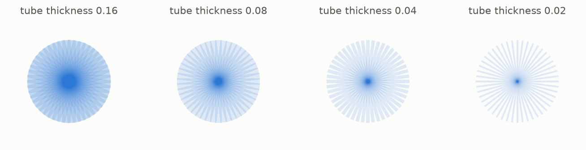

# 9 · Why it matters

*By the end of this page you will know why a puzzle about turning a needle became load bearing for large parts of modern mathematics.*

## From needles to tubes

A needle is infinitely thin, and nothing in the physical world is. Fatten it: take a **tube** of thickness $\delta$ around each unit segment.



Now the questions become quantitative. Take one tube for each of $1/\delta$ directions and ask how small their union can be. Kakeya says that as $\delta$ shrinks the union stays not much smaller than a fixed blob, and never gets as small as the sum of the tubes suggests. The dimension statement of chapter 8 is the sharp version of that, at the limit.

The moment you say "tube", analysts recognise the object. A wave that travels in some direction, over some stretch of time, lives in a tube. Add up waves going in many directions and you are asking exactly how much their tubes can pile up.

## Where it shows up

- **Fourier analysis.** The restriction problem asks when you can make sense of a Fourier transform on a curved surface like a sphere. Approximations to it are built out of wave packets, which are tubes, and a Kakeya set that was too small would break the estimates. Restriction implies Kakeya, so Kakeya is a floor under the whole subject.
- **Bochner-Riesz summation.** Whether the natural way of summing a Fourier series converges. Same tubes, same obstruction.
- **Wave equations.** Local smoothing estimates ask how much a wave can focus. A wave focusing too sharply would be a Kakeya set that was too small.
- **PDE more generally.** These estimates are the tools with which dispersive equations are attacked.
- **Number theory.** Kakeya style problems appear in bounds for exponential sums, where "directions" become "frequencies".
- **Computer science.** The finite field version of chapter 10 is used to build randomness extractors and to study error correcting codes: the same combinatorics, over a grid.

There is a hierarchy of conjectures here, roughly: restriction implies Bochner-Riesz implies local smoothing implies Kakeya, with details that specialists argue about. Kakeya sits at the bottom. It is the easiest of the family and it was still open for a century, which tells you what the ones above it are like.

## The reason it is quotable

A problem this famous usually has an unquotable statement. This one you can say to a stranger on a bus, as *how small can a room be, if you have to turn a needle around inside it*, and the answer is genuinely useful to people proving theorems about waves.

That combination, a question a child can hold and a theorem an expert needs, is rare. It is why the needle keeps its name in the literature.

## Try it

```bash
python src/viz/ch09_why_it_matters.py
```

---

> **The one thing to remember:** thicken the needles into tubes and the Kakeya question becomes the question of how much waves can pile up, which is why estimates in Fourier analysis, PDE and even computer science lean on it.

[← The conjecture](../08-the-conjecture/README.md) · [Next: on a grid →](../10-on-a-grid/README.md)
