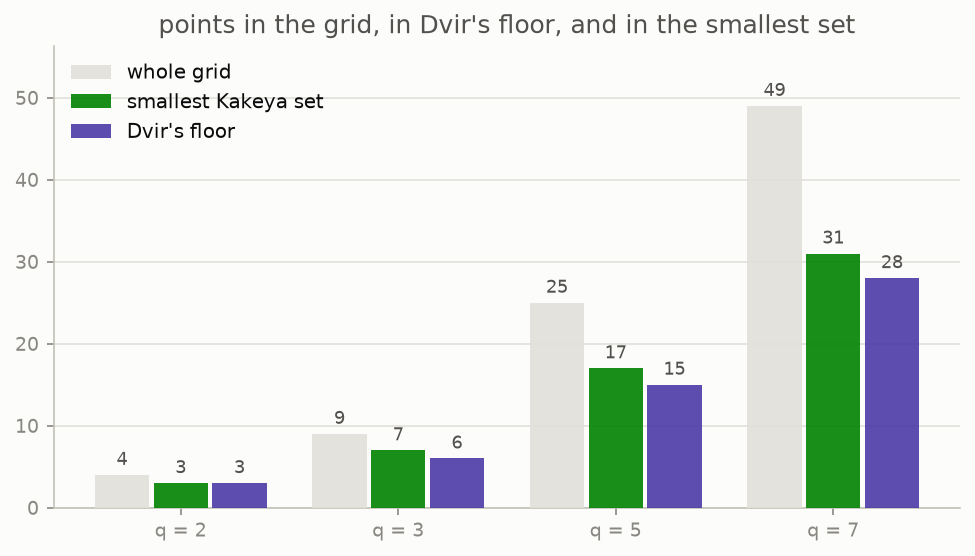

# 10 · On a grid

*By the end of this page you will have run a complete proof of the Kakeya conjecture. Not the real one: its shadow on a finite grid, where the whole argument fits on half a page and your computer can check every step.*

## Replace the plane with a grid

Continuous space is hard. So in 1999 Thomas Wolff suggested asking the same question in the simplest possible universe: arithmetic modulo a prime $q$.

Points are pairs $(x, y)$ with $x, y$ in $\{0, 1, \ldots, q-1\}$, and all arithmetic wraps around. A **line** is the $q$ points $a + tb$ as $t$ runs over the field. There are exactly $q+1$ directions, because $b$ and $2b$ point the same way. A **Kakeya set** is a set of grid points holding a whole line in every direction.


The question becomes one of counting. The grid has $q^2$ points, and what we want to know is how few of them a Kakeya set can have.

## The answers, computed

For small $q$ you can simply search. A smallest Kakeya set is a union of one line per direction, so the search runs over those choices, with a bound that prunes almost everything. This repo does it exactly:

| grid | points in grid | directions | smallest Kakeya set | Dvir's floor |
|---|---|---|---|---|
| $q=2$ | 4 | 3 | **3** | 3 |
| $q=3$ | 9 | 4 | **7** | 6 |
| $q=5$ | 25 | 6 | **17** | 15 |
| $q=7$ | 49 | 8 | **31** | 28 |



The middle column matches a formula of Blokhuis and Mazzocca: $q(q+1)/2 + (q-1)/2$ for odd $q$, and $q(q+1)/2$ for even $q$. The repo also builds these smallest sets by hand, out of the tangent lines to a parabola, and confirms they are Kakeya and exactly that size.

About half the grid. Not a tiny corner of it. That is the finite version of "cannot be thin".

## The same question, one dimension up

Dvir's argument is written for $\mathbb{F}_q^n$, not just for the plane. Seeing the grid in three dimensions first makes the general proof easier to follow.


Twenty seven points, thirteen directions through them, and a Kakeya set of fifteen points found by a greedy sweep. Dvir's floor for this grid is ten. The camera turns because a flat drawing of a cube of points is a lie about which points are near each other.

Exhaustive search stops being possible almost immediately here: in the plane the search has $q^{q+1}$ choices, and in space it has $(q^2)^{q^2+q+1}$. The figure above quotes what a greedy sweep found, which is an upper bound and says so.

## Dvir's proof, in six lines

In 2008 Zeev Dvir proved the general statement, for every $q$ and every dimension, in about half a page. The argument is famous, and it is short enough to give here in full.

Suppose $K$ is a Kakeya set in the grid, and suppose it is small. The argument below shows that the supposition cannot hold.

1. **Counting.** A polynomial of degree at most $q-1$ in $n$ variables has $\binom{q+n-1}{n}$ coefficients. Asking it to vanish at one point is one linear equation on those coefficients.
2. **Step one.** If $K$ has fewer points than there are coefficients, the equations cannot pin everything down, so there is a **nonzero** polynomial $g$ of degree at most $q-1$ vanishing on all of $K$.
3. **Step two.** $K$ contains a whole line in every direction $b$. Restricted to that line, $g$ becomes a polynomial in one variable of degree at most $q-1$ which vanishes at all $q$ points of the line. A degree $q-1$ polynomial with $q$ roots is the zero polynomial, so it vanishes identically along the line.
4. **Consequence.** The coefficient of the top power along that line is exactly the top homogeneous part of $g$ evaluated at $b$. So the top part vanishes at every direction $b$.
5. **Step three.** A homogeneous polynomial vanishing in every direction vanishes at every point of the grid. But no nonzero polynomial of degree less than $q$ can vanish on the entire grid.
6. **Contradiction.** So $K$ was not small after all:

```math
|K| \ \geq\ \binom{q+n-1}{n} \ \geq\ \frac{q^n}{n!}.
```

A Kakeya set in the grid must occupy a fixed fraction of it. That is the finite field Kakeya conjecture, proved.

## Run the proof

Every step above is a computation on small grids, and every one is a test in this repo (`tests/test_finite.py`):

- step one, by finding the vanishing polynomial with linear algebra over $\mathbb{F}_q$ and checking it really does vanish on the set;
- step two, by restricting a polynomial to a line and seeing every coefficient come out zero;
- the consequence, by comparing the top coefficient along a line with the top part evaluated at the direction, on random polynomials;
- step three, by computing the rank of the "evaluate every monomial at every point" matrix and finding it full;
- and the conclusion itself, by brute force: for $q = 3$ and $q = 5$, no set below the floor holds every direction.

```python
from kakeya_guide.finite import tangent_line_kakeya, dvir_report, min_kakeya_size

min_kakeya_size(7, 2)                       # -> 31, by exhaustive search
r = dvir_report(tangent_line_kakeya(5), 5, 2)
r["kakeya"], r["size"], r["bound"]          # -> (True, 17, 15)
r["too_small"]                              # -> False: exactly as promised
```

That last line is the theorem looking back at you. The argument only bites on sets below the floor, and the grid contains no such Kakeya set to feed it.

## The catch

The grid proof is beautiful, it is short, and it does **not** transfer to the plane. Chapter 11 is about why.

## Try it

```bash
python src/viz/ch10_on_a_grid.py
python -m pytest tests/test_finite.py -q
```

---

> **The one thing to remember:** on a finite grid the answer is known, a Kakeya set must be a fixed fraction of the whole grid, and Dvir's half page proof of it can be run line by line on your own machine.

[← Why it matters](../09-why-it-matters/README.md) · [Next: why it was hard →](../11-why-it-was-hard/README.md)
