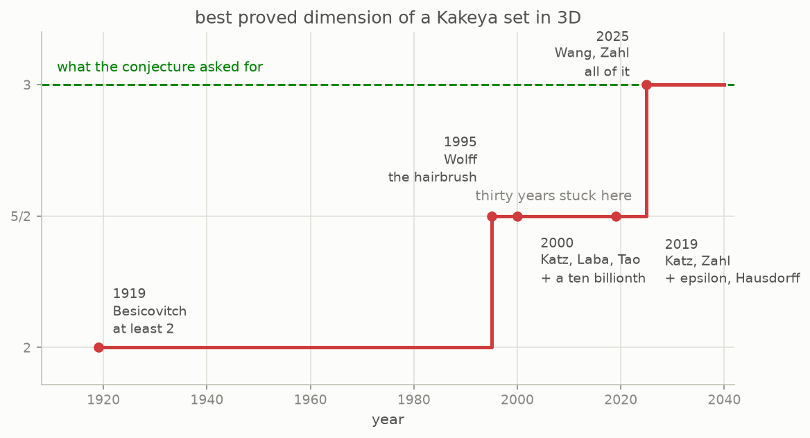
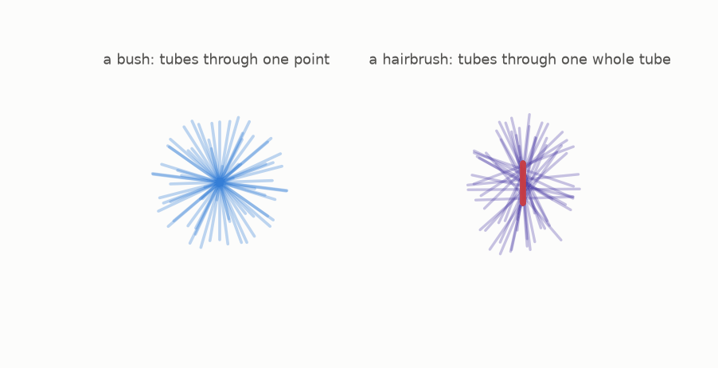

# 11 · Why it was hard

*By the end of this page you will understand why a proof that fits on half a page for grids took a century and a hundred pages for actual space.*

## A century of inches

Here is the whole assault on three dimensions, as one number: the best dimension anyone could prove a Kakeya set in $\mathbb{R}^3$ must have.



| year | who | what was proved |
|---|---|---|
| 1919 | Besicovitch | dimension at least 2, inherited from the plane |
| 1991 | Bourgain | the first modern advance: dimension beats $(n+1)/2$ in every dimension |
| 1995 | Wolff | $(n+2)/2$, which is 5/2 in three dimensions |
| 2000 | Katz, Laba, Tao | $5/2 + 10^{-10}$ in 3D, for box dimension |
| 2019 | Katz, Zahl | $5/2 + \varepsilon$ in 3D, for Hausdorff dimension too |
| 2025 | Wang, Zahl | **3** |

Read the fourth row again. A whole paper, by three of the strongest people in the field, to move the number by a ten billionth. That is not a joke at their expense: getting off 5/2 at all was the point, and it took an argument nobody had thought of. But it tells you how hard the ground was.

## What made it hard: the enemy has structure

The obstacles are not vague. People know exactly what a hypothetical thin Kakeya set would have to look like, because thirty years of work went into cataloguing the possibilities.

**Sticky.** Nearby directions have to sit on nearby tubes, in a way that persists at every scale. A sticky set is self similar and looks like the worst case.

**Plany.** At every point, the tubes through it lie almost inside a plane.

**Grainy.** The set is built of little slabs that line up across scales.

Wolff's hairbrush argument shows why counting has to be clever:



Both pictures rotate for a reason: the argument is about space, and the force of the hairbrush is that its bristles spread into the third dimension. The naive move is to find a point where many tubes meet, a **bush**, and count the room they must fill. Wolff's improvement was to find a whole *tube* that many tubes cross, a **hairbrush**, which forces far more room. That one idea was worth half a dimension, and it stood as the record in 3D for a quarter of a century.

## Why the grid proof does not carry over

Chapter 10's proof is half a page. It does not survive the trip to real space.

| | |
|---|---|
| **on the grid** | two lines meet in at most one point |
| | so a polynomial through the set is easy to control |
| **in the plane** | two tubes can hug each other for their whole length |
| | and a set can be almost-but-not-quite made of lines |
| | so Dvir's half page says nothing here |

On a grid, two different lines share at most one point, and every line is either wholly inside your set or not. In the plane, two tubes pointing in *nearly* the same direction can hug each other along their whole length, and a set can be almost made of lines without containing any. Polynomials do not notice "almost". The algebra that makes Dvir's argument work has no handle on a set that misses being algebraic by an arbitrarily small amount.

There is a deeper reason too. On the grid there is no notion of scale: a line is a line. In the plane the same set behaves differently at every scale, and a proof has to control all of them at once. That is what the modern arguments spend their pages on.

## The multi scale answer

The eventual proof works by taking the enemy's structure seriously. Wang and Zahl had already shown, before the main result, that **sticky** Kakeya sets in $\mathbb{R}^3$ cannot be thin. The final argument builds a way to handle unions of convex sets at many scales at once, and it is that machinery, not a clever trick, that finishes the job.

The lesson people drew is that the difficulty was never a missing idea about needles. It was that the correct statement needed a language for multi scale structure, and that language took thirty years to build.

## Try it

```bash
python src/viz/ch11_why_it_was_hard.py
```

---

> **The one thing to remember:** in the plane, tubes can hug without ever being lines, so the grid's algebra is useless, and the number crept from 2 to 5/2 over eighty years before the multi scale machinery finished it.

[← On a grid](../10-on-a-grid/README.md) · [Next: the proof →](../12-the-proof/README.md)
