# The Triangle Game, from Zero

*A step-by-step visual guide to a colouring game studied since 1955, a question for which Erdős offered prize money, and the 2026 result that answered it. You do not need a maths background. Each new idea begins with a picture.*


The animation shows sixteen people with a connection between every pair. That makes 120 connections, and each one receives one of three colours. When the colouring is complete, there is no group of three people whose three mutual connections all have the same colour. Sixteen is the largest group for which this is possible with three colours. Greenwood and Gleason built this example and proved that seventeen is impossible in 1955.

This guide asks what happens when many more colours are available. More colours let us keep a larger group safe, but how much larger can the group become for each added colour? Erdős offered cash prizes for answering that question. For decades, the best construction and the best limit were so far apart that researchers did not even know whether the long-term rate stopped at a fixed number. A result in 2026 showed that it never stops growing.

The guide develops the result in small steps. Every numbered section also has a [page you can play with](https://muchmirul.github.io/conjectures/multicolor-ramsey/play/index.html), where you can change the main choices and watch the picture respond.

The code that creates every figure is included in this repository. The tests recalculate the numbers and check the small colourings shown here. When a statement comes from an existing theorem rather than those tests, the text says so.

```
    first, learn the game     1  the rule
                              2  why six people cannot stay safe
                              3  what an extra colour changes
    then, find the question   4  how to compare different colour counts
    see why old tools stall   5  multiplying safe groups
                              6  a general upper limit
                              7  the wide gap between them
    build the 2026 idea       8  which colours each room omits
                              9  keeping arrivals on safe teams
                             10  one fixed referee for every choice
                             11  stacking the rooms into a tower
                             12  what the result settles
```

**[Play with this](https://muchmirul.github.io/conjectures/multicolor-ramsey/play/00.html)** to colour the opening group and inspect the finished pattern.

## 1 · The game

Start with a group of people and draw a connection between every pair. Give every connection a colour. Any choice of three people forms a triangle because each pair among them is connected. You lose if all three connections in one of those triangles have the same colour.

We will call this a **one-colour triangle**. A completed colouring with no one-colour triangle will be called **safe**. A group together with a safe colouring is a **safe table**.

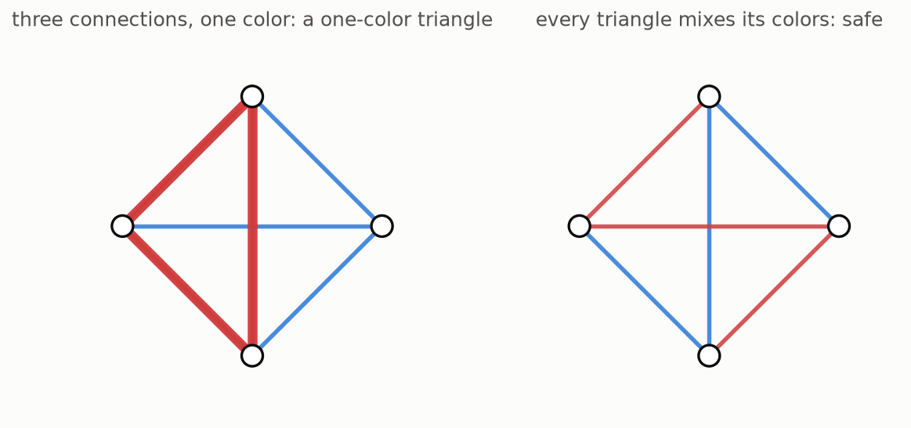

The thick triangle on the left uses one colour on all three sides, so that colouring loses. Four people contain four possible groups of three. On the right, each of those four triangles uses at least two colours, so the colouring is safe.

With two colours, a group of five can be kept safe. Apart from renaming the people or swapping the colours, there is only one way to do it. Place the five people around a circle. Use the first colour for neighbouring pairs around the outside, then use the second colour for the five connections that skip across the circle.

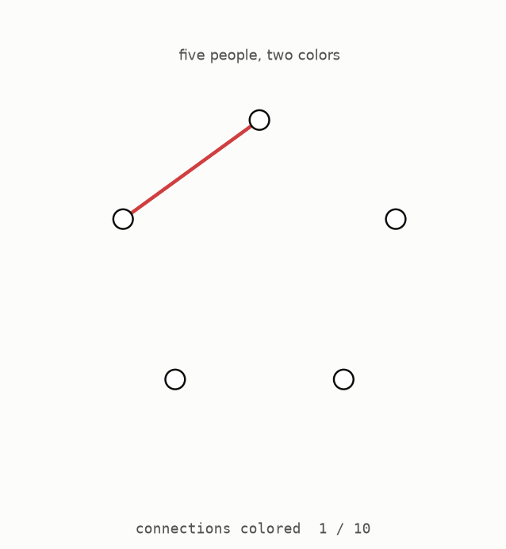

The final sweep checks every possible group of three. There are ten of them, and every one uses both colours. Safety is therefore not based on how the picture looks. It comes from checking a short, complete list. The tests in this repository perform the same check.

There is also a quick way to understand the pattern. Look at either colour by itself. Its five connections form a ring, and a ring contains no triangle. Since neither colour can make a triangle on its own, the combined colouring is safe.

**[Play with this](https://muchmirul.github.io/conjectures/multicolor-ramsey/play/01.html)** to colour the five-person group and check each triangle.

## 2 · Six is forced

Five people can stay safe with two colours. Six people cannot. This is the one theorem proved completely in this guide, and every step can be seen in the animation.

Choose one of the six people and look at the five connections leading from that person. There are only two colours available. At least three of those five connections must have the same colour, because two connections of each colour would account for only four. Suppose three of them are red.

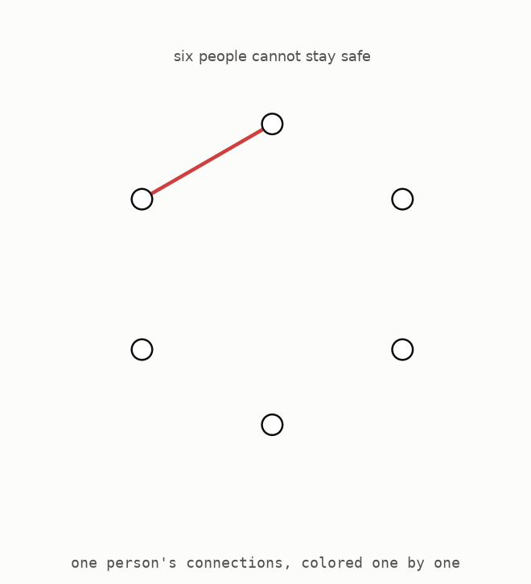

Now focus on the three people at the other ends of those red connections. If any pair among them is joined in red, that connection and the two red connections back to the first person make a red triangle. To avoid that outcome, all three connections among those people would have to be blue. But those three blue connections make a blue triangle instead.

A one-colour triangle appears in either case. The first counting step is often called the **pigeonhole principle**: when more objects are placed into fewer groups, one group must receive several objects.

The argument did not depend on how the connections were coloured, so it covers every possible two-colouring of six people. The computer tests check the same claim another way. Six people have fifteen connections, with two choices for each connection, giving 32768 complete colourings. The tests inspect all of them and find that none is safe.

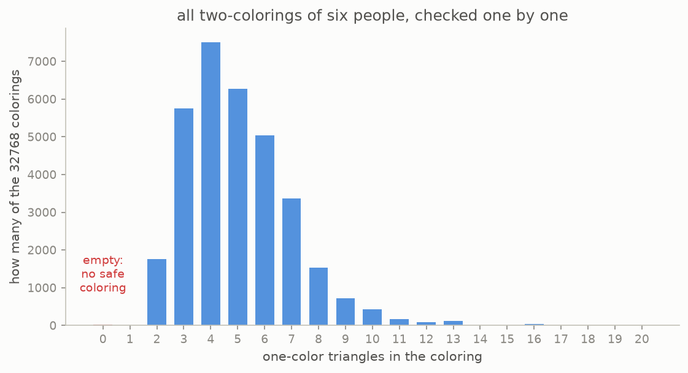

The empty bar at zero confirms that every colouring contains a one-colour triangle. The bar at one is empty too. Even the best six-person colourings contain exactly two one-colour triangles, never only one. Goodman recorded this stronger observation in 1959, and the exhaustive test finds it again.

The two-colour story is now complete: five people can stay safe, while six force a loss. We will call six **the forcing size** for two colours, meaning the first group size at which a one-colour triangle is unavoidable.

**[Play with this](https://muchmirul.github.io/conjectures/multicolor-ramsey/play/02.html)** to try colouring six people and see which triangle becomes unavoidable.

## 3 · More crayons

Adding a third colour makes a much larger safe group possible. The best safe size jumps from five people to sixteen. The opening animation showed the full colouring; the next picture separates its three colours so that each can be checked on its own.

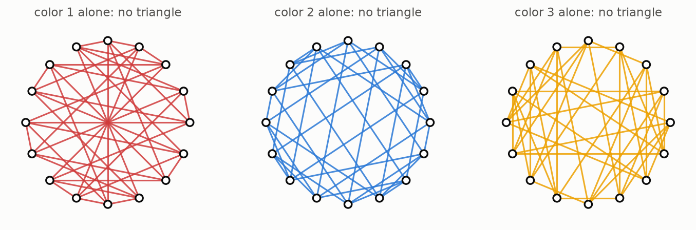

Each panel contains the connections of one colour. Every person has five connections in each panel, but no panel contains a triangle. A one-colour triangle would have to appear entirely inside one of these panels, so the full three-colour pattern is safe. Greenwood and Gleason created this pattern in 1955. This repository rebuilds it from their instructions and checks all 560 groups of three.

They also proved that seventeen people cannot stay safe with three colours. A direct computer sweep would require considering three choices on each of 136 connections, which is far beyond the case-by-case checks in this project. The guide therefore quotes their theorem rather than claiming to verify it.

After three colours, no exact forcing size is known.

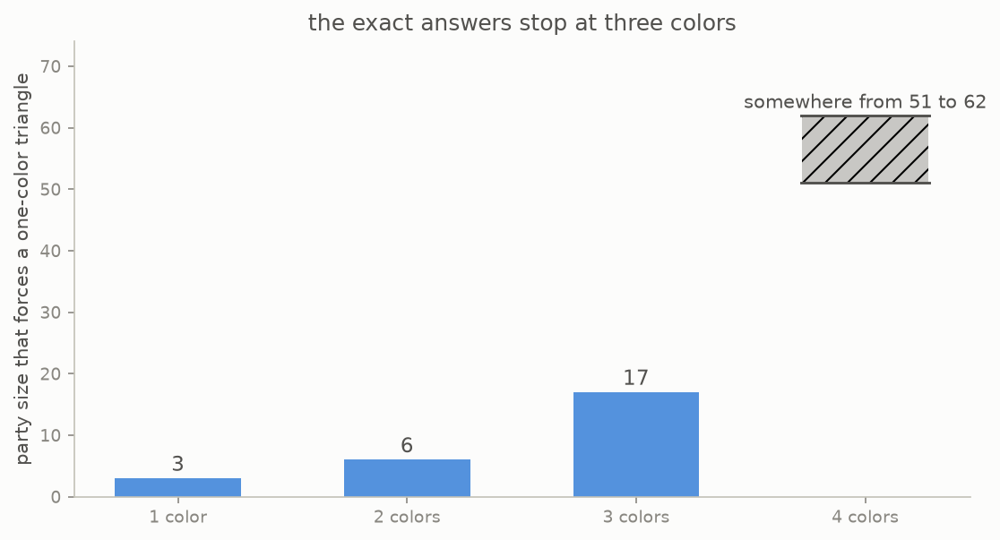

For four colours, the forcing size is known to be somewhere between 51 and 62. In other words, a safe colouring of fifty people is known, and every colouring of sixty-two people is known to fail, but the exact point between them remains open. The uncertainty is even wider for five colours. No exact answer is known for any colour count above three. The number of possible colourings grows too quickly for a simple search, so progress depends on general arguments and constructions.

**[Play with this](https://muchmirul.github.io/conjectures/multicolor-ramsey/play/03.html)** to compare the known small cases and the first open range.

## 4 · The question

To compare constructions that use different numbers of colours, we need a fair score. Suppose a safe table uses a certain number of colours. Ask for the number that, when multiplied by itself once for each colour, gives the group size. We will call that score **people per colour**. This is the usual root of the group size, but the repeated-multiplication picture is all we need here.

Five people with two colours score about 2.24, because multiplying 2.24 by itself gives about five. Sixteen people with three colours score about 2.52, because multiplying 2.52 by itself three times gives about sixteen. A larger score means that each colour contributes a larger multiplying effect.

Before 2026, the best long-term recipe was based on addition patterns around number circles. As the number of colours grows, its score approaches about 3.28. This does not mean there is a literal five-colour safe group with that score. Such a group would need 380 people, while the simple upper argument in section 6 already forces a triangle by 327 people. The recipe reaches 3.28 only as a long-term rate after its small losses are spread over more and more colours.

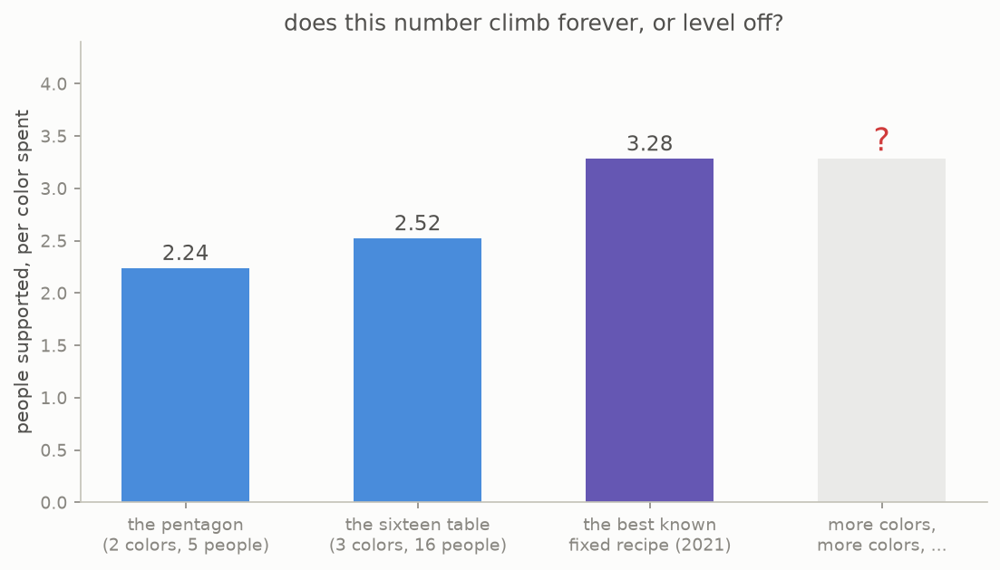

The known scores rose slowly, which led to the central question.

> As the number of colours grows without limit, does the people-per-colour score also grow without limit, or does it settle below one fixed ceiling?

Erdős offered 250 dollars for determining the long-term answer and 100 dollars for simply deciding whether that answer was finite. The prizes were recorded in a 1983 survey, and the growth question appeared in the standard Ramsey theory reference in 1990. Both possibilities remained open until 2026.

Either answer seemed possible. Every new colour gives the construction another choice, which might allow the score to keep rising. However, every known recipe produced only a fixed long-term score. The next sections explain why the old tools naturally behaved that way.

**[Play with this](https://muchmirul.github.io/conjectures/multicolor-ramsey/play/04.html)** to compare group size, colour count, and the resulting score.

## 5 · Multiply

A classical construction combines two safe tables to make a larger safe table. The animation applies it to two copies of the five-person pattern.


Begin with five outer people. Replace each person with a **room** containing a complete copy of the second safe group. Connections inside a room use the second group's colours. These colours are fresh, meaning they are not used between rooms. Every connection between two rooms uses the colour that joined the corresponding two people in the outer group.

To see why the result is safe, consider the three possible locations of a triangle.

1. If all three people are in one room, their triangle belongs to the safe inner colouring.
2. If two people are in one room and the third is in another, the two cross-room connections have the same outer colour. The connection inside the room has a fresh inner colour, so all three cannot match.
3. If the three people are in three different rooms, their colours copy a triangle in the safe outer colouring.

This covers every triangle, so the combined group is safe. The tests check all 2300 triangles in the resulting 25-person, four-colour group. They also check an 80-person, five-colour group made by combining the sixteen-person and five-person patterns.

The rule is simple: group sizes multiply, while colour counts add. Repeating the five-person construction gives 25 people with four colours, 125 with six colours, and so on.


The vertical scale compresses repeated multiplication, so a fixed score appears as a straight line. Repeating the five-person pattern always scores 2.24 people per colour. Repeating the sixteen-person pattern always scores 2.52. The groups become enormous, but the score never changes because every round spends the same number of colours for the same multiplying gain.

The ability to combine any two safe groups also guarantees that the best possible score has a well-defined long-term destination rather than bouncing forever. What remained unknown was whether that destination was a fixed number or infinity. Repeating one fixed construction can never answer infinity, because its score stays fixed at every round.

**[Play with this](https://muchmirul.github.io/conjectures/multicolor-ramsey/play/05.html)** to combine two safe groups and follow the three triangle cases.

## 6 · The ceiling

The argument from section 2 can be extended to any number of colours. Choose one person and sort everyone else into groups according to the colour of their connection to that person.

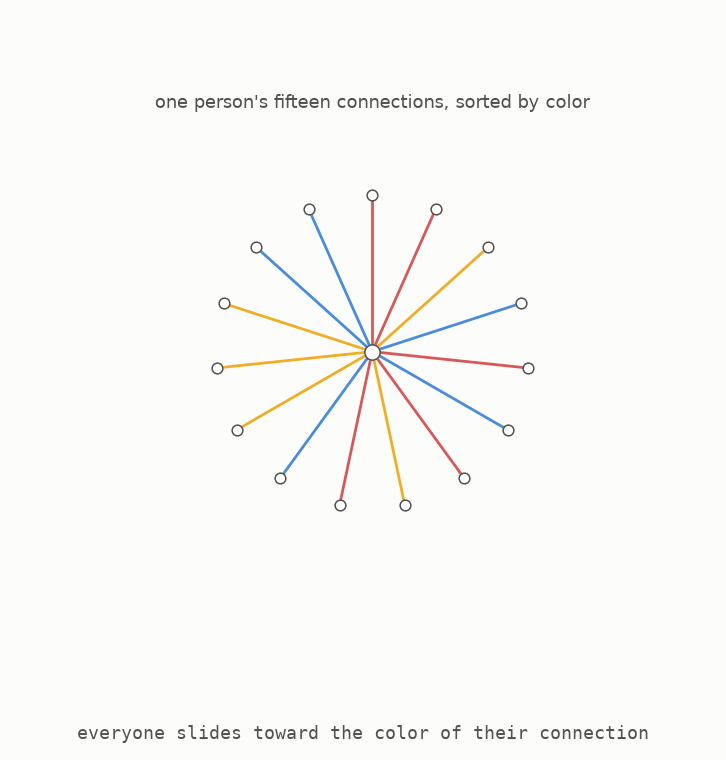

The picture uses the safe sixteen-person colouring. The chosen person has fifteen connections, so at least one of the three colour groups contains five people. Inside that group, its sorting colour cannot be used. If two people there were joined in that colour, they would complete a one-colour triangle with the chosen person. The group must therefore survive using only the other two colours, and five is exactly the largest size that can do so.

This also explains why a seventeenth person cannot be added. From one person there would be sixteen connections in three colours, so one colour group would contain at least six people. That group must avoid its sorting colour, leaving only two colours. Section 2 showed that six people cannot survive with two colours.

The same sorting step works again with more colours. Each step removes one available colour and leaves a smaller group. Starting with the one-colour case and working upward gives the forcing sizes 3, 6, 17, 66, 327, and then continues in the same way. These are upper limits: once a group reaches the listed size, the sorting argument guarantees a one-colour triangle.

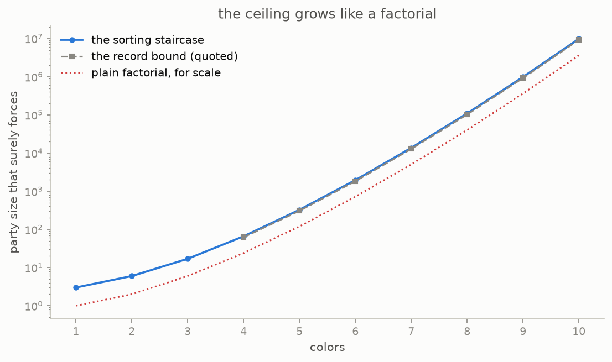

At each step, the size is multiplied by roughly the current number of colours. Repeatedly multiplying by each whole number up to the colour count is called a **factorial**, so this upper limit has factorial growth. The simple staircase gives the exact answers for one, two and three colours. At four colours it gives 66, while stronger work proves the answer is no more than 62.

Later refinements reduce the fixed amount in front of the factorial without changing this overall shape. The best published multiplier is called e minus one sixth, where e is a standard fixed number of about 2.72. No known upper-bound argument has replaced factorial growth with a fundamentally smaller kind of growth.

**[Play with this](https://muchmirul.github.io/conjectures/multicolor-ramsey/play/06.html)** to sort the connections and build the upper-limit staircase.

## 7 · The gap

The lower and upper limits can now be placed on the same chart.


The lower edge shows group sizes that can actually be kept safe by multiplying known examples. It grows through repeated multiplication by a fixed amount. The upper edge comes from the sorting argument and grows like a factorial, whose multiplying amount rises with every colour. The two kinds of growth move farther apart as more colours are added. Decades of work improved the fixed lower score from 2.24 toward 3.28, but the broad gap remained.

Several attractive shortcuts failed. One of the simplest uses different orderings of the same items.

Take every ordering of a small set of letters. For each pair of orderings, find the first position where they differ and use that position as the connection's colour. Three letters have six orderings, but only the first two positions can be the first difference. If this idea worked, it would keep six people safe with two colours and beat the five-person limit.


It fails. The orderings ABC, BAC and CAB all first differ from one another at the first letter. Their three connections therefore receive the same colour. The same collision can be built with any larger number of items. Recording more detail in each colour can prevent this particular collision, but it also uses so many extra colours that the hoped-for advantage disappears.

Addition patterns on number circles face another version of the same difficulty. Every colour, viewed alone, must contain no triangle. Simple methods achieve that by keeping each colour in a restricted part of the construction. To make the people-per-colour score grow, many different rooms must be able to reuse the same colours without letting the reused pieces join into a triangle. The 2026 construction provides a fixed global rule that makes this reuse safe.

**[Play with this](https://muchmirul.github.io/conjectures/multicolor-ramsey/play/07.html)** to test the ordering shortcut and watch its first failure.

## 8 · Palettes

The next three sections reuse ideas already introduced: rooms, colours, and the need to prevent one-colour triangles. Each section adds one simple rule. The first rule decides which colours may be used in each room.

As in section 5, divide the people into rooms. Give every room a **palette**, meaning a list of colours that are not allowed on connections inside that room. All colours outside the list may be used internally. In the pictures, a room is said to “hold” a colour when that colour is on its palette, even though holding it means keeping it out of the room.

A connection between two different rooms may use a colour only when that colour appears on exactly one of their palettes.

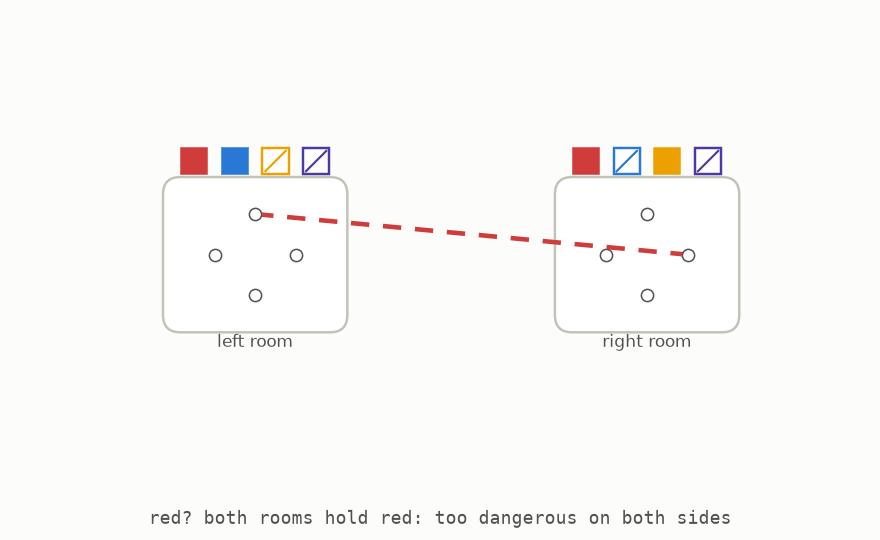

This rule immediately prevents a one-colour triangle spread across three rooms. Fix one colour and look at any three room palettes. For each room, the colour is either listed or not listed. Among three rooms, at least two must have the same answer. The connection between those two rooms cannot use that colour, because a cross-room colour must be listed by exactly one side. The chosen colour therefore cannot appear on all three sides of the triangle.

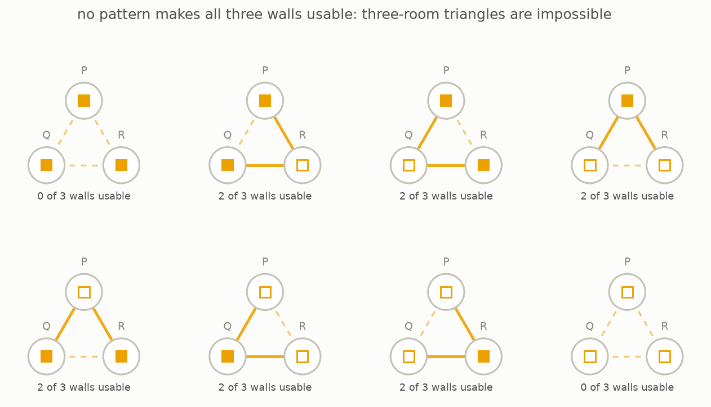

The figure shows all eight possible patterns, and the tests check every one. No extra colour was needed to rule out triangles across three rooms. A different danger remains: two corners of a triangle may lie in the same room while the third lies outside. The next section handles that case.

**[Play with this](https://muchmirul.github.io/conjectures/multicolor-ramsey/play/08.html)** to change the palettes and see which cross-room colours are allowed.

## 9 · The trap

Consider two people in one room and a third person outside it. Suppose both incoming connections use red. A red triangle appears if the two people inside the room are also connected in red. The construction must prevent the two incoming connections from landing on such a pair.

Look at the red connections already inside the room. Split the people into **teams** so that no red connection has both ends in one team. In the five-person room, the red connections form a ring, and the next picture shows a split into three teams.

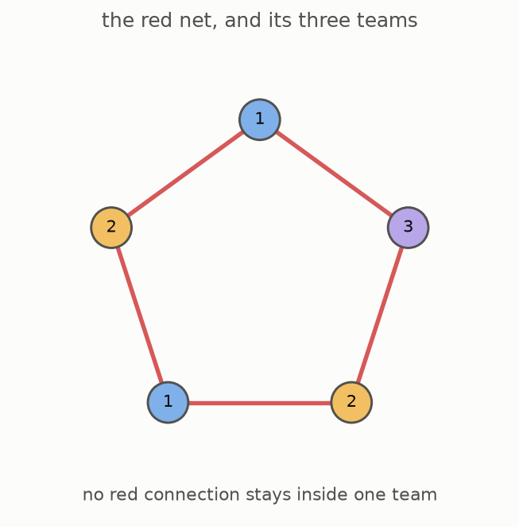

Now impose the landing rule: all red connections coming from the same outside person must end within one team. Since no two teammates are joined in red, those arrivals cannot complete a red triangle.

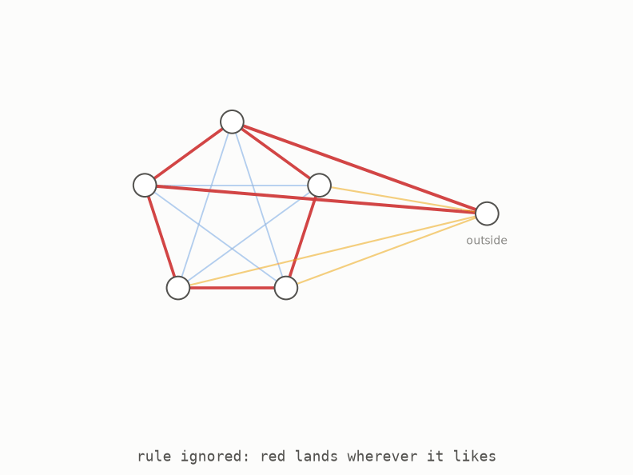

The first half of the animation breaks the rule. The two red arrivals land on people who are connected in red, so the triangle closes. In the second half, both arrivals land in one team, where no red connection exists, and the triangle cannot close.

There is a second safe case. If red appears on the room's palette, then red is not used anywhere inside that room. Incoming red connections are automatically harmless because the triangle would need a red internal connection too. Thus every incoming colour is protected in one of two ways: it is absent inside the room, or its arrivals are confined to one safe team.

The animation is a small demonstration of why the team rule matters. The real construction does not choose each arrival by hand. It needs one fixed procedure that enforces the rule for every pair of rooms without adding new colours. That procedure is the referee in the next section.

**[Play with this](https://muchmirul.github.io/conjectures/multicolor-ramsey/play/09.html)** to compare a broken landing rule with a safe one.

## 10 · The referee

Every connection between two rooms needs two choices: a colour allowed by the palettes, and a team on which it may safely land. These choices cannot be improvised for one pair and changed for the next. A single rule must work for every pair of people in every pair of rooms.

The construction begins by fixing a card filled with symbols before any people or rooms are considered. We will call it **the referee's card**. The next animation shows a genuine small example found and checked by this repository.

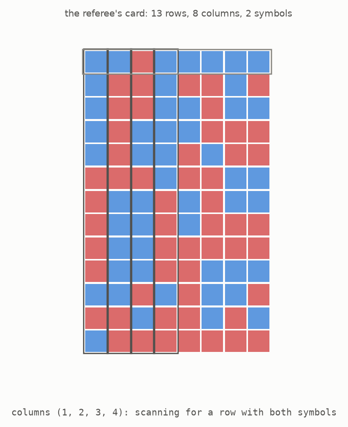

This card has thirteen rows and eight columns, and every entry is one of two symbols. Its promise is simple: choose any four columns, and there is at least one row in which both symbols appear among those four entries. There are seventy ways to choose the four columns, and the tests check all seventy.

At this small size, most randomly filled cards already pass. That does not show that the full construction is easy. At the real sizes, direct checking is impossible. Two counting arguments prove that at least one card works for all column choices at once. The rest of the construction needs only that promise, not a case-by-case search.

The card must be fixed first. If a new rule could be invented after seeing each pair of people, it could always be adjusted to make that one pair work. Such an adjustment would say nothing about any other pair. One card chosen in advance has to handle every future pair, which is what gives the promise its force.

Here is how the card guides a connection. For each candidate colour, a person's team number is written as one symbol in a word. The fixed card produces **the two answer lists**, one for each direction between the two people. More precisely, it gives two fixed rules for producing those lists. For any pair of words, at least one position is guaranteed to contain an agreement between one person's team symbol and the answer produced from the other person's word.

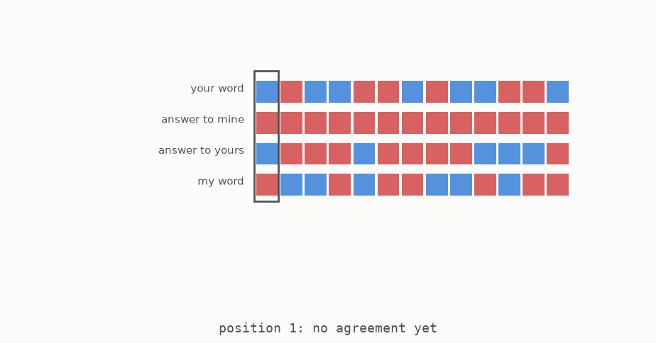

The agreeing position selects a candidate colour. It also selects the receiving team in the way section 9 requires: that team is determined from the sender's word. If the same outsider sends two connections of the same colour into a room, both must therefore land on the same team. The dangerous triangle cannot form.

At the small size, each word contains thirteen two-choice symbols, so there are 8192 possible words. The tests verify the meeting promise for every word on one side and every word on the other. This is a complete check of the toy version.

The toy is drawn small enough to read. The smallest card used by the full construction has 57 rows, and each word has 57 symbols. The rule is the same, but the proof that such a card exists depends on the counting arguments rather than exhaustive checking.

**[Play with this](https://muchmirul.github.io/conjectures/multicolor-ramsey/play/10.html)** to choose card columns and follow the search for an agreeing position.

## 11 · The tower

The palette rule protects triangles across three rooms. The team rule protects triangles that use two rooms. The referee enforces the team rule everywhere at once. The construction now repeats these parts over several floors.

The ground floor contains one person. On each new floor, many rooms are created. Every room contains a complete copy of the floor below, with its internal colours renamed to match the colours allowed by that room's palette. Different rooms receive palettes that differ in many places, ensuring that the referee always has enough cross-room colours from which to choose. The same fixed referee rule colours every connection between rooms.

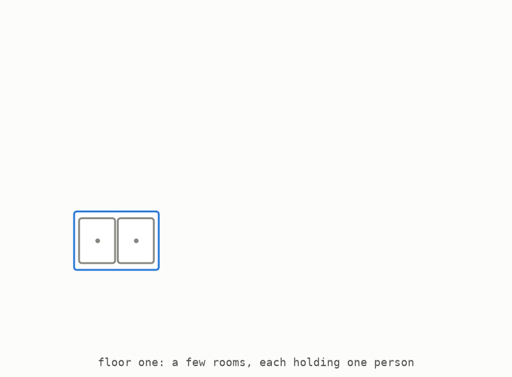

The animation shows the nesting pattern, not the true number of rooms. Even the first full-scale floors are far too wide to draw. The important change is that the available colour pool grows from one floor to the next. A larger pool provides many more sufficiently different palettes, so a later floor can contain more rooms than an earlier floor. Each floor multiplies the group size by a larger amount than the floor before it.

This is exactly what fixed products could not do. In section 5, every round used the same number of rooms and kept the score flat. Here, the number of rooms rises with the floor, so the people-per-colour score rises too.

There is a trade-off. Palettes must differ in many colours so that the referee has enough choices, which makes each palette large and spends more colours. Making the tower taller creates more multiplying gains, but also increases that cost. After balancing the two, first multiply the tower height by a slowly growing logarithmic factor and then cube the result. That is roughly how many colours the tower uses. Its people-per-colour score grows roughly like the height.

Turning that relationship around gives the final rate: for a given colour count, the score is about the cube root of the colour count, divided by its logarithm. A logarithm is a slow-growing way to record repeated multiplication. It grows much more slowly than a cube root, so the score eventually keeps increasing.

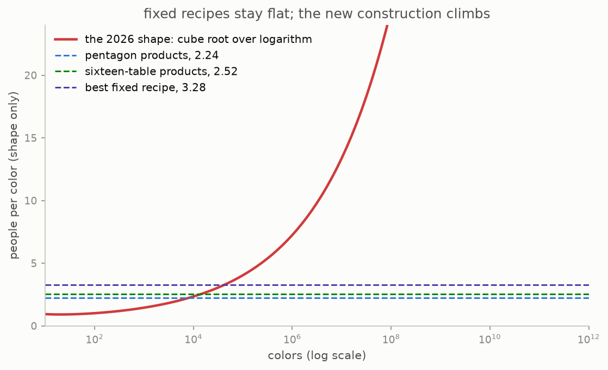

The rising curve shows the long-term shape without the theorem's tiny fixed multiplier. It is not a plot of useful values at small colour counts. For the smallest full-scale stage, the referee's card has 57 rows. Each floor uses palettes containing 114 colors, and three floors use 342 colours altogether. This repository recalculates those parameters from the paper's instructions.

**[Play with this](https://muchmirul.github.io/conjectures/multicolor-ramsey/play/11.html)** to add floors and compare a fixed product with the growing tower.

## 12 · What it means, and what it does not

The 2026 theorem can now be stated in the guide's plain language. For every colour count from two upward, there is a safe table whose people-per-colour score is at least one fixed positive constant times the cube root of the colour count, divided by its logarithm. The same constant works for every colour count.

That score grows without bound. Erdős's 100-dollar question asked whether the long-term score was finite, and the answer is no. His 250-dollar question asked what it approaches, and the answer is infinity.

Combine this construction with the factorial upper limit from section 6. The forcing size now has the same broad shape from both sides: the colour count is raised to a power proportional to the colour count. The lower result gives roughly one third of the colour count in that power, apart from slowly growing corrections. The upper result gives roughly the full colour count.


This chart compares the shapes of the two limits rather than exact values at a particular colour count. The result settles the type of growth, but not every detail.

```
    now known                              still open
    ---------                              ----------
    the people-per-colour score has        where the true power lies between
    no fixed ceiling                       the lower result's one third and the
    the forcing size has the colour        upper result's one
    count raised to a multiple of the      the four-colour forcing size remains
    colour count                           between 51 and 62
```

The scale of the theorem also matters. Its printed constant is extremely small because its denominator is enormous. The authors focused on proving the long-term shape rather than improving that number. With the printed constant, the new construction does not beat the old 3.28 score until around ten to the sixtieth colours. Below 342 colours, its numerical bound says nothing beyond the trivial fact that a safe group exists. At every size anyone could draw or compute directly, the older constructions give bigger tables. The advance is about what eventually becomes possible, not a new small-colour record.

The result also answers a question about sending messages through noise. The next picture begins with five symbols arranged in a ring. Neighbouring symbols can be confused with each other.


With one use of this channel, at most two symbols can be chosen so that every pair is clearly distinguishable. With two uses, five two-letter words can be chosen so that every pair differs safely in at least one position. Five messages over two uses is a better rate per use than two messages over one use.

The **capacity** of a noisy channel asks for the best message rate when words can be very long. Safe colourings and these channel codes are two forms of the same structure: people correspond to messages, and colours provide positions where pairs can be told apart. The 2026 result therefore creates channels in which every three symbols include a pair that may be confused, while the long-word capacity can still be as large as desired. Before this result, nobody knew whether such channels existed.

```
    1955  Greenwood and Gleason settle the two- and three-colour cases
    1971  Erdős, McEliece and Taylor connect the game with channel capacity
    1973  Chung proves that four colours can keep at least fifty people safe
    1983  Chung and Grinstead's survey records Erdős's prizes
    1990  Graham, Rothschild and Spencer record the growth question
    1995  Alon and Orlitsky make the channel connection explicit
    2021  addition-based recipes reach the best fixed score, about 3.28
    2026  the people-per-colour score is proved to grow without bound
```

**[Play with this](https://muchmirul.github.io/conjectures/multicolor-ramsey/play/12.html)** to compare the old and new rates and explore the noisy-channel example.

## What you can check yourself

The calculations and figures can be rebuilt from this repository. The commands below require Python and a command line, but no advanced mathematics.

```
cd multicolor-ramsey
make venv        # prepare the software once
make test        # recalculate the numbers and small examples in this guide
make figures     # rebuild every picture
```

Among other checks, the tests:

- rebuild the five-person and sixteen-person colourings and inspect every group of three
- inspect all 32768 two-colourings of six people, confirming that none is safe and that the best ones contain exactly two one-colour triangles
- combine safe groups and verify the 25-person four-colour result and the 80-person five-colour result
- rebuild the upper staircase 3, 6, 17, 66, 327 and compare its four-colour step with the known range from 51 to 62
- find the referee's card at toy size, check all seventy choices of columns, and check the meeting promise for every pair of words
- check all eight palette patterns across three rooms and both outcomes of the team trap
- recalculate the full construction's first parameters: 57 rows, 114 colors in each floor's palettes, and 342 colours in total
- estimate that the printed bound first overtakes the older recipes around ten to the sixtieth colours

The full tower and the 2026 theorem are described, not implemented, because even the smallest genuine floor is too wide for any computer. The tests verify only the small examples, toy versions of the moving parts, and numerical values listed above. The research notes identify which statements are calculated here and which are quoted from the literature.

## The plain words, and the real ones

| this guide's plain phrase | the standard mathematical term |
|---|---|
| the triangle game | multicolour Ramsey theory for triangles |
| a one-colour triangle | a monochromatic triangle |
| a safe table | a complete graph whose edges use several colours with no monochromatic triangle |
| the forcing size | the multicolour Ramsey number for triangles |
| people per color | the colour-count root of the largest safe group size |
| a room | a block in the recursive construction |
| a palette | the colours omitted by a block; cross-room colours lie in exactly one of two palettes |
| a team | one class in a proper vertex colouring of a single colour's graph |
| the referee's card | a saturated matrix |
| the two answer lists | a two-sided coordinate cover made from two fixed maps |
| the tower | the recursive palette construction in the 2026 proof |
| the noisy-channel result | unbounded Shannon capacity among graphs with independence number two |

The source uses a letter R with a colour-count label for the forcing size. It describes people per colour by taking the colour-count root of that number, and the theorem says the long-term value of this root is infinite.

## Where to go next

- The main source is chapter 9 of *Ten Advances in Mathematics and Theoretical Computer Science*, together with its reasoning walkthrough. Both files are in `docs/ten-proofs/09-multicolor-ramsey/`.
- For the five-person and sixteen-person colourings, see Greenwood and Gleason, “Combinatorial relations and chromatic graphs,” published in *Canadian Journal of Mathematics* 7 (1955).
- For current small-colour records, see Radziszowski, “Small Ramsey numbers,” a survey that is updated as results improve.
- For the channel connection, see Alon and Orlitsky, “Repeated communication and Ramsey graphs,” published in *IEEE Transactions on Information Theory* 41 (1995).
- The file `notes/research-content.md` lists each claim above and marks it as calculated here, quoted from earlier work, or part of the 2026 theorem.
