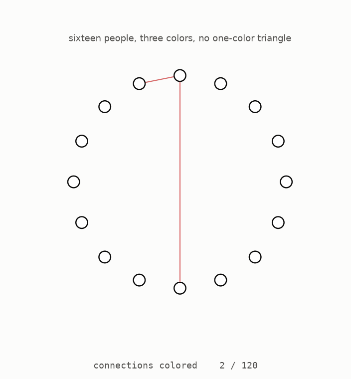

# Start here

*A step-by-step visual guide to a colouring game studied since 1955, a question for which Erdős offered prize money, and the 2026 result that answered it. You do not need a maths background. Each new idea begins with a picture.*



The animation shows sixteen people with a connection between every pair. That makes 120 connections, and each one receives one of three colours. When the colouring is complete, there is no group of three people whose three mutual connections all have the same colour. Sixteen is the largest group for which this is possible with three colours. Greenwood and Gleason built this example and proved that seventeen is impossible in 1955. Everything in this guide comes from the open source repository at [github.com/muchmirul/conjectures](https://github.com/muchmirul/conjectures): the text, every figure, and the tests behind each number.

This guide asks what happens when many more colours are available. More colours let us keep a larger group safe, and the question is how much larger the group can become for each added colour. Erdős offered cash prizes for answering that question. For decades, the best construction and the best limit were so far apart that researchers did not even know whether the long-term rate stopped at a fixed number. A result in 2026 showed that it never stops growing.

The guide develops the result in small steps. Most numbered sections also have a [page you can play with](https://muchmirul.github.io/conjectures/multicolor-ramsey/play/index.html), where you can change the main choices and watch the picture respond.

The code that creates every figure is included in this repository. The tests recalculate the numbers and check the small colourings shown here. When a statement comes from an existing theorem rather than those tests, the text says so.

The 2026 work is presented in two documents. One gives the finished proof, and the other is a behind-the-scenes guide that explains how the ideas were found, including earlier attempts that failed. Sections 5 to 7 explain why the old methods stalled. Sections 8 to 11 explain the finished construction. A table near the end shows where each idea appears in the two source documents.

```
    first, learn the game       1  the rule
                                2  why six people cannot stay safe
                                3  what an extra colour changes
    then, find the question     4  how to compare different colour counts
    why earlier ideas stalled   5  multiplying safe groups
                                6  a general upper limit
                                7  the wide gap between them
    the finished construction   8  which colours each room omits
                                9  keeping arrivals on safe teams
                               10  one fixed referee for every choice
                               11  stacking the rooms into a tower
    what the result settles    12  what the result settles
```

**[Play with this](https://muchmirul.github.io/conjectures/multicolor-ramsey/play/00.html)** to colour the opening group and inspect the finished pattern.

---

[The game →](../01-the-game/README.md)  ·  [the whole article on one page](../../ARTICLE.md)
