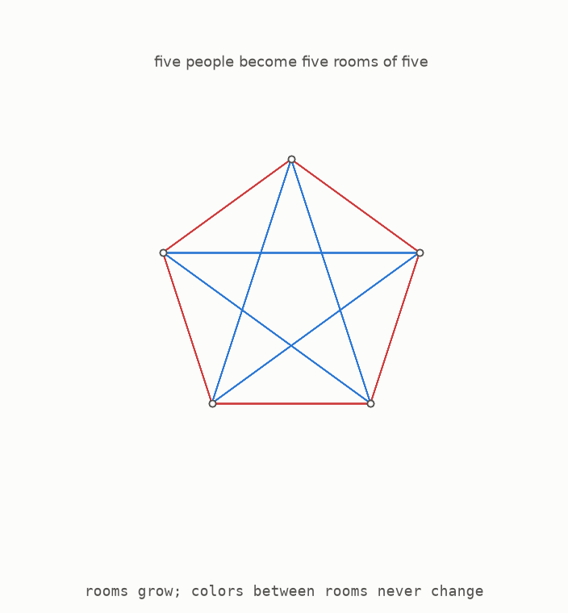
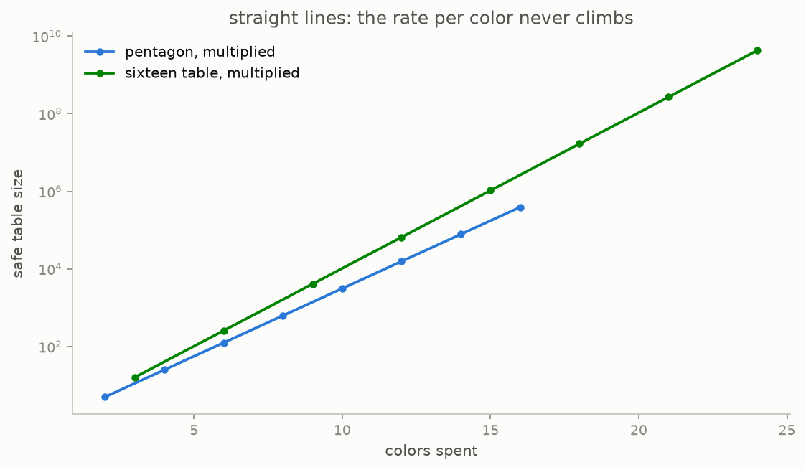

# 5 · Multiply

A classical construction combines two safe tables to make a larger safe table. The animation applies it to two copies of the five-person pattern.

Begin with five outer people. Replace each person with a **room** containing a complete copy of the second safe group. Connections inside a room use the second group's colours. These colours are fresh, meaning they are not used between rooms. Every connection between two rooms uses the colour that joined the corresponding two people in the outer group.

To see why the result is safe, consider the three possible locations of a triangle.

1. If all three people are in one room, their triangle belongs to the safe inner colouring.
2. If two people are in one room and the third is in another, the two cross-room connections have the same outer colour. The connection inside the room has a fresh inner colour, so all three cannot match.
3. If the three people are in three different rooms, their colours copy a triangle in the safe outer colouring.

This covers every triangle, so the combined group is safe. The tests check all 2300 triangles in the resulting 25-person, four-colour group. They also check an 80-person, five-colour group made by combining the sixteen-person and five-person patterns.

The rule is simple: group sizes multiply, while colour counts add. Repeating the five-person construction gives 25 people with four colours, 125 with six colours, and so on.

The vertical scale compresses repeated multiplication, so a fixed score appears as a straight line. Repeating the five-person pattern always scores 2.24 people per colour. Repeating the sixteen-person pattern always scores 2.52. The groups become enormous, but the score never changes because every round spends the same number of colours for the same multiplying gain.

The ability to combine any two safe groups also guarantees that the best possible score has a well-defined long-term destination rather than bouncing forever. What remained unknown was whether that destination was a fixed number or infinity. Repeating one fixed construction can never answer infinity, because its score stays fixed at every round.

**[Play with this](https://muchmirul.github.io/conjectures/multicolor-ramsey/play/05.html)** to combine two safe groups and follow the three triangle cases.

---

[← The question](../04-the-question/README.md)  ·  [The ceiling →](../06-the-ceiling/README.md)  ·  [the whole article on one page](../../ARTICLE.md)
