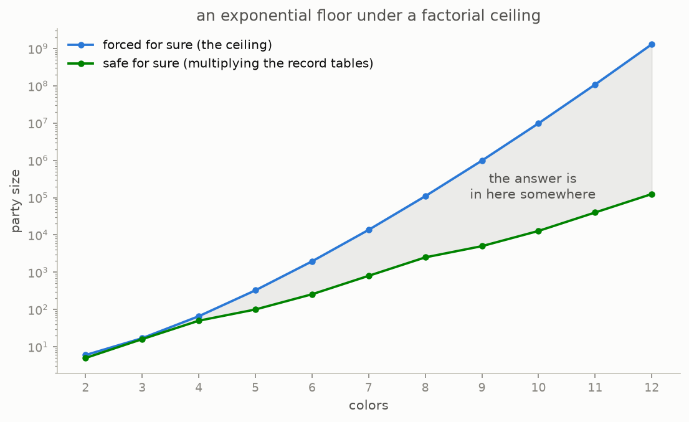
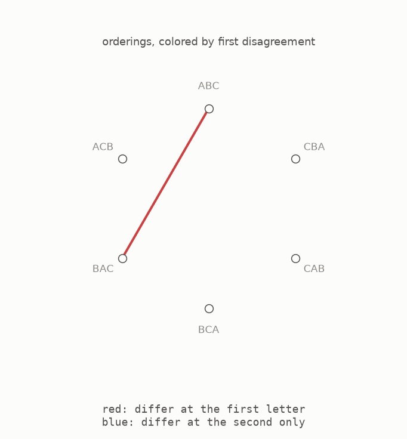
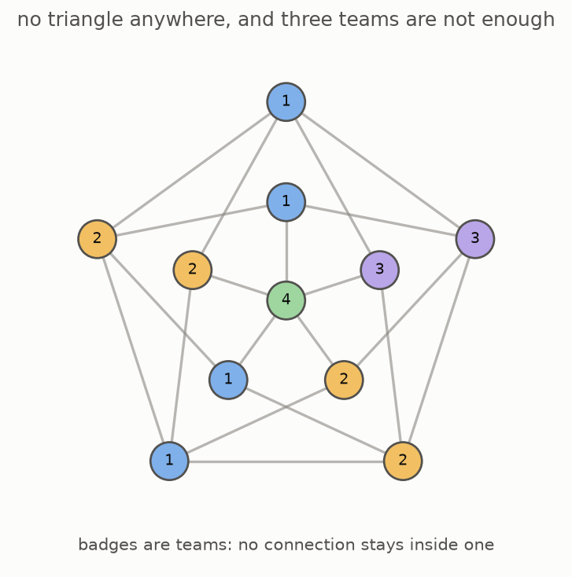

# 7 · The gap

The lower and upper limits can now be placed on the same chart. This section also explains why tempting shortcuts failed before the 2026 construction was found.

The lower edge shows group sizes that can actually be kept safe by multiplying known examples. It grows through repeated multiplication by a fixed amount. The upper edge comes from the sorting argument and grows like a factorial, whose multiplying amount rises with every colour. The two kinds of growth move farther apart as more colours are added. Decades of work improved the fixed lower score from 2.24 toward 3.28, but the broad gap remained.

Several attractive shortcuts failed. One of the simplest uses different orderings of the same items.

Take every ordering of a small set of letters. For each pair of orderings, find the first position where they differ and use that position as the connection's colour. Three letters have six orderings, but only the first two positions can be the first difference. If this idea worked, it would keep six people safe with two colours and beat the five-person limit.

It fails because the orderings ABC, BAC and CAB all first differ from one another at the first letter, so their three connections receive the same colour. The same collision can be built with any larger number of items. Recording more detail in each colour can prevent this particular collision, but it also uses so many extra colours that the hoped-for advantage disappears.

Researchers also tried to prove that the score could never grow past a fixed ceiling. One plan replaced each colour pattern with a small summary and then combined those summaries. For the plan to work, every pattern with no triangle would need to split into the same fixed number of teams, no matter how large the pattern became. A team here means a group containing no connection of that colour.

The next picture shows why that hope fails. It has eleven people and no triangle, yet no split into three teams works, which the tests confirm by trying every possible three-team split. By contrast, a split into four teams does work.

Larger examples can require five, six, or any chosen number of teams. Having no triangle does not make a pattern simple in this way, so the summary plan could not provide a fixed ceiling.

Addition patterns on number circles face another version of the same difficulty. Every colour, viewed alone, must contain no triangle. Simple methods achieve that by keeping each colour in a restricted part of the construction. To make the people-per-colour score grow, many different rooms must be able to reuse the same colours without letting the reused pieces join into a triangle. The 2026 construction provides a fixed global rule that makes this reuse safe.

---

[← The ceiling](../06-the-ceiling/README.md)  ·  [Palettes →](../08-palettes/README.md)  ·  [the whole article on one page](../../ARTICLE.md)
