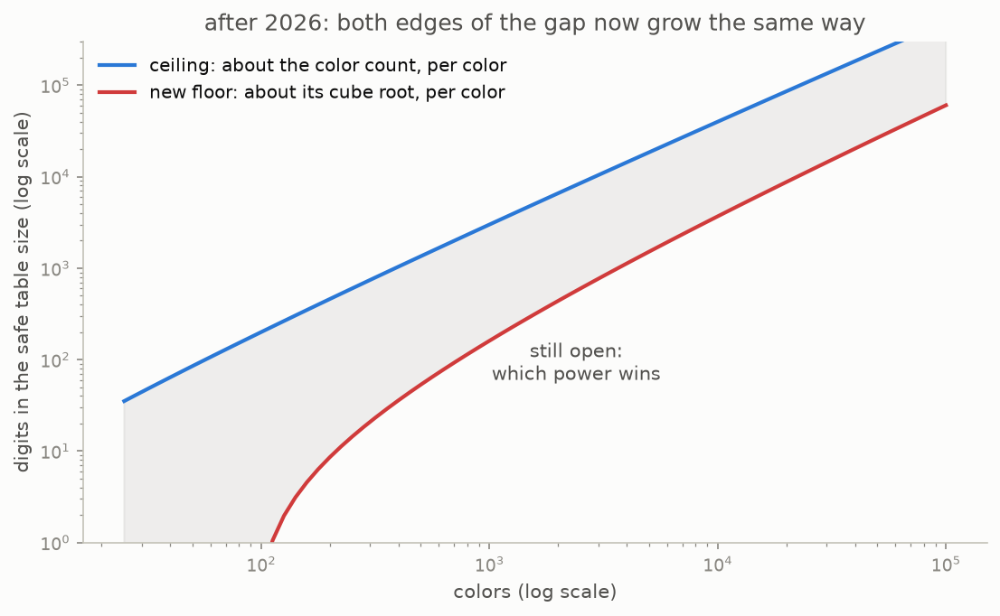
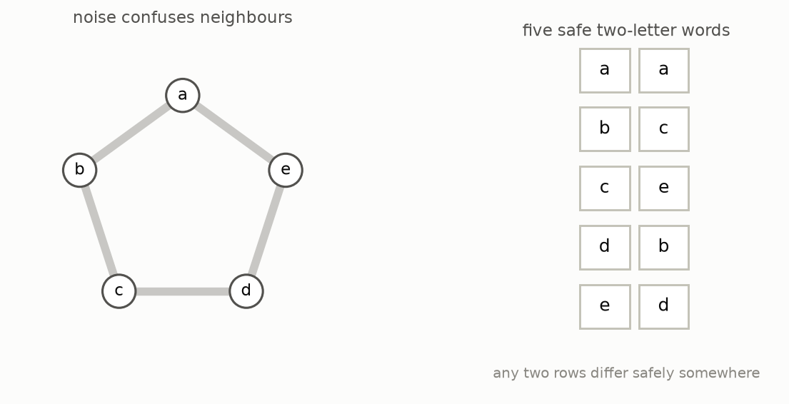

# 12 · What it means, and what it does not

The theorem, in the words of this article: for every color count from two upward, there is a safe table whose people-per-color rate is at least a fixed constant times the cube root of the color count divided by its logarithm. The rate climbs without bound. Erdős's 100-dollar question, whether the rate approaches something finite, is answered: it does not. His 250-dollar question, what it approaches, is answered the same way: it grows forever.

Combined with the factorial ceiling of chapter 6, the forcing size is now boxed in tightly in shape: it is the color count raised to a power that is itself proportional to the color count.



Be equally clear about what was not settled.

```
    settled                                  still open
    -------                                  ----------
    the rate climbs without bound            the multiple: the floor gets a third,
    the forcing size is the color count      the ceiling gets one, and the truth
      to the power of about the color count  is somewhere between
    the four-color forcing size is           still somewhere between 51 and 62
```

And be clear about scale. The theorem's explicit constant is enormous, deliberately so, because the authors optimized the argument's shape rather than its constants. With that constant, the new bound does not overtake the old 3.28-per-color recipe until around ten to the sixtieth colors, and below 342 colors it says nothing at all. At every size a person will ever draw, the older constructions give bigger tables. What changed is not any record at small sizes; it is the answer to what kind of growth is possible.

There is a payoff outside the game. A safe table is secretly a code for talking over a noisy channel. Here is the classic small example of the phenomenon, re-checked by this repository's tests.



Five symbols, each confusable with its neighbours. Any three symbols include a confusable pair, so single-letter messages stop at two safe words; but there are five two-letter words that pairwise differ safely somewhere, which is more per letter. Capacity is about long words, not single letters. A safe table with many colors performs the same trick at scale: its people become symbols, its colors become letter positions, and the sixteen-fold or larger table gives that many words, all mutually safe. Because the rate now climbs without bound, there are channels in which any three symbols contain a confusable pair and yet whose capacity is as large as you like. Before this result, it was not known whether such channels exist at all.

```
    1955  Greenwood and Gleason: two colors force at six, three at seventeen
    1971  Erdős, McEliece and Taylor connect the game to channel capacity
    1973  Chung: four colors force at fifty one or more
    1983  Chung and Grinstead's survey records Erdős's prizes
    1990  Graham, Rothschild and Spencer record the growth question
    1995  Alon and Orlitsky make the channel connection explicit
    2021  Schur-type recipes reach the best fixed rate, about 3.28
    2026  the rate is proved to climb without bound
```

**[Play with this](https://muchmirul.github.io/conjectures/multicolor-ramsey/play/12.html)** and turn the idea over yourself.

---

[← The tower](../11-the-tower/README.md)  ·  [the whole article on one page](../../ARTICLE.md)
