# Stacking Balls, from Zero

*A step-by-step visual guide to packing equal balls, a question first asked in 1611, and to a major result proved in 2026. You do not need a maths background. Each new idea begins with a picture.*

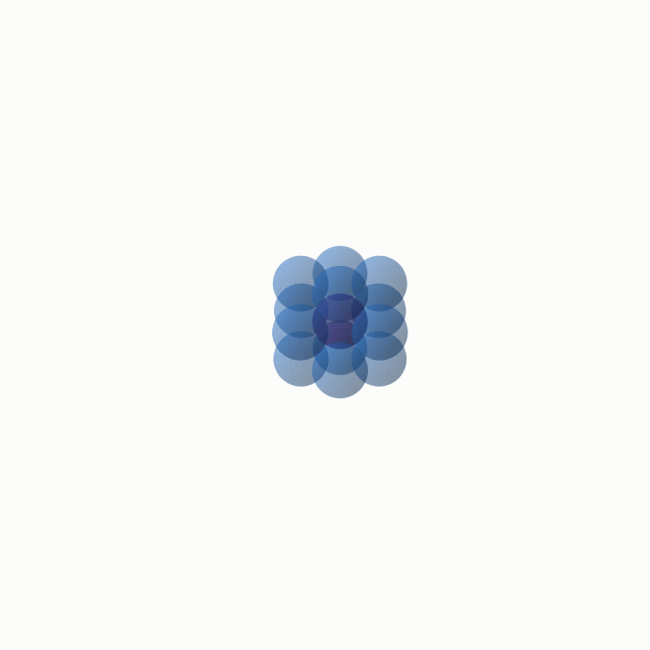

Every ball in this stack is the same size, and none of them overlap. This familiar fruit-shop arrangement fills a little under 75 percent of the surrounding space. The remaining space is made of gaps between the balls.

For circles on a flat surface, the best arrangement is known. For balls in ordinary three-dimensional space, finding the answer took almost four hundred years. In most higher dimensions, the exact answer is still unknown and is expected to remain difficult. Researchers therefore also ask a more manageable question: how dense could any packing possibly be? In 2026, they found the exact long-term limit of the main method used to answer that question. The result improved a general limit that had stood since 1978.

This guide develops that story one small step at a time. Most numbered sections also have a [page you can play with](https://muchmirul.github.io/conjectures/sphere-packing/play/index.html), where you can change the main quantities and watch the picture respond.

The code that makes each figure is included in this repository. The tests recalculate the numbers used in the guide. When a statement comes from an existing theorem rather than from those calculations, the text says so.

```
    first, the problem       1  what are we trying to find?
                             2  why balls lose space
                             3  why examples are not enough
    next, the method         4  one useful function
                             5  one total counted two ways
                             6  what the method can show
                             7  can the method be improved forever?
    finally, the 2026 result 8  balancing the two views
                             9  the limit no function can cross
                            10  building a function that reaches it
                            11  why the two parts give an exact answer
                            12  what is settled and what remains open
```

**[Play with this](https://muchmirul.github.io/conjectures/sphere-packing/play/00.html)** to rotate the opening stack and see why its depth matters.

## 1 · The question

Pack equal balls together without letting them overlap. The **density** tells us how much of the available space is inside the balls. A density of 100 percent would leave no gaps, so a larger density means a tighter packing.

On a flat surface, the “balls” are circles. Put their centres in straight rows and columns and the circles cover a little over 78 percent of the surface. Now slide every other row sideways. Each circle can settle into the dip between two circles in the row below, allowing the rows to move closer together.

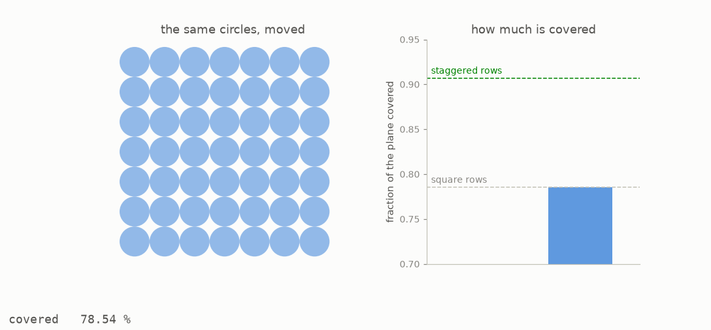

The number and size of the circles have not changed. Only their positions have changed, yet they now cover 90.69 percent of the surface. This staggered arrangement is the best possible packing in two dimensions. Thue gave an argument in 1910, and Fejes Toth completed the proof in 1943.

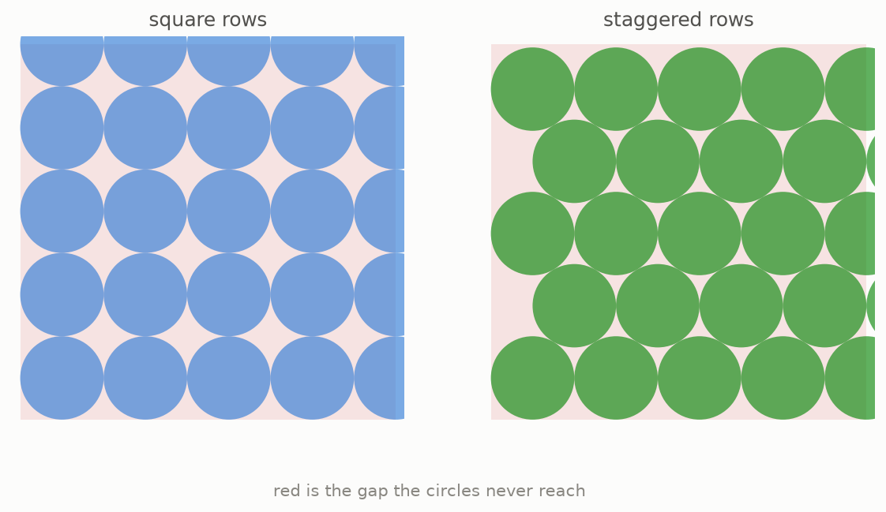

A dimension is simply an independent direction in which something can move. A line has one direction, a flat surface has two, and ordinary space has three. Although we cannot directly see eight or twenty-four dimensions, the same packing question still makes sense there. The exact best packing is known in only five dimensions. The next picture divides the available space into one hundred equal parts and colours the amount filled in each known case.

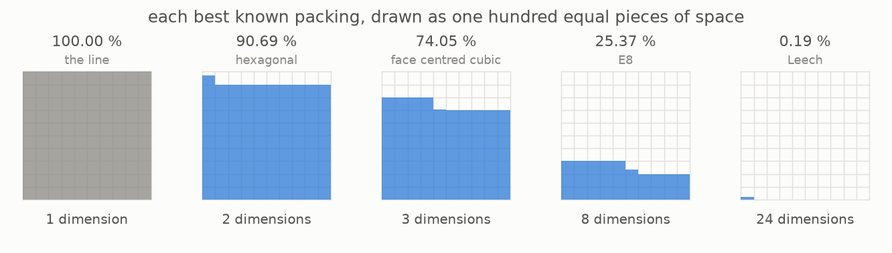

In one dimension, the “balls” are line segments, and they can touch end to end with no gaps. In two dimensions, staggered rows give the answer. In three dimensions, the answer is the fruit-shop stack: Kepler proposed it in 1611, and Hales proved it in 1998. The eight-dimensional case was settled by Viazovska in 2017. In the same year, Cohn, Kumar, Miller, Radchenko and Viazovska settled the twenty-four-dimensional case.

The last two panels show how quickly the filled share can become small. In dimension eight, the balls fill about twenty-five of the one hundred parts. In dimension twenty-four, they fill less than one fifth of a single part. Extra dimensions do not simply add more room for balls; they also create far more room between them.

**[Play with this](https://muchmirul.github.io/conjectures/sphere-packing/play/01.html)** to compare the known densities and rearrange the circles yourself.

## 2 · The room runs out

To see why high dimensions behave so differently, begin with one ball inside the smallest box that can hold it. The ball may look as if it fills most of the box, but the corners tell a different story.

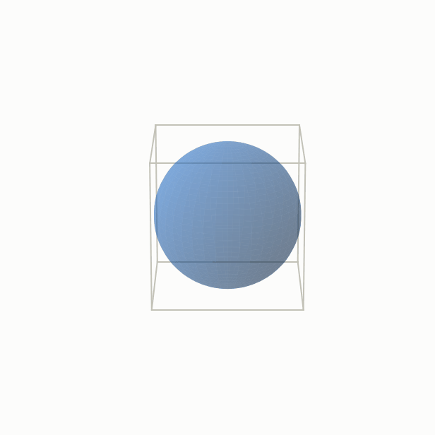

On a flat surface, a circle inside a square cannot reach the square’s four corners. In ordinary space, a ball inside a cube cannot reach its eight corners. Each new dimension doubles the number of corners, while the round ball still curves away from all of them.

The next animation represents every dimension inside one flat frame. Each red mark stands for a corner of the box in that dimension, so the number of marks doubles at every step. The blue disc does not show the ball’s literal shape in those dimensions. Its area shows the exact fraction of the box that the ball fills.

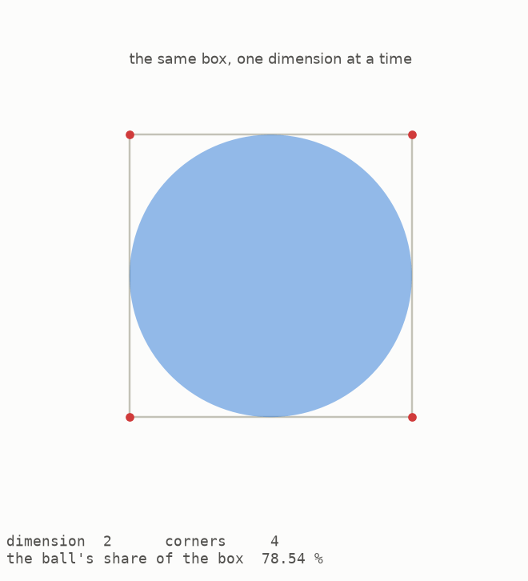

By dimension ten, the ball fills only about one quarter of one percent of its box. By dimension thirty, it fills about two parts in a hundred trillion. Nearly all the box’s volume lies away from the ball, toward its many corners.

There is another surprising effect. Keep the ball’s radius fixed at one and compare its own volume from one dimension to the next. In the next picture, the sizes represent those volumes directly. They grow at first, reach a largest value, and then begin to shrink.

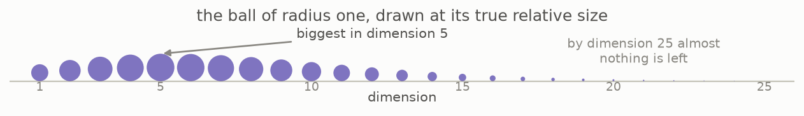

Among balls with radius one, the numerical value of the volume is largest in dimension five. From dimension six onward, adding another dimension makes that value smaller.

We cannot draw a four-dimensional object directly. Instead, the next animation shows its three-dimensional shadow and turns it partly through the fourth direction. The changing shadow is much like the changing flat shadow of an ordinary object as you rotate it.

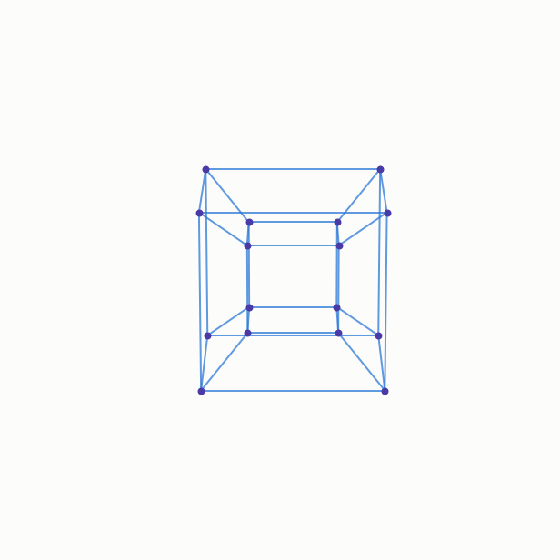

The corners swing outward and back because the turn uses a direction that is not present in ordinary space. Every added direction gives the box more corners and gives those corners more ways to lie far from the round centre.

**[Play with this](https://muchmirul.github.io/conjectures/sphere-packing/play/02.html)** to change the dimension and watch the ball’s share of its box disappear.

## 3 · Why you cannot just check

Trying many arrangements can help us find a good packing, but it can never confirm that we have found the best one.

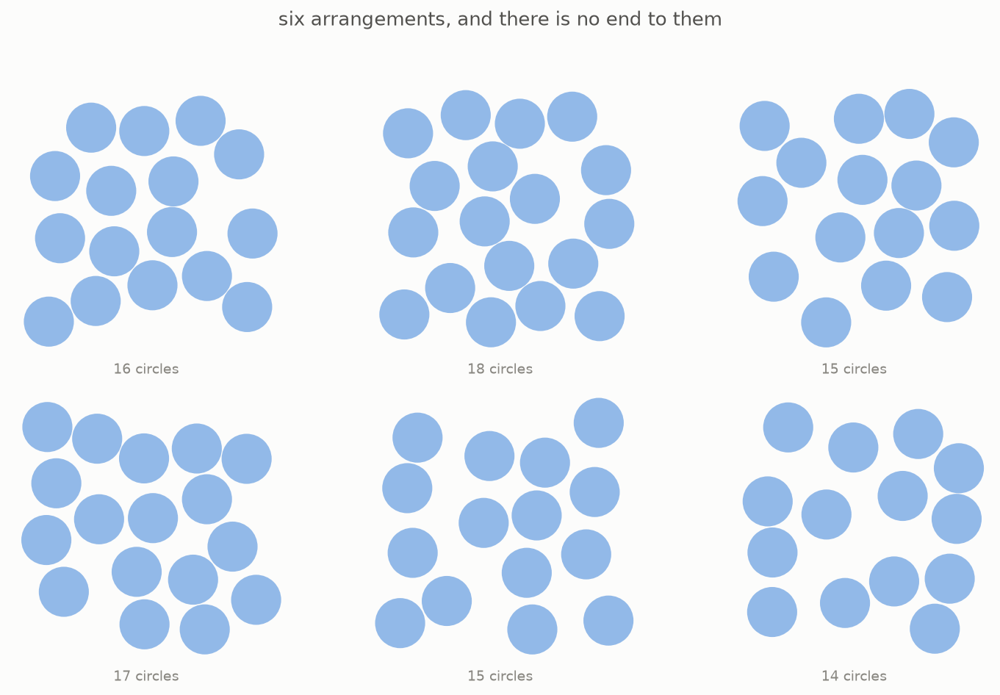

There are endlessly many ways to place the balls, and there is no checklist that contains them all. One arrangement can show that a particular density can be reached. This is called a lower bound. It cannot show that every other arrangement is worse. For that, we need an upper bound: one statement that applies to all possible packings at once.

The rest of the guide explains how a single number-making rule can provide such a statement.

```
    trying arrangements one by one      using one certificate
    --------------------------------    ---------------------
    test one arrangement                choose one function
    test another                        make it pass two rules
    keep testing
    there is no final test              get a limit for every packing at once
```

We will call this function a **certificate**, because passing its two rules certifies a density limit. The usual mathematical name appears in the glossary near the end.

**[Play with this](https://muchmirul.github.io/conjectures/sphere-packing/play/03.html)** to compare what examples can show with what a certificate can show.

## 4 · The certificate

Before defining a certificate, choose the unit of distance so that every ball has diameter one. Resizing the whole packing does not change the fraction of space it fills. With that choice made, a certificate is a function: give it the distance between two ball centres, and it returns a number.

The function must pass two rules.

**Rule one.** At distance one and beyond, its value must always be zero or negative.

**Rule two.** A second view of the function, called its **Fourier transform**, must always be zero or positive.

The name “Fourier transform” can sound more difficult than the picture. A changing curve can be described as a mixture of simple waves. The Fourier transform tells us how much of each wave is present. The original curve and this list of waves are two views of the same information, just as a musical chord and the notes inside it describe the same sound.

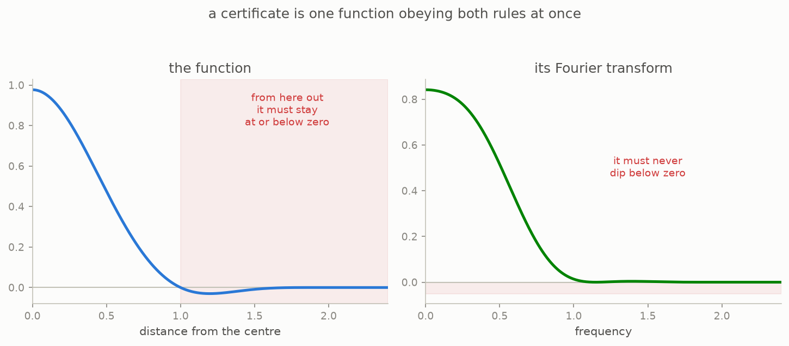

The left panel shows the original function. In the shaded region, which begins at distance one, the curve stays on or below the zero line. That is rule one. The right panel shows its Fourier transform staying on or above the zero line. That is rule two.

Either rule is easy to satisfy by itself. It is easy to draw a curve that stays negative after distance one, and it is easy to draw a curve whose Fourier view stays positive. Satisfying both at the same time is difficult. A sharp change in one view usually spreads out and produces ripples in the other, so improving one side can break the other.

The next picture shows a basic function that passes both rules.

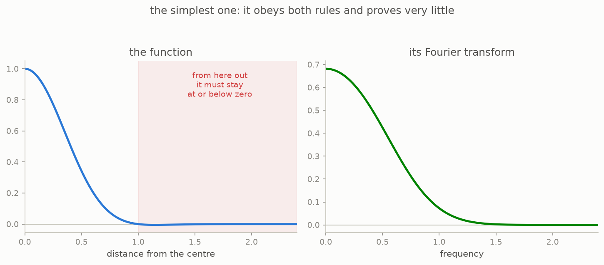

This function qualifies as a certificate in dimensions one through six, but it gives useful information only in dimensions four and five. In the plane, for example, its density limit is greater than 100 percent. We already know that no packing can fill more than 100 percent, so that limit tells us nothing new. In dimension seven, its Fourier view becomes negative and the function no longer qualifies as a certificate.

The next animation changes one part of a working certificate. Watch the Fourier view as the control moves.

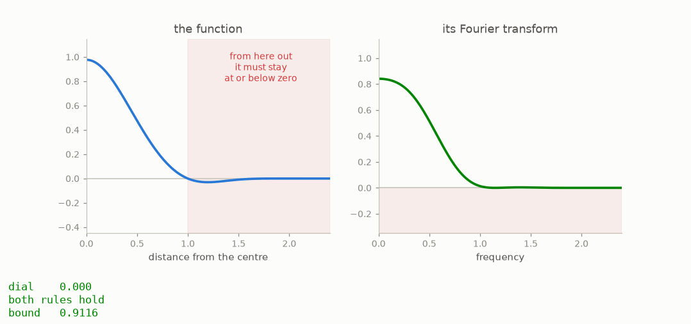

Once any part of the Fourier view falls below zero, rule two fails. Even a small failure means the function can no longer prove a density limit.

A function that passes both rules produces a number that no packing in that dimension can exceed. The next section explains where that number comes from.

**[Play with this](https://muchmirul.github.io/conjectures/sphere-packing/play/04.html)** to adjust a certificate and see exactly when one of its rules breaks.

## 5 · Counting twice

The key idea is to calculate one total in two different ways. To keep the picture simple, first imagine a packing that repeats. The full argument handles a non-repeating packing by looking at larger and larger regions.

Take the centres of the balls and, for every pair of centres, use their distance as the input to the certificate. Add all the returned values.


First count by pairs of centres. Two different centres are at least distance one apart because the balls have diameter one and cannot overlap. Rule one says every such pair contributes zero or a negative number. Only a centre paired with itself has distance zero. The different-centre pairs can therefore only pull the total downward.

Now count the same total through the Fourier view, which describes the waves in the packing. A standard result called **Poisson summation** says that these two counts give the same number. Rule two says every contribution in the Fourier count is zero or positive, so this view can only push the total upward.

```
    count pairs of centres  --->  the same total  <---  count waves
    this gives an upper side                         this gives a lower side

    the packing must fit between the two sides,
    which creates a limit on its density
```

The two counts squeeze one total from opposite sides. When the number of centres is separated out, the result is an upper limit on density. The limit depends on the certificate, not on the particular packing, so it applies to every packing. This is the bound introduced by Gorbachev and by Cohn and Elkies in work from 2000 and 2003.

The source paper calls this a **linear program**. In plain terms, it means searching for the best possible value while obeying a set of simple restrictions. Here, the restrictions are the two sign rules.

**[Play with this](https://muchmirul.github.io/conjectures/sphere-packing/play/05.html)** to follow the two counts and see how they trap the density.

## 6 · What certificates actually prove

This repository includes a small computer search for useful certificates. It begins with a function that passes both rules, makes small random changes, and keeps changes that improve the density limit. The picture treats space like a container filling from the bottom. Blue shows the density reached by the best known packing, while the line above it shows the candidate certificate’s limit.


For the plane, the search finds a candidate limit of 91.16 percent. If its two sign rules held at every distance, it would prove that no circle packing could be denser than that. Staggered rows reach 90.69 percent, leaving less than half a percentage point between the two numbers.

That narrow gap is a limit of this numerical certificate, not an unsolved gap in the two-dimensional packing problem. Section 1 already noted that a separate theorem proves 90.69 percent is the exact answer. The enlarged sliver shows only what this candidate certificate has not ruled out.

There is another important limit. The program checks the two sign rules at a very fine set of sample points, rather than proving them at every possible point. The result is therefore a **numerical certificate**, not a formal proof. Specialists use a stronger kind of search called semidefinite programming and deliberately place zero points in the function. Neither technique is included here.

The small search also shows why the choice of starting function matters. Its starting family stops qualifying before dimension six, so the search cannot even start in dimension eight. Viazovska’s exact certificate for dimension eight comes from a much more advanced family of functions called modular forms.

```
    dimensions 8 and 24     exact certificates meet the exact packing densities
    dimensions 1, 2 and 3   other proofs give the exact packing densities;
                            the simple certificates here leave a gap
    most other dimensions   neither the exact packing nor the exact best
                            certificate is known
    very large dimensions   the best possible long-term certificate rate
                            is known because of the 2026 result
```

Only in dimensions eight and twenty-four do known exact certificates meet the known packing density and settle the problem through this method. In most other dimensions, there is still a gap between the density people can build and the density certificates can rule out.

**[Play with this](https://muchmirul.github.io/conjectures/sphere-packing/play/06.html)** to compare a known packing with the limit from a candidate certificate.

## 7 · Is there a ceiling on the method?

In high dimensions, these density limits are compared by how quickly they shrink as the dimension grows. Once the dimension is very large, the main part of each limit behaves like multiplying by the same fraction whenever another dimension is added. The next picture represents that repeated shrinking with squares. Each square has a fixed fraction of the area of the previous one.

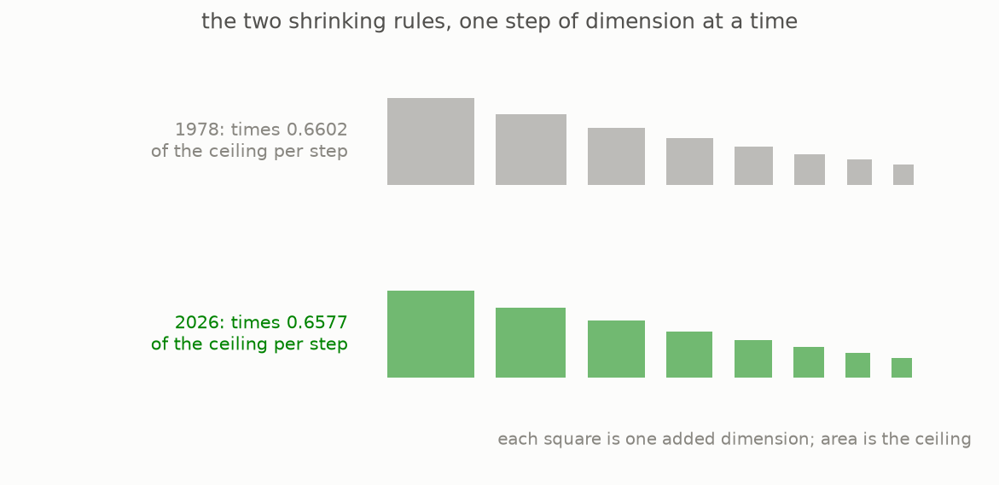

At first glance, the two rows look the same. A useful way to compare them is to ask how much of a halving happens per added dimension. A larger number is better because it means the upper limit becomes smaller more quickly. Kabatianskii and Levenshtein obtained 0.59906 halvings per dimension in 1978. That rate remained the best general result for forty-eight years.

The difference made in 2026 begins only in the fourth decimal place, but it is repeated across every dimension. The animation lets that repeated difference build up. The grey disc keeps the 1978 value at a fixed display size. The green disc shows the 2026 value at the same scale as the dimension rises.

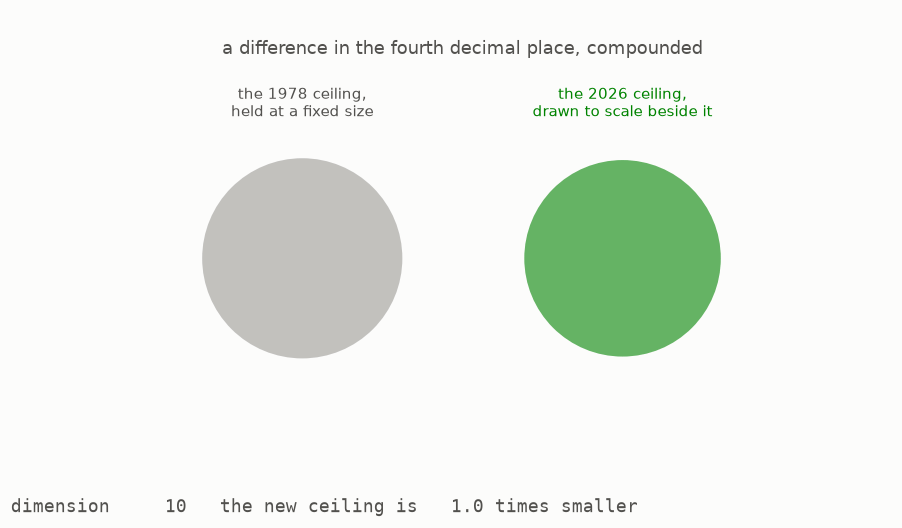

If we use only these long-term rates to compare dimension one thousand, the 2026 value is about 40.6 times smaller than the 1978 value.

This leads to the main question behind the 2026 work. Researchers had found increasingly good certificates for about twenty years, but could the method keep improving forever? Answering that requires two separate results.

```
    build one certificate near a rate   shows the method can reach that rate
    rule out all better certificates    shows the method cannot pass that rate

    the exact limit is known only when both statements meet
```

A good example proves what the method can achieve. A limit that applies to every possible certificate proves what the method cannot achieve. The second task is especially difficult because it must cover functions that nobody has found or written down.

In 2020, Afkhami-Jeddi, Cohn, Hartman, de Laat and Tajdini calculated the rate they expected and stated it as a conjecture. In 2026, both required statements were proved.

## 8 · The balancing trick

The final sections do not require a new starting idea. They reuse the two sign rules and the Fourier transform from section 4, together with the familiar idea of a radius. Until now, we asked what one chosen certificate could prove. We will now ask what every possible certificate is forced to look like.

Begin with any certificate and stretch its graph, as though changing the zoom on a picture. When the original graph becomes wider, its Fourier view becomes narrower and changes height. There is one amount of stretching for which the original function and its Fourier view have the same value at the centre. Make that adjustment, and then subtract the stretched function from its Fourier view.

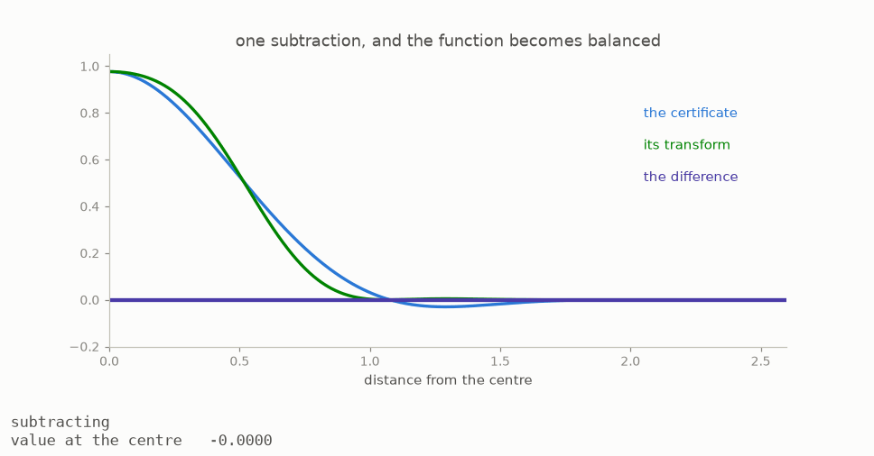

We will call the result the **balanced function**. The way it was made immediately gives it two useful features.

First, its value at the centre is zero because the two values there were made equal before the subtraction.

Second, taking its Fourier transform changes it into its own negative. The transform swaps the two parts of the subtraction, so their order reverses. This strong symmetry leaves the balanced function much less freedom to change shape.

To see why that helps, look at the area above and below the zero line. Count the area above as positive and the area below as negative. For the balanced function, those two amounts cancel and leave a total of zero, so they must be equal. If all the area is then counted without a sign, exactly half of it lies below zero. The original sign rules also ensure that the balanced function cannot be negative beyond a certain radius.

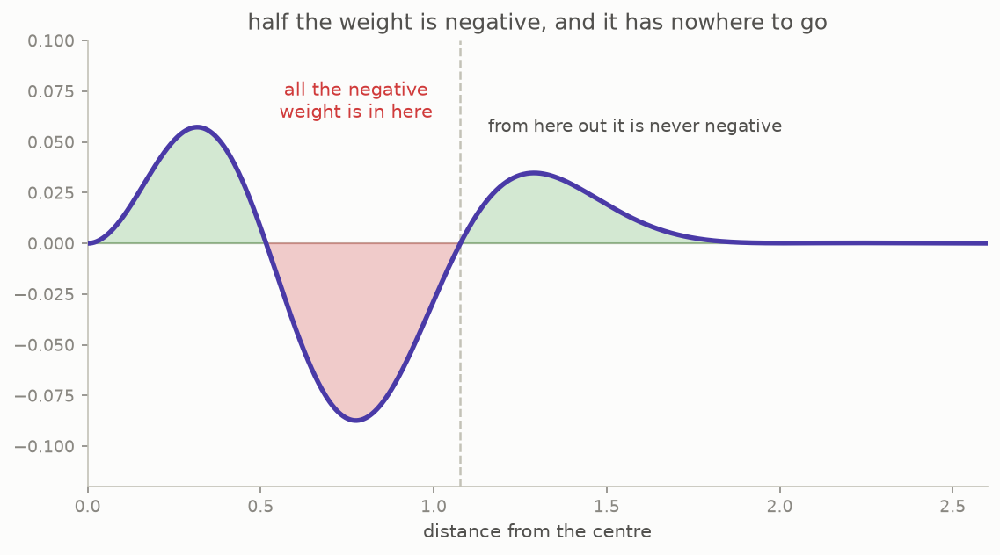

All of the negative half must therefore fit inside one ball. The size of this ball records the strength of the original certificate: a smaller radius leads to a stronger density limit. The packing problem has now become a simpler-looking question about how small that radius can be.

**[Play with this](https://muchmirul.github.io/conjectures/sphere-packing/play/08.html)** to stretch the two views until their centre values balance.

## 9 · The wall

Making the radius smaller makes the requirement harder to meet. The negative amount remains exactly half of the total, but it has less space in which to fit.

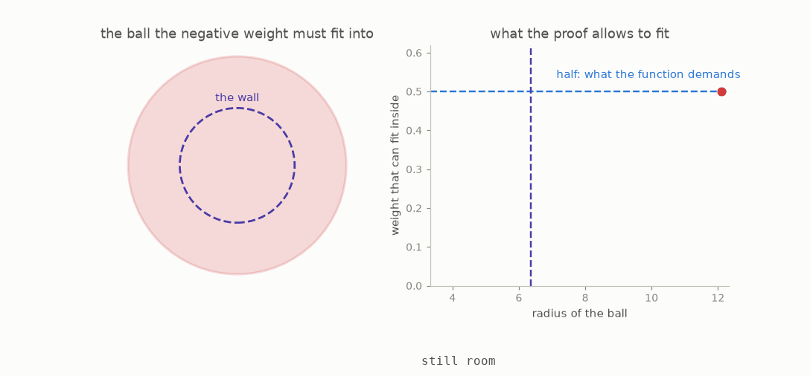

The animation uses a simple shrinking speed chosen to make the idea visible. It shows why the fixed half eventually cannot fit, rather than exact values for individual dimensions.

The 2026 proof shows that there is a long-term limit. As dimensions grow, a radius below one over pi times the square root of the dimension cannot hold enough of the balanced function. The greatest amount that could fit there becomes exponentially small, meaning that it repeatedly shrinks by a fixed factor as dimensions are added. One half does not shrink at all, so no certificate can keep its radius below that limit.

Finite dimensions can differ slightly from this simple description. The statement is about the rate as the dimension becomes large: after the radius is divided by the square root of the dimension, those smaller differences disappear. This is the part of the proof that places a ceiling on the certificate method.

The appearance of pi comes from a specific step in the proof. The argument first changes to a view in which the Fourier transform acts like a reflection. It then studies a strip-shaped region. A standard result says that values along the two edges control what can happen between them; this result is called the maximum principle. It gives a weight to each wave. At the decisive edge of the strip, those weights approach one particular bell-shaped curve.

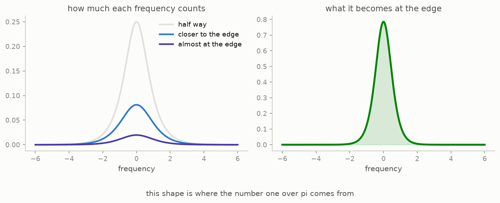

That final curve produces the factor one over pi. This repository does not reproduce the proof, but it does recalculate several of its ingredients. The tests confirm that the reflection step changes direction without changing size along the required line. They also confirm that the limiting curve has total area one and the stated Fourier view. A separate check recovers the exact average used by the proof.

One small-looking detail affects the final number. At an earlier stage, the edge weights do not add up to one. Turning them into percentages too soon would change the result, so the proof must keep their original total until the correct step.

**[Play with this](https://muchmirul.github.io/conjectures/sphere-packing/play/09.html)** to reduce the radius and compare its capacity with the fixed negative half.

## 10 · Building the witness

In this chapter, a **witness** simply means a concrete example. Proving that no certificate can cross the limit gives only one half of the result. The other half requires a family of certificates that gets all the way to that limit as the dimension grows.

A natural starting point is the familiar bell curve, also called a Gaussian. Its Fourier transform has the same shape, so the needed symmetry is already present. However, after measuring the radius per square root of the dimension, the Gaussian gives about 0.399. The limit is one over pi, about 0.318, so the unmodified Gaussian does not reach it.

The construction changes the bell curve with a carefully chosen left-right symmetric adjustment. Mathematicians call this an even deformation. It moves the radius while preserving the Fourier symmetry.


The amount of movement comes from one **integral**. An integral gathers many thin pieces into a total; in this picture, that total is the area under the curve. The animation fills the area from left to right while the container beside it shows how much has been collected. The final amount is exactly the logarithm of pi over two. A logarithm measures repeated multiplication in the way an ordinary difference measures addition. This old result is known as Wallis’s identity.


Combining that amount with the Gaussian moves the limiting radius from about 0.399 to exactly one over pi, about 0.318. The construction reaches the same long-term limit that the first half said no certificate could pass.

Two extra parts repair side effects of the adjustment. They do not change the central idea.

```
    the bell curve               already has the required Fourier symmetry
    a symmetric adjustment       moves its radius to the limit
    a tiny distant bump          makes the curve fade properly far away again
    two simple curve factors     correct the signs close to the centre
```

Without the adjustment, the bell curve fades quickly at great distances. The adjustment spoils some of that fading, so a tiny positive bump far away restores it. The broad checks also do not control the signs near the centre, so two polynomial factors—simple curves built from powers—are added to handle that short range separately.

## 11 · The two halves meet

One part of the proof says that no certificate can have a better long-term radius than the limit. The other part builds certificates whose radii approach that same limit. Either statement alone leaves room for a gap. Together, they show that the limit is exact.

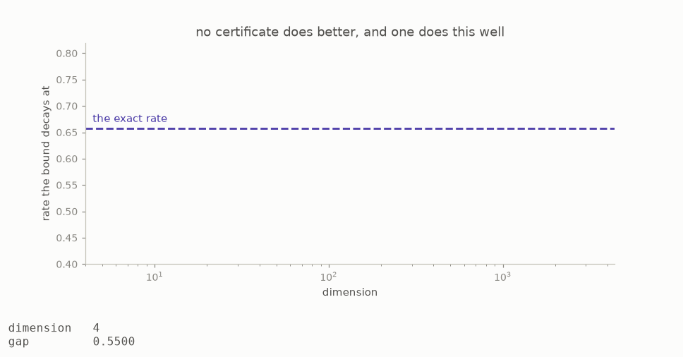

The speed of the two moving sides is chosen only to make their meeting easy to see. It does not represent the proof’s exact step-by-step error.

One standard estimate is still needed to turn a radius into a density. It is called Stirling’s formula, and here it gives a reliable description of the volume of a ball when the dimension is very large. Applying it to the ball volumes from section 2 makes the parts that still change with the dimension cancel, leaving one fixed rate.

```
    multiplying factor per dimension    0.6577446234794570
    the same rate in halvings            0.6044005442916777
    radius per square root of dimension  0.3183098861837907

    these are three descriptions of the same long-term result
```

The middle number is the easiest one to compare with earlier work: **0.6044005442916777** halvings per dimension. In the long run, each added dimension contributes about that much of a halving to the density limit. The 1978 value was 0.59905576.

This is the first improvement to the general sphere-packing exponent since 1978. “Exponent” is the standard name for this long-term shrinking rate. Because the other half of the proof rules out every better certificate, no certificate using these two sign rules can improve that rate again.

**[Play with this](https://muchmirul.github.io/conjectures/sphere-packing/play/11.html)** to bring the constructed and impossible sides together at one value.

## 12 · What it means, and what it does not

The 2026 result settles the limit of one method. It does not settle the sphere-packing problem in most dimensions.

```
    now known                              still unknown
    ---------                              -------------
    the exact long-term rate of this       the densest packing in most
    certificate method                     dimensions
    the improved general upper-limit rate  whether a different method can give
    that replaces the 1978 rate            a better long-term upper limit
    the two related Fourier sign limits    how to close the gap between packings
                                           we can build and limits we can prove
```

No known high-dimensional packing comes close to the new upper limit. The gap between the best construction and the best proven limit is still exponentially wide, which means their ratio grows by repeated factors as dimensions are added. The advance maps one route completely: we now know exactly how far this certificate method can go, so a better long-term rate will need a different idea.

```
    1611  Kepler proposes that the fruit-shop stack cannot be beaten
    1978  Kabatianskii and Levenshtein obtain the rate 0.59905576
    2000  Gorbachev publishes the Fourier certificate method
    2002  Cohn independently develops the same method
    2003  Cohn and Elkies publish it together and calculate new limits
    2005  Hales’s proof of Kepler’s three-dimensional claim appears in print
    2014  Cohn and Zhao show the method is at least as strong as the 1978 rate
    2017  Viazovska settles dimension 8; with Cohn, Kumar, Miller and
          Radchenko, she also helps settle dimension 24
    2020  Afkhami-Jeddi, Cohn, Hartman, de Laat and Tajdini predict the exact rate
    2026  a proof establishes the rate, and 0.6044005442916777 replaces the
          1978 exponent
```

The proof also answers two closely related questions about functions and their Fourier transforms. Some special functions turn into themselves under the Fourier transform; others turn into their own negative. These are the plus and minus versions of a **Fourier eigenfunction**. For each version, ask how far from the centre we must go before the function settles to one fixed sign and never changes sign again.

Both versions were expected to approach the same radius in high dimensions. The proof confirms this. For each one, the limiting radius is one over pi times the square root of the dimension.

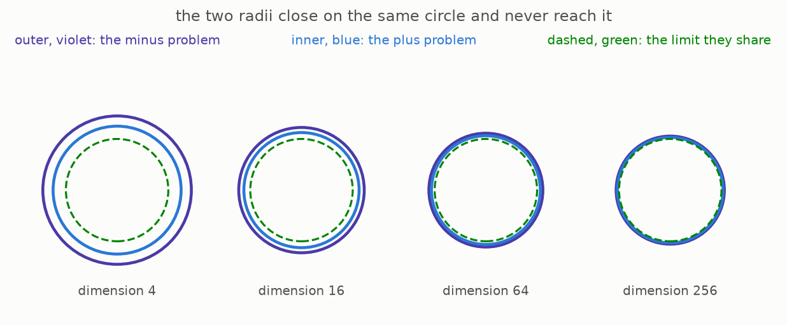

The shared limit does not mean the two radii are equal in any particular dimension. The source shows that the plus radius is smaller in every finite dimension. Their difference becomes small compared with the square root of the dimension, so only their long-term limits agree.

## What you can check yourself

The calculations and figures can be rebuilt from this repository. The commands below assume no mathematical knowledge, though you will need Python and a command line.

```
cd sphere-packing
make venv        # prepare the software once
make test        # recalculate the numbers quoted in this guide
make figures     # rebuild every picture
```

Among other checks, the tests:

- recalculate the quoted densities of the five known packings from their repeating point patterns, called lattices
- confirm that the volume of a radius-one ball reaches its largest value in dimension five and then falls
- add up areas directly in dimensions one and three to check that the certificate building blocks have the stated Fourier behaviour
- check both sign rules for the numerical certificates on a grid thirty times finer than the search grid
- confirm Wallis’s integral, and confirm that it moves the Gaussian radius to one over pi
- combine the three numerical parts and recover the rate stated by the theorem

These calculations do not prove that the five known packings are best; that comes from the cited theorems. The main 2026 argument is also described, not implemented, so running the tests does not prove the theorem.

## The plain words, and the real ones

| this guide’s plain phrase | the standard mathematical term |
|---|---|
| certificate | an admissible function for the Cohn-Elkies linear program |
| the two sign rules | the sign conditions that decide whether a function is admissible |
| the balanced function | an anti-self-Fourier function, whose transform is its own negative |
| the wall | the lower limit for the sign uncertainty radius |
| halvings per dimension | the base-two exponent of the density limit |
| the list of waves | the Fourier transform |
| counting one total two ways | Poisson summation |
| the symmetric adjustment | the Mellin envelope multiplier |
| stretching a function | dilation |

The source shortens “linear program” to LP. It also gives an exact description of the new decimal exponent: one half of the base-two logarithm of two pi divided by e.

## Where to go next

- The main source is chapter 1 of *Ten Advances in Mathematics and Theoretical Computer Science*, together with its reasoning walkthrough. Both files are in `docs/ten-proofs/01-sphere-packing-linear-program/`.
- The full published collection of reasoning walkthroughs is available at [cdn.openai.com/pdf/reasoning-walkthroughs.pdf](https://cdn.openai.com/pdf/reasoning-walkthroughs.pdf).
- For the certificate method, see Cohn and Elkies, “New upper bounds on sphere packings I,” published in *Annals of Mathematics* 157 (2003).
- For the exact eight-dimensional result, see Viazovska, “The sphere packing problem in dimension 8,” published in *Annals of Mathematics* 185 (2017).
- The file `notes/research-content.md` lists the source of every claim above and marks it as calculated here, taken from earlier work, or part of the 2026 result.
