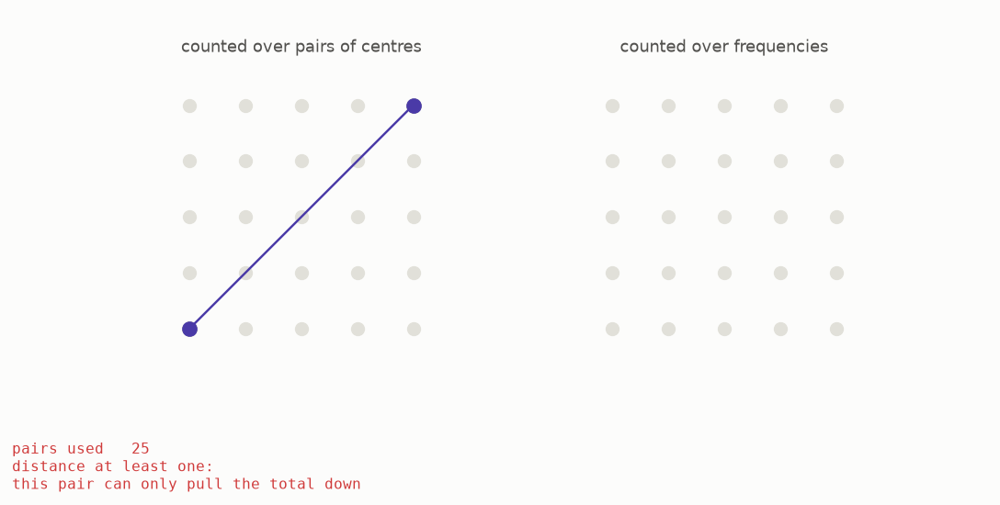

# 5 · Counting twice

The key idea is to calculate one total in two different ways. To keep the picture simple, first imagine a packing that repeats. The full argument handles a non-repeating packing by looking at larger and larger regions.

Take the centres of the balls and, for every pair of centres, use their distance as the input to the certificate. Add all the returned values.



First count by pairs of centres. Two different centres are at least distance one apart because the balls have diameter one and cannot overlap. Rule one says every such pair contributes zero or a negative number. Only a centre paired with itself has distance zero. The different-centre pairs can therefore only pull the total downward.

Now count the same total through the Fourier view, which describes the waves in the packing. A standard result called **Poisson summation** says that these two counts give the same number. Rule two says every contribution in the Fourier count is zero or positive, so this view can only push the total upward.

```
    count pairs of centres  --->  the same total  <---  count waves
    this gives an upper side                         this gives a lower side

    the packing must fit between the two sides,
    which creates a limit on its density
```

The two counts squeeze one total from opposite sides. When the number of centres is separated out, the result is an upper limit on density. The limit depends on the certificate, not on the particular packing, so it applies to every packing. This is the bound introduced by Gorbachev and by Cohn and Elkies in work from 2000 and 2003.

The source paper calls this a **linear program**. In plain terms, it means searching for the best possible value while obeying a set of simple restrictions. Here, the restrictions are the two sign rules.

**[Play with this](https://muchmirul.github.io/conjectures/sphere-packing/play/05.html)** to follow the two counts and see how they trap the density.

---

[← The certificate](../04-the-certificate/README.md)  ·  [What certificates actually prove →](../06-best-so-far/README.md)  ·  [the whole article on one page](../../ARTICLE.md)
