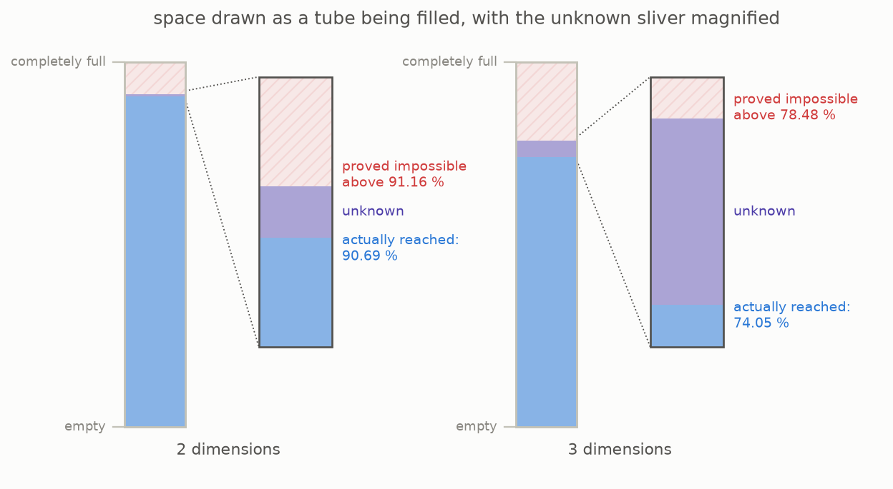

# 6 · What certificates actually prove

This repository includes a small computer search for useful certificates. It begins with a function that passes both rules, makes small random changes, and keeps changes that improve the density limit. The picture treats space like a container filling from the bottom. Blue shows the density reached by the best known packing, while the line above it shows the candidate certificate’s limit.



For the plane, the search finds a candidate limit of 91.16 percent. If its two sign rules held at every distance, it would prove that no circle packing could be denser than that. Staggered rows reach 90.69 percent, leaving less than half a percentage point between the two numbers.

That narrow gap is a limit of this numerical certificate, not an unsolved gap in the two-dimensional packing problem. Section 1 already noted that a separate theorem proves 90.69 percent is the exact answer. The enlarged sliver shows only what this candidate certificate has not ruled out.

There is another important limit. The program checks the two sign rules at a very fine set of sample points, rather than proving them at every possible point. The result is therefore a **numerical certificate**, not a formal proof. Specialists use a stronger kind of search called semidefinite programming and deliberately place zero points in the function. Neither technique is included here.

The small search also shows why the choice of starting function matters. Its starting family stops qualifying before dimension six, so the search cannot even start in dimension eight. Viazovska’s exact certificate for dimension eight comes from a much more advanced family of functions called modular forms.

```
    dimensions 8 and 24     exact certificates meet the exact packing densities
    dimensions 1, 2 and 3   other proofs give the exact packing densities;
                            the simple certificates here leave a gap
    most other dimensions   neither the exact packing nor the exact best
                            certificate is known
    very large dimensions   the best possible long-term certificate rate
                            is known because of the 2026 result
```

Only in dimensions eight and twenty-four do known exact certificates meet the known packing density and settle the problem through this method. In most other dimensions, there is still a gap between the density people can build and the density certificates can rule out.

**[Play with this](https://muchmirul.github.io/conjectures/sphere-packing/play/06.html)** to compare a known packing with the limit from a candidate certificate.

---

[← Counting twice](../05-count-twice/README.md)  ·  [Is there a ceiling on the method? →](../07-the-ceiling/README.md)  ·  [the whole article on one page](../../ARTICLE.md)
