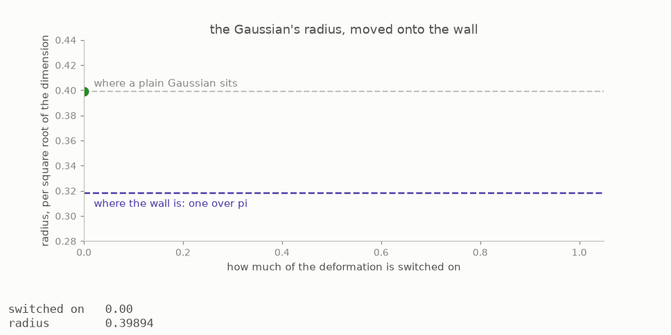
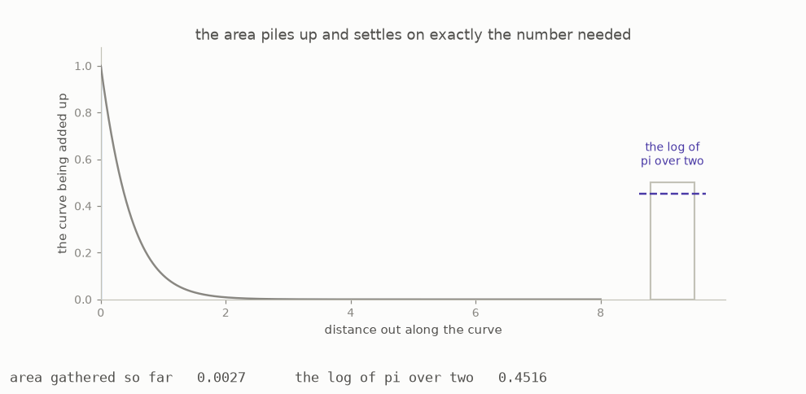

# 10 · Building the witness

Section 10 supplies the second half of the proof by building a concrete family of certificates that approaches the wall. In this chapter, a **witness** simply means a concrete example. Proving that no certificate can cross the limit gives only one half of the result, and the other half requires a family of certificates that gets all the way to that limit as the dimension grows.

A natural starting point is the familiar bell curve, also called a Gaussian. Its Fourier transform has the same shape, so the needed symmetry is already present. However, after measuring the radius per square root of the dimension, the Gaussian gives about 0.399. The limit is one over pi, about 0.318, so the unmodified Gaussian does not reach it.

The construction changes the bell curve with a carefully chosen left-right symmetric adjustment, which mathematicians call an even deformation. It moves the radius while preserving the Fourier symmetry.



The amount of movement comes from one **integral**. An integral gathers many thin pieces into a total; in this picture, that total is the area under the curve. The animation fills the area from left to right while the container beside it shows how much has been collected. The final amount is exactly the logarithm of pi over two, where a logarithm measures repeated multiplication in the way an ordinary difference measures addition. This old result is known as Wallis’s identity.



Combining that amount with the Gaussian moves the limiting radius from about 0.399 to exactly one over pi, about 0.318. The construction reaches the same long-term limit that the first half said no certificate could pass.

Two extra parts repair side effects of the adjustment without changing the central idea, so the full construction looks like this:

```
    the bell curve               already has the required Fourier symmetry
    a symmetric adjustment       moves its radius to the limit
    a tiny distant bump          makes the curve fade properly far away again
    two simple curve factors     correct the signs close to the centre
```

The original bell curve fades quickly at great distances, but the adjustment weakens that fading, and a tiny positive bump far away restores it. The bump covers a range of distances rather than one exact distance, because if it sat at only one point, a wave could line up with that point and avoid the correction. Spreading the bump removes that opening. The broad checks also miss what happens near the centre, so two simple curve factors built from powers handle that short range separately.

---

[← The wall](../09-the-wall/README.md)  ·  [The two halves meet →](../11-they-meet/README.md)  ·  [the whole article on one page](../../ARTICLE.md)
