# The Critical Line, from Zero

*A step-by-step visual guide to the Riemann zeta function, the most famous unsolved problem in mathematics, and the 2026 paper that proved two thirds of the function's zeros sit exactly where Riemann said they should. You do not need a maths background. Each new idea begins with a picture.*


The animation shows a single function being evaluated along a single vertical line, one height at a time. At each height the function's value is a point in the plane, and as the height climbs the value traces the curving path you see. Again and again the path swings around and passes exactly through the centre. Each exact hit is called a **zero** of the function, and the counter records them: the first sits at height 14.13, and they keep coming forever. The function is the Riemann zeta function, the vertical line is called the critical line, and the question of whether every zero sits on this one line is the Riemann hypothesis, unanswered since 1859. Everything in this guide comes from the open source repository at [github.com/muchmirul/conjectures](https://github.com/muchmirul/conjectures): the text, every figure, and the tests behind each number.

In August 2026 a paper appeared with a shorter, unconditional statement: at least two thirds of the zeros sit on the line, each a clean single point, and at least five sixths of them are distinct. The previous record, held since 2020, was five twelfths, about 0.4166. The paper is unusual in a second way: its author is a large language model, Claude, built by Anthropic, and the mathematics was found in a single recorded session, then checked by hostile reviews, formalised in the Lean proof assistant, and studied by human mathematicians before release. This guide explains what the paper proves, how the proof works, and, just as carefully, what it does not prove: it says nothing about the Riemann hypothesis itself, in either direction.

The guide develops the result in small steps. Most numbered sections also have a [page you can play with](https://muchmirul.github.io/conjectures/zeta-critical-line/play/index.html), where you can change the main choices and watch the picture respond.

The code that creates every figure is included in this repository. The tests recompute the zeros, the constants, and the toy experiments shown here. When a statement comes from an existing theorem rather than those tests, the text says so.

```
    first, meet the objects     1  the primes and their wobble
                                2  the zeta landscape and its zeros
                                3  zeros are waves, primes are the tune
    then, find the question     4  the hypothesis, and the record race
                                5  four ways to count a zero
    the proof, one part each    6  listening to the zeros with microphones
                                7  bowls, saddles, and the see-saw law
                                8  two totals the primes reveal
                                9  the whole-number trick, upgraded
    the result                 10  assembling two thirds
                               11  the checks: numbers, Lean, and the story
                               12  what it settles, and what it does not
```

**[Play with this](https://muchmirul.github.io/conjectures/zeta-critical-line/play/00.html)** to steer the zeta path yourself and watch it strike the centre.

## 1 · The primes

A prime is a whole number bigger than one that only breaks into pieces the trivial way: 7 is prime, 6 is not, because 6 is 2 times 3. Primes are the atoms of multiplication. Every whole number is a product of primes in exactly one way, so whatever the primes do, all numbers inherit.

What the primes do is thin out, irregularly. There are 25 of them below 100, but only 21 in the next hundred, and 16 in the hundred after that. The picture below counts them: each step up is one new prime.

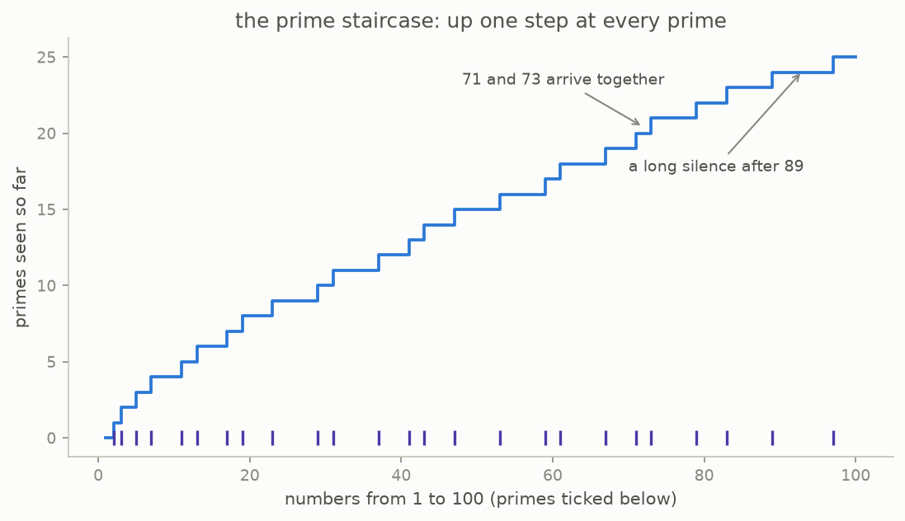

The steps come at uneven moments. Sometimes two primes arrive almost together, like 71 and 73, and sometimes there is a long silence, like the eight-number gap after 89. Nobody has ever found a simple rule that predicts the next step, and the arrivals stay irregular no matter how far anyone counts.

From a distance, however, the staircase smooths into a gentle curve. In 1792, aged fifteen, Gauss guessed a formula for that curve, and his guess turns out to be very accurate. The next picture subtracts the guess from the true count, leaving only the difference.

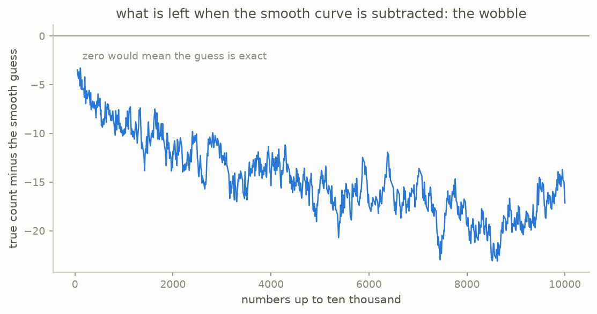

What is left is a wobble: the gap between truth and guess wavers irregularly, in waves with no obvious period. (In this whole range the true count runs slightly under the guess; Littlewood proved in 1914 that the gap nevertheless flips sign infinitely often, the first flip lying unimaginably far out. The quoted theorems in this paragraph and the last are classical, and the chart itself is recomputed by this repository.) This wobble is the whole subject of this guide. The zeta function's zeros turn out to be, quite literally, the frequencies of these waves, and every question about how far the primes can stray from the smooth curve becomes a question about where the zeros sit.

**[Play with this](https://muchmirul.github.io/conjectures/zeta-critical-line/play/01.html)** to walk the staircase and compare it with the smooth guess.

## 2 · Riemann's map

In 1859 Bernhard Riemann sent the Berlin Academy an eight-page memoir on how many primes lie below a given bound. Its central object is a single function, now written with the Greek letter zeta. The recipe behind it starts simply: pick a strength, take every whole number, raise each to that strength, flip each into one-over-it, and add them all up. Riemann's step was to feed this recipe not a single number but a point in the plane: one coordinate for the strength, a second coordinate that makes the terms rotate as well as shrink. He then extended the map, in the one standard way such maps extend, so that it covers essentially the whole plane. The result assigns a value to every point, and it helps to see the size of that value as a landscape.


The camera circles so that the shape is genuinely three-dimensional: two directions of the floor are the two coordinates of the input point, and the height is the size of zeta there. What matters is where the landscape touches the floor, because floor level means the value is exactly zero. There are some easy touchdowns far to the left of the picture, at a neat row of evenly spaced points on the real axis; they are called the trivial zeros, they are completely understood, and this guide sets them aside now and does not mention them again. Every other touchdown lies inside a vertical band called **the strip**: the band of points whose first coordinate is between zero and one. These are the zeros that control the prime wobble of chapter 1, and in the picture every one of them sits at first coordinate exactly one half, on the vertical line down the middle of the strip. That middle line is **the line** of this guide's title: the critical line.

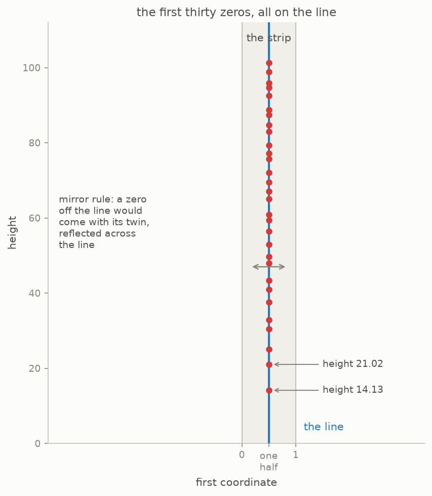

The flat map shows the same region from above, with the first thirty zeros marked as pins. Two symmetries are worth carrying forward. The zeros come in top-bottom pairs, so it is enough to look above the horizontal axis, and everyone measures a zero by its **height**: the first sits at height 14.13, the second at 21.02, and so on, forever upward. Less obviously, the landscape obeys a left-right mirror rule across the line: if a zero ever sat off the line, its mirror image through the line would also be a zero. Off-line zeros could only appear as symmetric pairs, one on each side at the same height. We will call such a hypothetical couple a **mirror pair**, and no such pair has ever been found.

## 3 · The music of the primes

Riemann's discovery is that the zeros and the primes are two descriptions of one thing, the way a chord and its notes are. There is an exact formula, called the explicit formula, that turns the list of zeros into the prime staircase and back. Instead of writing the formula, this guide shows it working.

Each zero contributes one wave, and the zero's height sets the wave's frequency: a zero at height 14.13 contributes a wave that oscillates 14.13 fast on a logarithmic ruler. The picture below shows the first zero's wave on its own.

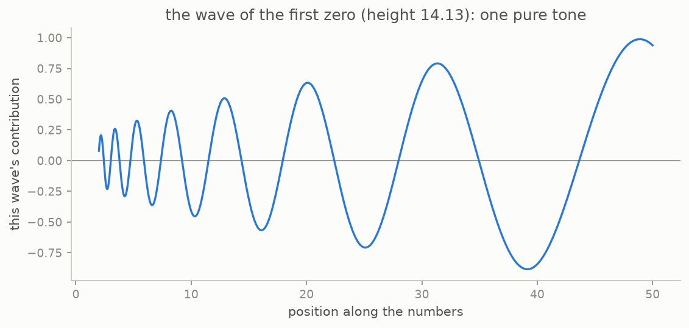

One wave on its own explains very little. The animation therefore adds the waves of the first zero, then the first two, the first five, twenty, and one hundred, and shows what the sum converges to.

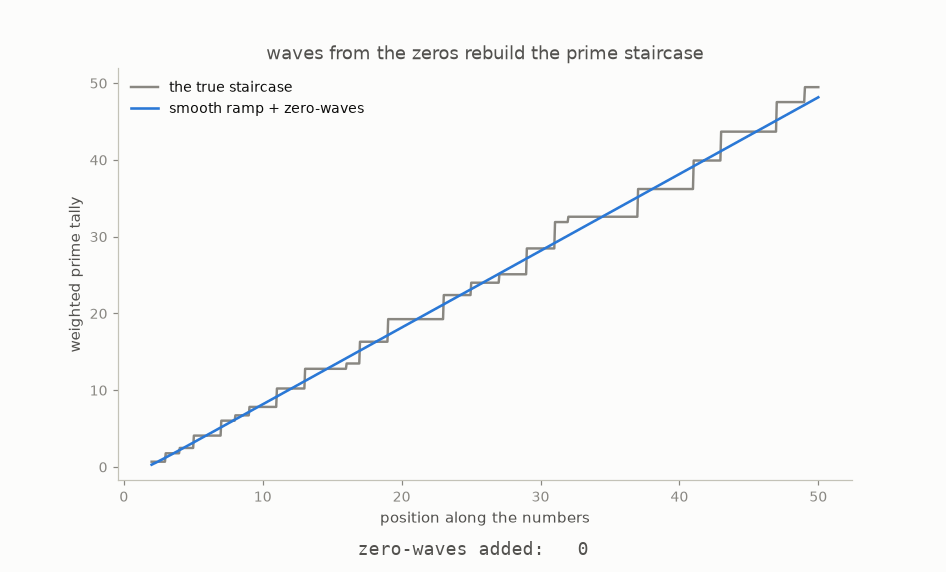

As more waves are added, the sum reproduces the staircase, corners and all. (The staircase in this figure is a standard weighted variant of the prime count, chosen because its formula is the cleanest; its steps land on primes and their powers, and its wobble is the same wobble.) The convergence is an exact mathematical identity rather than an approximation invented for the picture, and the tests in this repository check that adding more waves really does shrink the error.

The same identity also works in the other direction: a sum with one wave for every prime points back at the zeros. This reverse direction is what the 2026 paper relies on, because it gives information about zeros nobody can see, and chapter 8 shows it in action.

One further fact will matter later. How loud each zero's wave sounds depends on where the zero sits sideways. A zero on the line contributes the quietest possible wave, one whose loudness stays balanced forever. A mirror pair off the line would contribute a wave that grows louder, and the further off the line, the faster the growth. The Riemann hypothesis is therefore exactly the statement that the prime wobble stays as quiet as it can possibly be.

**[Play with this](https://muchmirul.github.io/conjectures/zeta-critical-line/play/03.html)** to add the zero-waves one at a time yourself.

## 4 · The question

Riemann observed, in one parenthetical sentence of the 1859 memoir, that it is "very likely" that all the zeros sit on the line. He added that he had put the question aside after a few fleeting attempts, since it was not needed for his immediate purpose. That aside became the Riemann hypothesis, the most famous open question in mathematics: one of Hilbert's problems of 1900, one of the seven million-dollar Millennium Prize Problems of 2000, and still open today.

The evidence sits in an unusual position. By 2004, computers had checked the first ten trillion zeros, and every single one sits exactly on the line. This checking can never settle the question, because there are infinitely many zeros, and the history of this subject contains patterns that hold for trillions of cases and then fail. What has been proven, across more than a century, is that an increasing *proportion* of the zeros must sit on the line.


Hardy proved in 1914 that infinitely many zeros are on the line, which says nothing yet about a proportion. Selberg proved in 1942 that a positive proportion is on the line, without saying which proportion. Levinson reached one third in 1974 by a new method, mollifying zeta near the line, and every record since has sharpened his machinery: Conrey's two fifths in 1989, then refinements by Bui, Conrey and Young and by Feng, and finally, in 2020, five twelfths, about 0.4166, by Pratt, Robles, Zaharescu and Zeindler. The record then stayed there until 2026.

The 2026 paper comes from a different tradition, started by Montgomery in 1973 rather than by Levinson, and it reaches two thirds. The rest of this guide explains the bar on the right of the chart.

```
    1914  Hardy            infinitely many zeros on the line
    1942  Selberg          a positive, unspecified proportion
    1974  Levinson         one third
    1989  Conrey           two fifths
    2020  Pratt, Robles,
          Zaharescu,
          Zeindler         five twelfths, about 0.4166
    2026  this paper       two thirds, simple and on the line,
                           and five sixths distinct
```

One caution is needed before the proof. Montgomery showed already in 1973 that *if* the Riemann hypothesis is true, then at least two thirds of the zeros are well-behaved in the sense the next chapter makes precise. This means the number two thirds itself is fifty years old, and the 2026 paper's achievement is a proof of it that no longer needs the "if". The paper is precise about this ancestry, and this guide will be too.

## 5 · Four ways to count

The theorems ahead distinguish counts that sound alike, and most of the care in their statements sits in these distinctions. This chapter fixes the counts with one picture, and nothing in it is difficult.

Think of each zero as a pin stuck in the strip at its height. Four counters walk up the strip together through the same stretch of heights.

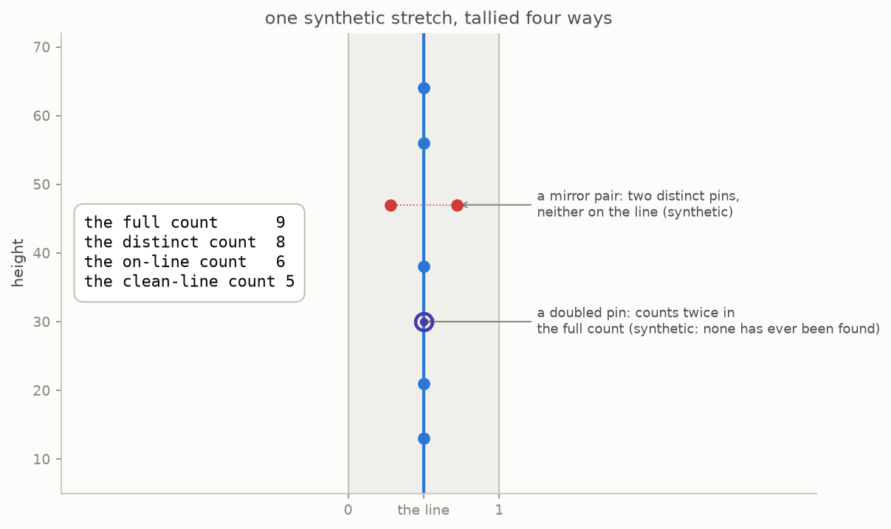

**The full count** tallies every pin, and it counts a doubled pin twice. A doubled pin is a subtle possibility the theory must allow for: the landscape of chapter 2 could, in principle, touch the floor at one point in an extra-flat way, and such a point legitimately counts twice (or more). We will call an ordinary once-counting pin **a clean pin**, and the technical word for it is a *simple* zero. For the record, no doubled pin has ever been found either: every zero anyone has computed is clean and on the line.

**The distinct count** tallies pins as locations, so a doubled pin counts once.

**The on-line count** tallies only pins on the line, as locations.

**The clean-line count** tallies only pins that are both on the line and clean.

By their definitions, the clean-line count can never exceed the on-line count, which can never exceed the distinct count, which can never exceed the full count. The full count is the one with a known formula: a stretch of heights contains a predictable number of pins (the counting formula of [equation 1.2, page 3 of the paper](https://www-cdn.anthropic.com/564f962e60643842f5fcb4a17c9dbc8f608f1c37.pdf#page=3)), and the tests here verify that prediction against this repository's own table of computed zeros.

The 2026 paper's three headline theorems can now be said exactly, in this guide's words. Take an ever-higher stretch of heights, from any large height up to its double, and compare each counter with the full count. Then, in the limit:

> The on-line count is at least two thirds of the full count. So is the clean-line count. The distinct count is at least five sixths of the full count.

These are [Theorems A, B and C on pages 3 and 4 of the paper](https://www-cdn.anthropic.com/564f962e60643842f5fcb4a17c9dbc8f608f1c37.pdf#page=3). "Unconditional" means: assuming nothing unproven, in particular not assuming the Riemann hypothesis.

**[Play with this](https://muchmirul.github.io/conjectures/zeta-critical-line/play/05.html)** to place pins yourself and watch the four counters disagree.

## 6 · The microphones

Everything in the proof happens inside one constructed object: a square table of numbers built by listening to the zeros. This chapter builds that table, and the toy version on this page was really computed and really drawn.

A **microphone**, in this guide, is a probe tuned to one frequency: point it at the zeros and it rings according to how close each zero's height is to the microphone's tuned frequency. Its sensitivity curve has a bump shape: a zero at the tuned frequency rings it hard, a zero a little away rings it less, a zero far away barely at all. The shape of that bump is set by a **window**, a taper the paper chooses once ([section 2.2, page 7](https://www-cdn.anthropic.com/564f962e60643842f5fcb4a17c9dbc8f608f1c37.pdf#page=7)); the window also has a width knob, called **the dial** in this guide, which trades sharpness for reach and whose best setting turns out to be the natural one.

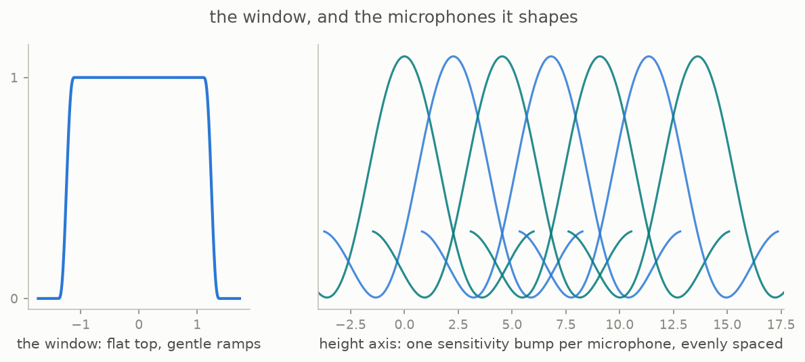

The next step is to spread microphones evenly across the stretch of heights being studied, packed at the natural density of about one microphone per zero expected in the stretch. Our toy uses the stretch from height 100 to height 200, which holds 44 microphones. For every pair of microphones, record how much the two hear in common: each zero rings both, so each zero contributes to the pair jointly, and adding the contributions of all zeros gives one number per pair. Written into a grid, one row and one column per microphone, these numbers form **the table** ([equation 2.20, page 8](https://www-cdn.anthropic.com/564f962e60643842f5fcb4a17c9dbc8f608f1c37.pdf#page=8)).

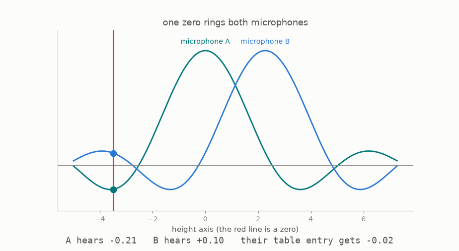

The animation shows the principle on two microphones: as a zero slides across, each microphone's response follows its bump, and the product of the two responses is what lands in the table. The next picture shows the real table for our toy stretch, computed from the actual 196 zeros this repository holds near the stretch:

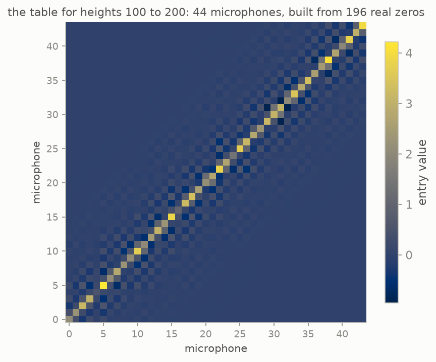

The table is big along its diagonal, where a microphone is paired with itself or a close neighbour, and fades away from it, because distant microphones share almost nothing. It is also perfectly symmetric, thanks to the mirror symmetries of chapter 2. Everything after this point works with this grid alone: the zeros built it, and the next three chapters extract from it everything the theorems need. A reader who wants the standard name can know it as a Gram matrix of Weil's Hermitian form; the glossary at the end collects such names.

## 7 · Bowls and saddles

Nothing new is needed in this chapter: only the table of chapter 6 and one idea about shapes. The question is what a zero's position does to the table's character.

The table is symmetric, and every symmetric table describes a landscape of its own: feed it any mixing recipe for the microphones (so much of microphone one, so much of microphone two, and so on) and the table returns one number, the strength of that mix. Varying the recipe and plotting the strength gives a surface. What kind of surface depends on the zeros, and there are exactly two characters, corresponding to the two kinds of pin.

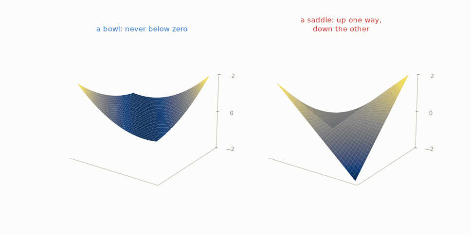

**A zero on the line contributes a bowl.** Whatever mix you feed it, its contribution to the strength is never negative: the surface curves up, in at most one direction, and is flat in all the others. This is visible in the arithmetic of the table (each on-line zero enters as a product of a response with itself, and a times a is never negative) and the tests here verify it on real zeros: the toy table of chapter 6, built entirely from on-line zeros, has all 44 of its principal directions curving up or flat, none down.

**A mirror pair contributes a saddle.** The two off-line partners enter the table as a product of *different* responses, and such a contribution curves up in exactly one direction and down in exactly one other ([the paper's Proposition 4.1, page 11](https://www-cdn.anthropic.com/564f962e60643842f5fcb4a17c9dbc8f608f1c37.pdf#page=11)). The tests build a synthetic mirror pair and confirm: one up-direction, one down-direction.

The table is therefore a sum: one bowl per distinct on-line pin, and one saddle per mirror pair. The counting law that makes this useful has been known since the 1850s as Sylvester's law of inertia, and this guide pictures it as **the see-saw law**: however you add surfaces together, and however you then restrict attention to fewer mixing directions, *the number of independent up-curving directions can never exceed the number of up-contributions you added*. Bowls give at most one up-direction each, and saddles give exactly one each, so no combination of them can show more up-directions than there were contributions.

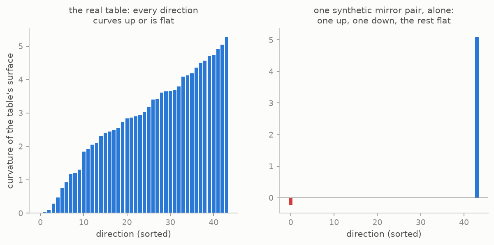

Read the law in the useful direction: **count the up-curving directions of the finished table, and you have a floor on how many pins built it.** If the table shows many up-directions, there must be many distinct on-line pins and mirror pairs behind them; and a second, finer accounting in the paper (same proposition) separates the two, because a mirror pair always spends one of its two table slots on a down-direction, while clean on-line pins never do. Counting directions is something a computer, or a theorem, can do to the table without ever being told where the pins are. That is the entire role of the zero side: the paper's [section 4](https://www-cdn.anthropic.com/564f962e60643842f5fcb4a17c9dbc8f608f1c37.pdf#page=10) does this bookkeeping carefully, including the pins just outside the stretch, whose leakage into the table it bounds once and for all.

It is worth saying plainly why this step replaces the Riemann hypothesis. The older route to these counts read the table's entries zero by zero and needed every reading to be positive, which is only guaranteed when all zeros are on the line, and that is exactly where RH used to enter. The see-saw law needs no such positivity, because it allows for saddles and prices them in, so it works whatever the zeros are doing.

**[Play with this](https://muchmirul.github.io/conjectures/zeta-critical-line/play/07.html)** to mix bowls and saddles and count the up-directions yourself.

## 8 · What the primes reveal

The see-saw law turns the table into a counting device, but only if something about the finished table is known. The paper's central resource is the fact that two properties of the table can be computed without looking at the zeros at all, because the primes determine them.

The reason is the two-way identity of chapter 3. The zeros built the table, and the explicit formula lets the primes rebuild it: Riemann's identity converts the sum over zeros into a sum over primes, exactly, so every entry of the table equals a sum of prime contributions plus smooth, fully understood terms ([Proposition 2.1, page 7](https://www-cdn.anthropic.com/564f962e60643842f5fcb4a17c9dbc8f608f1c37.pdf#page=7)). The prime rebuild also needs surprisingly little input, because with the dial at its natural setting only the primes and prime powers below a small reach enter. For our toy stretch, heights 100 to 200, the reach is sixteen, so the whole table is determined by the primes up to 13 and their powers.

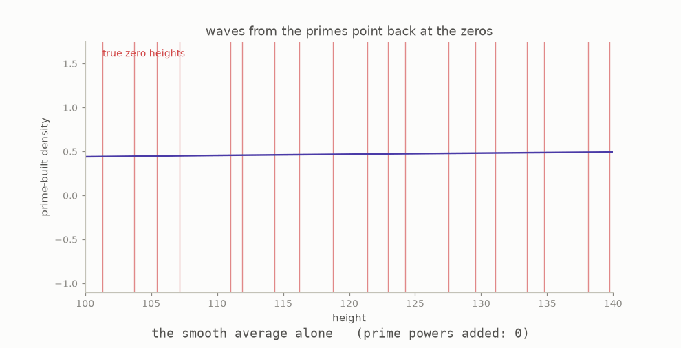

The animation runs the identity in the prime-to-zero direction: it starts from the smooth average, adds one wave per prime power, and spikes stand up at the heights of the true zeros, marked along the base. (With so few primes playing, the profile is low-resolution: where two zeros crowd together it shows one broad spike between them, and the tests state the alignment exactly.) This spiky profile is the density the paper integrates against ([equation 2.6, page 7](https://www-cdn.anthropic.com/564f962e60643842f5fcb4a17c9dbc8f608f1c37.pdf#page=7)). The tests confirm the alignment quantitatively at toy scale: this repository computes the table twice, once from its zeros and once from its primes, and the two agree to about two parts in a hundred million. (The paper's own numerical section reports the same experiment at greater heights, with the same order of agreement.)

Two properties of the table are what the proof extracts, and this guide gives them plain names.

**The count.** Add up the table's diagonal. The prime-side calculation shows this total is, up to small errors, exactly the full count of zeros in the stretch: the microphones, collectively, tally every pin once per multiplicity. In the paper's units our toy table's diagonal adds to 50.4, against 50 zeros really in the stretch.

**The energy.** Square every entry of the table and add them all up. The prime side computes this too, and at the natural dial setting the answer is, per zero counted, four thirds in the limit ([the summary is Theorem 5.8, page 18](https://www-cdn.anthropic.com/564f962e60643842f5fcb4a17c9dbc8f608f1c37.pdf#page=18)); our small toy still reads about ten percent above it, and closes in slowly as the stretch rises. This single number is the deep arithmetic input of the whole paper. It is Montgomery's 1973 pair-correlation calculation, and the fact that it holds *without assuming the Riemann hypothesis* was made fully explicit by Baluyot, Goldston, Suriajaya and Turnage-Butterbaugh in 2024. The paper leans on their work by name, re-deriving it with the explicit error terms its finite table needs, and adds no new arithmetic of its own: every input beyond this is bookkeeping or linear algebra.

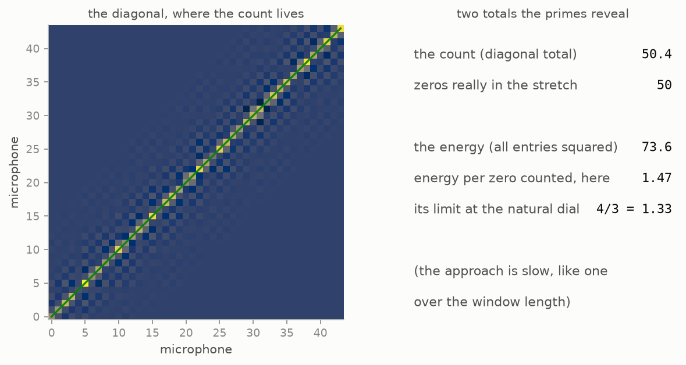

It is worth restating what has happened. The count and the energy are facts about an object built from the zeros, whose positions are unknown, yet both facts are certain, because the primes, which can be listed, fix them through an exact identity. As a result, the proof works with a table whose individual entries it never needs to inspect, while still knowing the table's diagonal total and its energy.

**[Play with this](https://muchmirul.github.io/conjectures/zeta-critical-line/play/08.html)** to add prime waves yourself and watch the spikes find the zeros.

## 9 · The whole-number trick

The last ingredient is the oldest kind of mathematics in the paper: a fact about whole numbers, upgraded to tables. Nothing new is needed beyond chapter 8's two totals.

The fact concerns multiplicities, which are whole numbers: a pin counts once, or twice, or three times, never one and a half. Compare a whole number's square with three times the number minus two. At one the two sides are equal, one against one, and at two they are equal again, four against four. From three onward the square is strictly larger, nine against seven, then sixteen against ten, and the gap keeps growing.

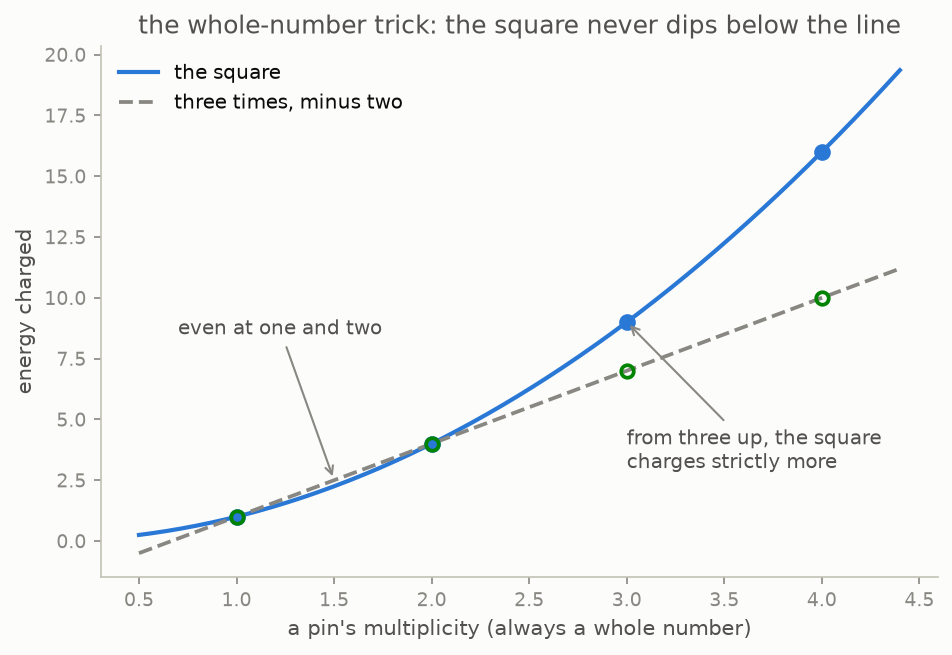

So for every whole number, the square is at least three times the number minus two. This matters because in the table's energy a pin of multiplicity m contributes like m squared, while in the count it contributes m. A doubled pin is therefore expensive: it pays four in energy for its two of count, which makes clean pins the most energy-efficient way to fill a table. Since chapter 8 *measured* the energy and found it modest, four thirds per zero, there is simply not enough energy in the table for many pins to be doubled or worse. Montgomery's original argument was exactly this, run under RH: modest energy forces most pins to be clean.

The paper's upgrade is to make the same trick work on the table itself, where off-line saddles and the microphones' finite reach muddy any pin-by-pin reading. The upgraded statement, the **rank-trace inequality** ([Lemma 3.2, equation 3.1, page 9](https://www-cdn.anthropic.com/564f962e60643842f5fcb4a17c9dbc8f608f1c37.pdf#page=9)), says: for a sum of bowls and saddles, the number of independent directions the bowls span is at least twice the bowls' diagonal total, plus four times the saddles' diagonal total, minus four per saddle, minus the energy of the whole table. Every quantity on the right is either measured by the primes (chapter 8) or counted by the see-saw law (chapter 7). The proof of the upgrade is half a page of linear algebra resting on one classical inequality of von Neumann about how two tables can share their strength, and its connection to the whole-number fact stays visible: reducing every direction to the one-number case collapses it to the square-versus-three-m-minus-two comparison above.

This repository cannot prove the lemma, but it can do what the paper's own referees did and attack it. The tests throw thousands of random bowl-and-saddle tables at the inequality, including adversarial near-equality shapes, and count how often the guaranteed floor exceeds the true direction count. For the inequality to be correct that count must be zero, and zero is what the tests find.

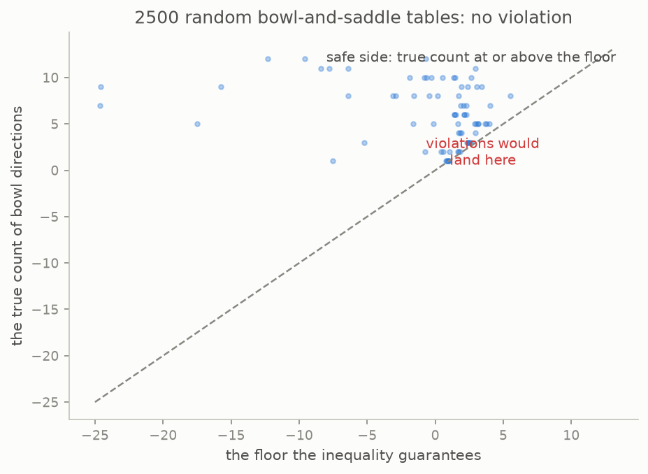

**[Play with this](https://muchmirul.github.io/conjectures/zeta-critical-line/play/09.html)** to choose multiplicities and watch the energy budget expose doubled pins.

## 10 · Two thirds

All the parts are now available, and nothing new is needed, because this chapter only adds them up, the way [section 6 of the paper](https://www-cdn.anthropic.com/564f962e60643842f5fcb4a17c9dbc8f608f1c37.pdf#page=19) does.

Write the budget in units where the full count of zeros in the stretch is one. The rank-trace inequality of chapter 9 promises: clean on-line pins are at least twice the count, plus a term for the saddle bookkeeping that the see-saw law caps at twice the count again, minus the energy. Chapter 8 measured the count's total (one, in these units, times a factor of two from how the table's slots pair up) and the energy (four thirds). The assembly is three subtractions long:

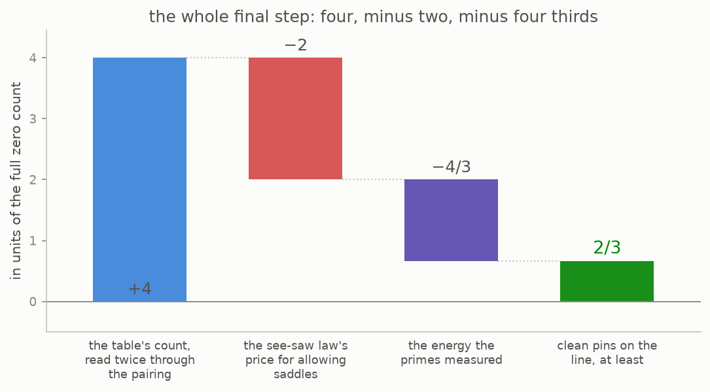

Four, minus two, minus four thirds, leaves two thirds. That is the whole final step, and each block of the waterfall is a chapter of this guide: the four is the doubled count reading of the table (chapters 6 and 8), the minus two is the see-saw law's price for allowing saddles at all (chapter 7), and the minus four thirds is the measured energy (chapter 8) entering through the whole-number trick (chapter 9). The conclusion: in the limit, clean on-line pins are at least two thirds of the full count. This proves the guide's version of Theorems A and B at the natural dial setting. For Theorem C, the same inequality re-run with the count of *distinct* pins gives five sixths: each mirror pair, remember, still contains two genuinely distinct points, so distinctness is cheaper to certify than being on the line.

Two refinements complete the paper's headline numbers.

**The dial matters.** Run the whole argument at a different dial setting and each block of the budget changes: the shape of the result as a function of the dial is the paper's [equation 1.3, page 3](https://www-cdn.anthropic.com/564f962e60643842f5fcb4a17c9dbc8f608f1c37.pdf#page=3). The chart below plots it: the certified proportion peaks exactly at the natural setting, dial equal to one, where it reads two thirds.

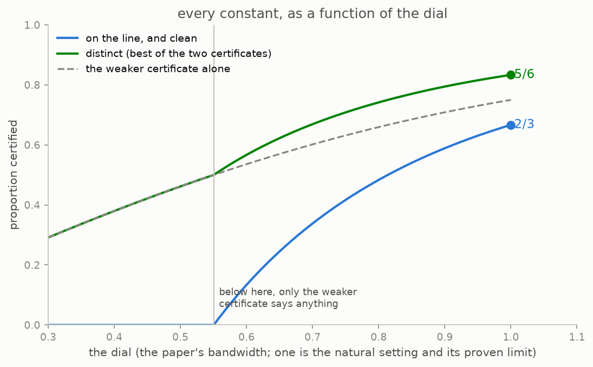

**The window matters, a little.** The bump shape of chapter 6 was flat-topped for simplicity. Optimising the shape instead ([section 7.1, page 20](https://www-cdn.anthropic.com/564f962e60643842f5fcb4a17c9dbc8f608f1c37.pdf#page=20)) leads to a gently curved cosine profile, and the constants improve to 0.6725 on the line and simple, and 0.83625 distinct. The optimal shape was already known: Montgomery and Taylor found the same test function in 1975 for the conditional version of this problem, and the paper proves that the 2026 machine reaches their constant without their hypothesis. This repository recomputes the optimising shape's score numerically and checks that nearby shapes do worse.

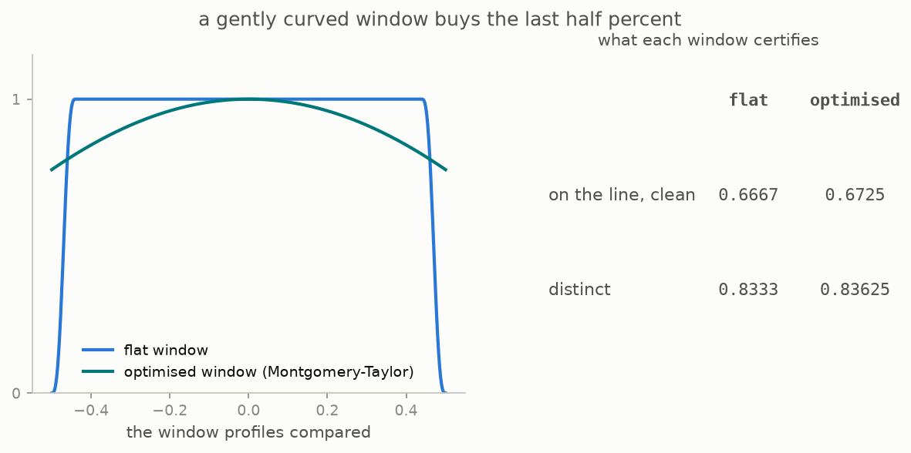

Finally, the same machine runs verbatim for close cousins of zeta: for the L-function of any fixed Dirichlet character, the paper's [Theorem E, page 22](https://www-cdn.anthropic.com/564f962e60643842f5fcb4a17c9dbc8f608f1c37.pdf#page=22) gives the same constants, and for the derivative of the completed zeta function it certifies 0.85838 simple-and-on-the-line and 0.92919 distinct ([Remark 7.3, page 23](https://www-cdn.anthropic.com/564f962e60643842f5fcb4a17c9dbc8f608f1c37.pdf#page=23)).

**[Play with this](https://muchmirul.github.io/conjectures/zeta-critical-line/play/10.html)** to turn the dial and switch windows, and watch every constant respond.

## 11 · The checks

A large jump in a hundred-year-old record, authored by a language model, invited scepticism and received it. The paper answers this scepticism in three ways, and this repository re-runs the smallest example of each.

**Numbers.** The paper's [section 8](https://www-cdn.anthropic.com/564f962e60643842f5fcb4a17c9dbc8f608f1c37.pdf#page=25) opens with a sentence this guide repeats: no theorem in the paper depends on any computation, and the computations only illustrate. The main computation fills the table in the two independent ways, from zeros and from primes. At the paper's heights the two agree to between a millionth and a hundred-millionth, and our toy at heights 100 to 200 agrees to about two parts in a hundred million.

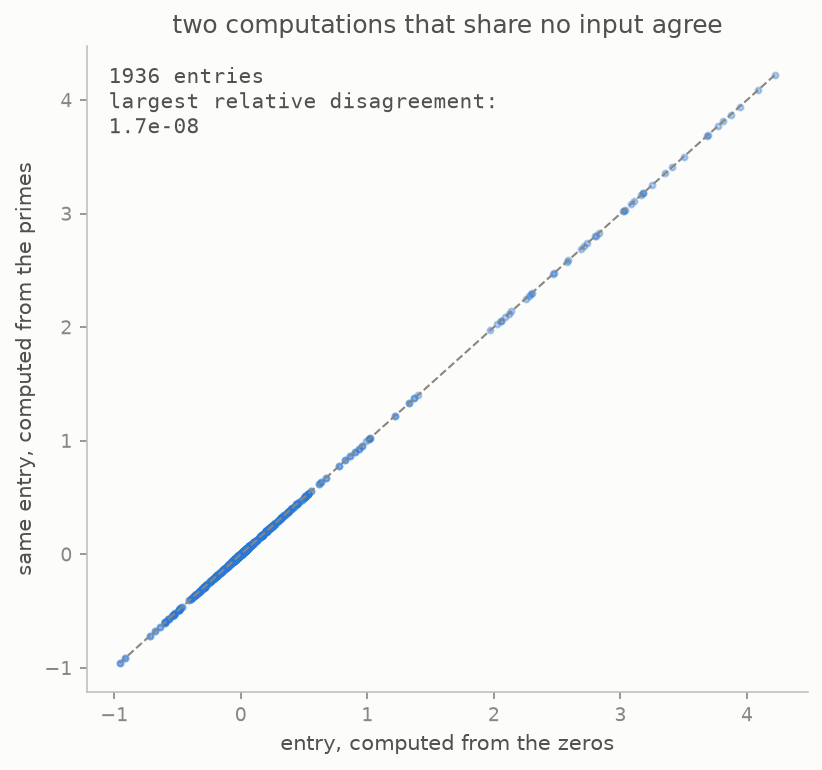

A second experiment attacks the certificate itself. On synthetic zero configurations, built to be as hostile as possible, the certified count must never exceed the truth: replace all the real ordinates with mirror pairs (so the true clean-line count is zero) and the certificate must notice and go negative; double every pin and it must fall; mix half and half and it must stay under. The tests here run all of these at toy height, mirroring the paper's own synthetic runs, and the certificate stays on the honest side in every case.

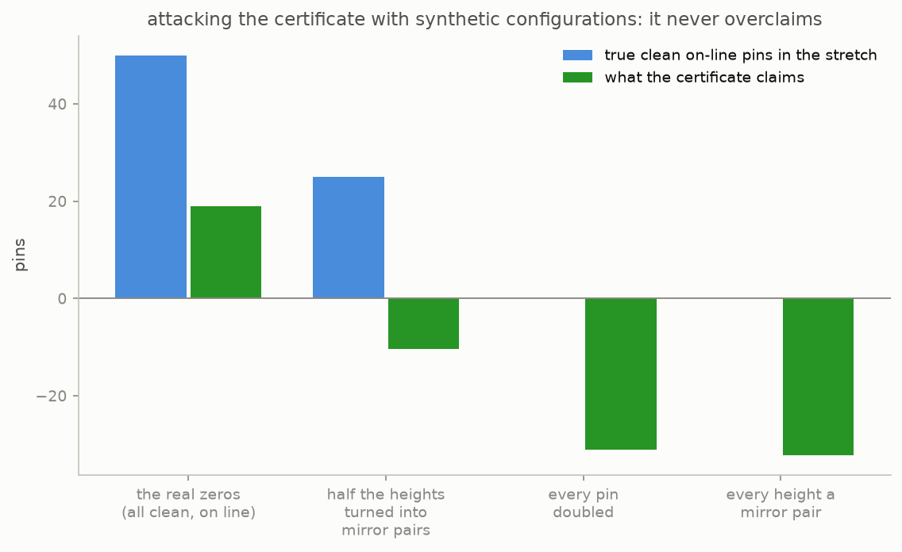

One honesty note the paper itself insists on ([Remark 5.9, page 19](https://www-cdn.anthropic.com/564f962e60643842f5fcb4a17c9dbc8f608f1c37.pdf#page=19)): the two-thirds is a limit. At any height a computer can actually reach, the finite-size corrections eat part of the constant; our toy stretch certifies about 38 percent of its zeros as clean and on the line, not 67, and the paper's own tables at greater heights certify around 40. The constants approach their limits slowly, like one over the window length. A reader who checks the numbers should expect exactly this.

**Machine proof.** The paper's [Appendix B](https://www-cdn.anthropic.com/564f962e60643842f5fcb4a17c9dbc8f608f1c37.pdf#page=28) describes a formalisation of all five theorems, with the constants as stated, in the Lean 4 proof assistant, against the standard mathematical library's own definition of the zeta function; the repository is public at [github.com/anthropics/zeta-23-lean](https://github.com/anthropics/zeta-23-lean). The audit trail records that the statements carry no hypotheses and depend only on Lean's three standard axioms, with no gaps. Separately, the main constants were verified symbolically, 31 checks in all. Formal proof is the strongest form of checking mathematics currently has; a reader does not need to trust the author, the reviewers, or this guide, only the Lean checker's small kernel.

**The story.** The paper's [Appendix C](https://www-cdn.anthropic.com/564f962e60643842f5fcb4a17c9dbc8f608f1c37.pdf#page=30) recounts how the argument was found, and it is unusual reading for a mathematics paper. The session began with a user instruction to resume work on the Riemann hypothesis itself. The model declined to promise that, on the record, and instead dispatched twenty-three parallel search agents down deliberately different roads, each ordered to test its line against control problems where the analogue of RH is false. Most lines ended quickly at known obstacles. The line that survived had a different target: an agent labelled E2, sent to bound a quantity from above, reported that its intended bound was empty but that the dual bookkeeping, counting positive directions instead of negative ones, appeared to certify half the zeros unconditionally. The model's own recorded reaction was disbelief, followed by three hostile reviews it commissioned against itself, each assigned a specific way the result should fail. The claim survived, a further exchange upgraded one half to two thirds by the rank-trace lemma, and referee instances later noticed that the same lemma gives the simple and distinct refinements. After ten independent review passes the model judged that more of its own checking added no information, and the work was handed to human analytic number theorists: the problem was posed by Jarred Sumner, whom the paper credits as its human co-author in every meaningful sense; Ralph Furman and Levent Alpöge studied the result, placed it in the literature, and took responsibility for its communication; Brian Conrey and Daniel Goldston read the manuscript; Eric Easley orchestrated the Lean formalisation. The acknowledgments close by recording the paper's debt to the mathematicians whose work supplied every analytic ingredient, Baluyot, Goldston, Suriajaya and Turnage-Butterbaugh above all.

## 12 · What it means, and what it does not

The paper spends a full section, [1.5, page 5](https://www-cdn.anthropic.com/564f962e60643842f5fcb4a17c9dbc8f608f1c37.pdf#page=5), stating what its results are not, and any honest account must lead with the same.

**It has no bearing on the Riemann hypothesis, in either direction.** The argument produces lower bounds only: it certifies that at least two thirds of the zeros are clean and on the line, and it says nothing about the remaining third. Those zeros are simply beyond this certificate's reach, and nothing in the result suggests they are off the line. The paper also notes that its inputs are too coarse to ever decide RH, because there exist other functions, long known, that satisfy every input the proof uses while their version of the hypothesis is false. This means a proof of RH must use more about zeta than this proof does.

**The method has a proven ceiling.** The paper proves its own limit ([Remark 1.1, page 4](https://www-cdn.anthropic.com/564f962e60643842f5fcb4a17c9dbc8f608f1c37.pdf#page=4)): no certificate built from this data, the table's two totals at the natural dial, can ever certify more than 0.68185 of the zeros. The two thirds already sits within 0.016 of that ceiling, and the optimised 0.6725 within a hundredth, so the machine has been driven essentially as far as it goes. Reaching 0.70, 0.80 or 0.90 by this route would need pair-correlation knowledge at bandwidths around 1.04, 1.26 and 1.70, beyond what anyone can currently prove, and the full hypothesis would correspond to unlimited bandwidth.

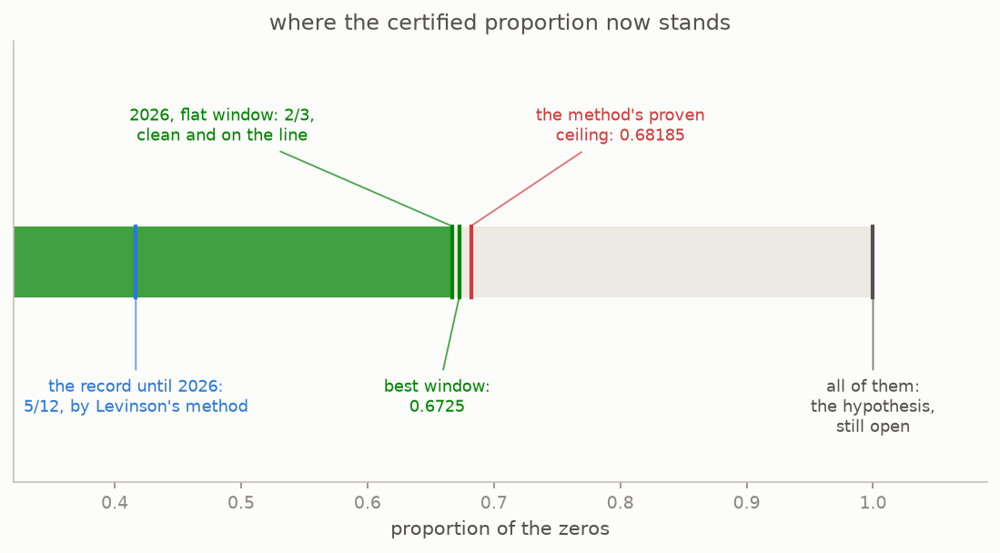

```
    now known, unconditionally             still open
    ----------------------------           ----------
    at least 2/3 of the zeros are          whether all zeros are on the
    on the line, and clean                 line (the Riemann hypothesis)
    at least 5/6 are distinct              whether all zeros are clean
    with the best window: 0.6725           anything between 0.68185 and 1
    and 0.83625                            by this method: provably nothing
    the same for every Dirichlet
    L-function
```

Three conclusions are worth keeping. The first is that the state of knowledge moved: the best unconditional statement about where zeta's zeros live improved from five twelfths to two thirds, the largest single step since Levinson in 1974, and the companion counts (five sixths distinct, and the derivative's 0.929) moved with it. The second is that a fifty-year-old conditional theorem became unconditional: what Montgomery could prove in 1973 only by assuming RH, the see-saw law now delivers with no assumption, and the paper is candid that this, rather than any new arithmetic, is its real contribution. The third concerns how the result was produced: a mathematical result of record strength was found by a machine, doubted by the machine, attacked by the machine, formalised down to axioms, and only then handed to people. The paper took unusual care that the question of whether the result is true would not depend on the question of who wrote it.

The question itself remains where Riemann left it. Two thirds of the wobble's frequencies are now proved to sit on the line. The remaining third lie somewhere in the strip, all of them on the line as far as any computer has looked and none of them proven to be, and the oldest question in analytic number theory is exactly as open as it was in 1859.

**[Play with this](https://muchmirul.github.io/conjectures/zeta-critical-line/play/12.html)** to walk the proportion line and see what each mark would take to move.

## Where to find each idea in the paper

The paper is kept in this repository at `docs/zeta-critical-line/paper/more-than-two-thirds.pdf` and published at [www-cdn.anthropic.com](https://www-cdn.anthropic.com/564f962e60643842f5fcb4a17c9dbc8f608f1c37.pdf). This table points each of this guide's sections at the passages it retells.

| this guide | in the paper |
|---|---|
| section 1, the primes and the wobble | section 1.1, the question |
| section 2, the map, the strip, the line | section 1.1 and the notation of section 1.8 |
| section 3, zeros as waves | Weil's explicit formula, section 2.1 and Appendix A |
| section 4, the record race | section 1.2, history of the problem |
| section 5, four ways to count | section 1.3, the results: the counting functions and Theorems A, B, C |
| section 6, the microphones and the table | section 2.2, the test family, and equation 2.20 |
| section 7, bowls, saddles, the see-saw law | sections 3 and 4: Lemma 3.1, Proposition 4.1, the tail Proposition 4.2 |
| section 8, the count and the energy | section 5, the prime side; Theorem 5.8; Remark 5.10 on Montgomery |
| section 9, the whole-number trick | Lemmas 3.2 and 3.3, and the discussion after Proposition 4.4 |
| section 10, the assembly and the constants | section 6, proofs of Theorems A to C; section 7.1, Theorem D; sections 7.2 to 7.3, Theorem E and the derivative |
| section 11, the checks | section 8, numerical illustrations; Appendix B, Lean and symbolic verification; Appendix C, the discovery account |
| section 12, what it does not mean | section 1.5, what the results are not; Remark 1.1 and section 7.5, limits of the method; Remark 5.9, effectivity |

## What you can check yourself

The calculations and figures can be rebuilt from this repository. The commands below require Python and a command line, but no advanced mathematics.

```
cd zeta-critical-line
make venv        # prepare the software once
make test        # recompute the numbers and toy experiments in this guide
make figures     # rebuild every picture
```

Among other checks, the tests:

- recompute a sample of the 300 shipped zero heights with independent software and confirm zeta vanishes at every shipped height, the first being 14.13
- verify the counting formula's predictions against the shipped zeros over several stretches
- rebuild the prime staircase from zero-waves and confirm the error shrinks as waves are added
- confirm the prime-built density spikes at the true zero heights
- build the 44-microphone toy table twice, from zeros and from primes, and confirm agreement to about two parts in a hundred million
- confirm every principal direction of the real-zero table curves upward, and that one synthetic mirror pair contributes exactly one downward direction
- pin the shape function's values: two thirds, five sixths and three quarters at dial one, and the crossover of the two certificates
- recompute the optimised window's constant 0.6725 and 0.83625 from the paper's formula and confirm nearby windows score worse
- throw thousands of random and adversarial bowl-and-saddle tables at the rank-trace inequality and find no violation
- run the hostile synthetic configurations and confirm the certificate never exceeds the truth
- pin every number in the record race chart, the ceiling 0.68185, and the derivative's constants

The full theorem is described, not implemented: its statement lives at the limit of ever-larger stretches, where no finite table reaches. The tests verify the toy models, the constants, and every number this article quotes. The research notes identify which statements are calculated here and which are quoted from the paper or the literature.

## The plain words, and the real ones

| this guide's plain phrase | the standard mathematical term |
|---|---|
| the line | the critical line, real part one half |
| the strip | the critical strip |
| a pin, at its height | a nontrivial zero, with ordinate its imaginary part |
| a clean pin | a simple zero (multiplicity one) |
| a doubled pin | a multiple zero |
| a mirror pair | a hypothetical pair of zeros off the line, symmetric about it |
| the wobble | the error term in the prime number theorem |
| the staircase (weighted variant) | the Chebyshev function, weighted by von Mangoldt's function |
| a zero-wave | one term of the explicit formula's sum over zeros |
| a microphone | one test function of the paper's family, a modulated window |
| the window | the taper, the paper's compactly supported profile |
| the dial | the bandwidth parameter, the paper's lambda |
| the table | the Gram matrix of Weil's Hermitian form on the family |
| a bowl | a positive semidefinite rank-one quadratic form |
| a saddle | a form of signature (1, 1) |
| the see-saw law | Sylvester's law of inertia, with pull-back monotonicity of the positive index |
| up-curving directions | the positive index (number of positive eigenvalues) |
| the count | the trace |
| the energy | the squared Frobenius norm |
| the whole-number trick | the integrality steps: m squared at least 2m minus 1, and at least 3m minus 2 |
| its matrix upgrade | the rank-trace inequality, proved by von Neumann's trace inequality |
| the certificate | the unconditional lower bound extracted from the table |
| clean-line proportion two thirds | Theorems A and B: distinct, and simple, zeros on the critical line |
| the four counters | the paper's counting functions on page 3 |

The paper's own shorthand for the four counters appears in its equation 1.1; its dial is the letter lambda, and its shape function for the certified proportion is the H of equation 1.3. This guide's "two thirds" is always the limiting proportion of the full count, over stretches from a height to its double.

## Where to go next

- The paper itself: "More than two thirds of the zeros of the Riemann zeta function lie on the critical line", Claude (Anthropic), August 2026, in `docs/zeta-critical-line/paper/` and at [www-cdn.anthropic.com](https://www-cdn.anthropic.com/564f962e60643842f5fcb4a17c9dbc8f608f1c37.pdf). Appendix C, the account of the discovery, is readable with no mathematics at all.
- The Lean formalisation the paper describes: [github.com/anthropics/zeta-23-lean](https://github.com/anthropics/zeta-23-lean).
- For the tradition the paper completes: H. L. Montgomery, "The pair correlation of zeros of the zeta function" (1973), and S. A. C. Baluyot, D. A. Goldston, A. I. Suriajaya and C. L. Turnage-Butterbaugh, "An unconditional Montgomery theorem for pair correlation of zeros of the Riemann zeta-function", *Acta Arithmetica* 214 (2024).
- For the question the paper leaves open, stated for a general reader: the Clay Mathematics Institute's official problem description of the Riemann hypothesis.
- The file `notes/research-content.md` lists each claim above and marks it as calculated here, quoted from the literature, or part of the 2026 paper.
