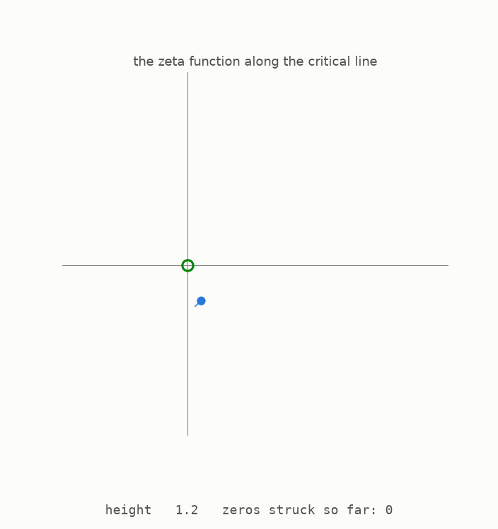

# Start here

*A step-by-step visual guide to the Riemann zeta function, the most famous unsolved problem in mathematics, and the 2026 paper that proved two thirds of the function's zeros sit exactly where Riemann said they should. You do not need a maths background. Each new idea begins with a picture.*



The animation shows a single function being evaluated along a single vertical line, one height at a time. At each height the function's value is a point in the plane, and as the height climbs the value traces the curving path you see. Again and again the path swings around and passes exactly through the centre. Each exact hit is called a **zero** of the function, and the counter records them: the first sits at height 14.13, and they keep coming forever. The function is the Riemann zeta function, the vertical line is called the critical line, and the question of whether every zero sits on this one line is the Riemann hypothesis, unanswered since 1859. Everything in this guide comes from the open source repository at [github.com/muchmirul/conjectures](https://github.com/muchmirul/conjectures): the text, every figure, and the tests behind each number.

In August 2026 a paper appeared with a shorter, unconditional statement: at least two thirds of the zeros sit on the line, each a clean single point, and at least five sixths of them are distinct. The previous record, held since 2020, was five twelfths, about 0.4166. The paper is unusual in a second way: its author is a large language model, Claude, built by Anthropic, and the mathematics was found in a single recorded session, then checked by hostile reviews, formalised in the Lean proof assistant, and studied by human mathematicians before release. This guide explains what the paper proves, how the proof works, and, just as carefully, what it does not prove: it says nothing about the Riemann hypothesis itself, in either direction.

The guide develops the result in small steps. Most numbered sections also have a [page you can play with](https://muchmirul.github.io/conjectures/zeta-critical-line/play/index.html), where you can change the main choices and watch the picture respond.

The code that creates every figure is included in this repository. The tests recompute the zeros, the constants, and the toy experiments shown here. When a statement comes from an existing theorem rather than those tests, the text says so.

```
    first, meet the objects     1  the primes and their wobble
                                2  the zeta landscape and its zeros
                                3  zeros are waves, primes are the tune
    then, find the question     4  the hypothesis, and the record race
                                5  four ways to count a zero
    the proof, one part each    6  listening to the zeros with microphones
                                7  bowls, saddles, and the see-saw law
                                8  two totals the primes reveal
                                9  the whole-number trick, upgraded
    the result                 10  assembling two thirds
                               11  the checks: numbers, Lean, and the story
                               12  where things stand
```

**[Play with this](https://muchmirul.github.io/conjectures/zeta-critical-line/play/00.html)** to steer the zeta path yourself and watch it strike the centre.

---

[The primes →](../01-the-primes/README.md)  ·  [the whole article on one page](../../ARTICLE.md)
