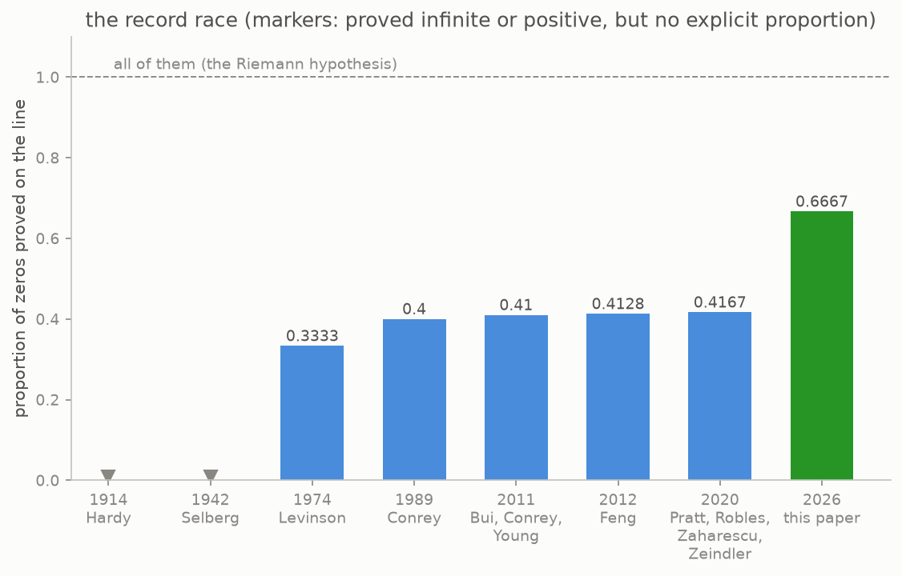

# 4 · The question

Riemann observed, in one parenthetical sentence of the 1859 memoir, that it is "very likely" that all the zeros sit on the line. He added that he had put the question aside after a few fleeting attempts, since it was not needed for his immediate purpose. That aside became the Riemann hypothesis, the most famous open question in mathematics: one of Hilbert's problems of 1900, one of the seven million-dollar Millennium Prize Problems of 2000, and still open today.

The evidence is unusual in what it can and cannot establish. By 2004, computers had checked the first ten trillion zeros, and every single one sits exactly on the line. This checking can never settle the question, because there are infinitely many zeros, and the history of this subject contains patterns that hold for trillions of cases and then fail. What has been proven instead, across more than a century, is that an increasing *proportion* of the zeros must sit on the line.



Hardy proved in 1914 that infinitely many zeros are on the line, which says nothing yet about a proportion. Selberg proved in 1942 that a positive proportion is on the line, without saying which proportion. Levinson reached one third in 1974 by a new method, mollifying zeta near the line, and every record since has sharpened his machinery: Conrey's two fifths in 1989, then refinements by Bui, Conrey and Young and by Feng, and finally, in 2020, five twelfths, about 0.4166, by Pratt, Robles, Zaharescu and Zeindler. The record then stayed there until 2026.

The 2026 paper comes from a different tradition, started by Montgomery in 1973 rather than by Levinson, and it reaches two thirds. The rest of this guide explains the bar on the right of the chart.

```
    1914  Hardy            infinitely many zeros on the line
    1942  Selberg          a positive, unspecified proportion
    1974  Levinson         one third
    1989  Conrey           two fifths
    2020  Pratt, Robles,
          Zaharescu,
          Zeindler         five twelfths, about 0.4166
    2026  this paper       two thirds, simple and on the line,
                           and five sixths distinct
```

One caution is needed before the proof. Montgomery showed already in 1973 that *if* the Riemann hypothesis is true, then at least two thirds of the zeros are well-behaved in the sense the next chapter makes precise. This means the number two thirds itself is fifty years old, and the 2026 paper's achievement is a proof of it that no longer needs the "if". The paper is precise about this ancestry, and this guide will be too.

---

[← The music of the primes](../03-the-music/README.md)  ·  [Four ways to count →](../05-four-counts/README.md)  ·  [the whole article on one page](../../ARTICLE.md)
