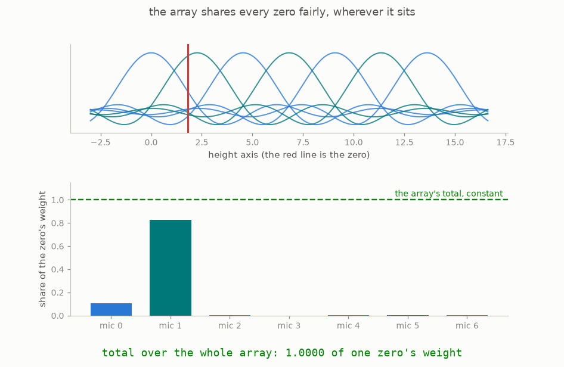

# 6 · The microphones

Everything in the proof happens inside one constructed object: a square table of numbers built by listening to the zeros. This chapter builds that table, and the toy version on this page was really computed and really drawn.

A **microphone**, in this guide, is a probe tuned to one frequency: point it at the zeros and it rings according to how close each zero's height is to the microphone's tuned frequency. Its sensitivity curve has a bump shape: a zero at the tuned frequency rings it hard, a zero a little away rings it less, a zero far away barely at all. The shape of that bump is set by a **window**, a taper the paper chooses once ([section 2.2, page 7](https://www-cdn.anthropic.com/564f962e60643842f5fcb4a17c9dbc8f608f1c37.pdf#page=7)); the window also has a width knob, called **the dial** in this guide, which trades sharpness for reach and whose best setting turns out to be the natural one.

The next step is to spread microphones evenly across the stretch of heights being studied, packed at the natural density of about one microphone per zero expected in the stretch. Our toy uses the stretch from height 100 to height 200, which holds 44 microphones. For every pair of microphones, record how much the two hear in common: each zero rings both, so each zero contributes to the pair jointly, and adding the contributions of all zeros gives one number per pair. Written into a grid, one row and one column per microphone, these numbers form **the table** ([equation 2.20, page 8](https://www-cdn.anthropic.com/564f962e60643842f5fcb4a17c9dbc8f608f1c37.pdf#page=8)).

The animation shows the principle on two microphones: as a zero slides across, each microphone's response follows its bump, and the product of the two responses is what lands in the table. One property of this arrangement will carry chapter 8, and the next animation shows it. The microphones are spaced at exactly the right density for the window, and at that spacing the array shares every zero fairly: as a zero slides along, one microphone's share falls while its neighbours' shares rise, and the total of all the squared responses never changes ([Lemma 2.2, page 8](https://www-cdn.anthropic.com/564f962e60643842f5fcb4a17c9dbc8f608f1c37.pdf#page=8)). Because of this, the table registers every zero with the same total weight wherever it happens to sit between the microphones; only zeros near the two ends of the stretch are read partially, and the paper bounds that edge effect once and for all. The tests check the constant total numerically.

The next picture shows the real table for our toy stretch, computed from the actual 196 zeros this repository holds near the stretch:

The table is big along its diagonal, where a microphone is paired with itself or a close neighbour, and fades away from it, because distant microphones share almost nothing. It is also perfectly symmetric, thanks to the mirror symmetries of chapter 2. Everything after this point works with this grid alone: the zeros built it, and the next three chapters extract from it everything the theorems need. A reader who wants the standard name can know it as a Gram matrix of Weil's Hermitian form; the glossary at the end collects such names.

**[Play with this](https://muchmirul.github.io/conjectures/zeta-critical-line/play/06.html)** to slide a zero along the array and watch the shares move while the total stays fixed.

---

[← Four ways to count](../05-four-counts/README.md)  ·  [Bowls and saddles →](../07-bowls-and-saddles/README.md)  ·  [the whole article on one page](../../ARTICLE.md)
